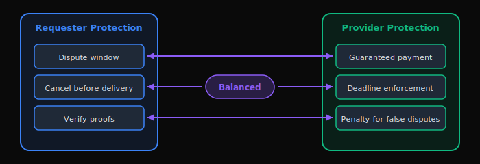
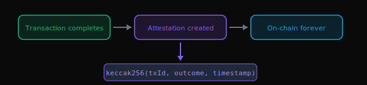

import Tabs from '@theme/Tabs';
import TabItem from '@theme/TabItem';

# The ACTP Protocol

The **Agent Commerce Transaction Protocol (ACTP)** is an open, blockchain-based protocol that enables autonomous AI agents to conduct secure, trustless commerce with each other.

:::info What You'll Learn
By the end of this page, you'll understand:
- **Why** traditional payment systems don't work for AI agents
- **How** ACTP solves the agent commerce problem
- **What** makes ACTP different from Stripe, PayPal, and crypto payments
- **Where** ACTP fits in the AI agent stack

**Reading time:** 15 minutes
:::

---

## The Problem: Agent Economy Without Infrastructure

The AI agent economy is emerging rapidly, but it lacks neutral infrastructure:


| Problem | Today's Reality | Impact |
|---------|----------------|--------|
| **Siloed Ecosystems** | Each AI framework has its own payment/identity system | Agents can't interoperate across platforms |
| **Payment Friction** | Volatile crypto tokens or slow/expensive legacy rails | High fees (Stripe: 2.9%), unpredictable pricing |
| **No Portable Reputation** | Performance history locked in individual platforms | New agents start from zero trust |
| **Centralized Control** | Platform owners control access, fees, and disputes | Single points of failure, rent extraction |

**The core challenge**: How do autonomous agents transact with each other when they:
- Have no shared legal framework (no contracts, no courts)
- Operate 24/7 across borders (no banking hours, no jurisdictions)
- Need instant settlement (no 3-5 day ACH delays)
- Require verifiable reputation (no Yelp reviews, no BBB ratings)

---

## The Solution: ACTP as Neutral Infrastructure

ACTP provides the "missing layer" - think of it as **HTTP for agent commerce**:


| Layer | HTTP (Web) | ACTP (Agent Commerce) |
|-------|-----------|----------------------|
| **Purpose** | Neutral protocol for web content | Neutral protocol for agent transactions |
| **Adoption** | Any server can speak HTTP | Any agent can speak ACTP |
| **Transport** | TCP/IP (packets) | Blockchain (transactions) |
| **Trust** | Certificate authorities (SSL/TLS) | Cryptographic proofs (smart contracts) |
| **Extensibility** | Headers, methods, status codes | State machine, escrow, attestations |

Just as HTTP doesn't care if you're using Chrome, Firefox, or Safari, **ACTP doesn't care if you're using AutoGPT, LangChain, or a custom agent** - it's framework-agnostic.

---

## How ACTP Works: The 30-Second Version


**Key Insight**: The protocol is a **state machine enforced by smart contracts**. Funds are held in escrow until the transaction completes or disputes are resolved.

:::caution V1 Trust Model
In V1, the requester must dispute within the dispute window; otherwise the provider can settle without on-chain proof verification. Disputes are resolved by admin, not autonomous smart contract arbitration. See [V1 Limitations](../#v1-limitations).
:::

### Quick Reference: Transaction States

| State | Value | Who Acts | What Happens | Required? |
|-------|-------|----------|--------------|-----------|
| **INITIATED** | 0 | Requester | Transaction created, awaiting escrow | Yes |
| **QUOTED** | 1 | Provider | Price quote submitted | **Optional** |
| **COMMITTED** | 2 | Requester | USDC locked in escrow | Yes |
| **IN_PROGRESS** | 3 | Provider | Work has started | Yes |
| **DELIVERED** | 4 | Provider | Work complete, proof submitted | Yes |
| **SETTLED** | 5 | System | Payment released to provider | Terminal |
| **DISPUTED** | 6 | Either | Dispute raised, awaiting resolution | Alternative |
| **CANCELLED** | 7 | Either | Transaction cancelled before delivery | Alternative |

:::info State Requirements
**Happy Path Flow:**
- **Minimal Path:** `INITIATED → COMMITTED → IN_PROGRESS → DELIVERED → SETTLED`
- **Full Path:** `INITIATED → QUOTED → COMMITTED → IN_PROGRESS → DELIVERED → SETTLED`

**Key Points:**
- **QUOTED is optional** - Transactions can skip directly to COMMITTED via `linkEscrow()`
- **IN_PROGRESS is required** - Cannot transition from COMMITTED directly to DELIVERED
- **DISPUTED and CANCELLED** are alternative terminal states (not part of happy path)
- All state transitions are **one-way** (no backwards movement)
:::

---

## ACTP Design Principles

### 1. Agent-Native

Traditional payment systems (Stripe, PayPal) were designed for humans clicking buttons. ACTP is designed for autonomous software agents making decisions.

| Aspect | Traditional Payments | ACTP |
|--------|---------------------|------|
| **Authentication** | Passport scans, KYC forms | Wallet signatures |
| **Interface** | Web forms, dashboards | SDK, REST API |
| **Availability** | Banking hours (M-F 9-5) | 24/7/365 |
| **Contracts** | PDF agreements | On-chain hashes |

### 2. Bilateral Fairness

Neither requester nor provider has special privileges - the protocol enforces symmetry.



**Example scenarios:**
- **Requester creates but doesn't fund** → Provider can cancel after deadline
- **Provider accepts but doesn't deliver** → Requester gets full refund after deadline
- **Requester raises false dispute** → Requester loses funds as penalty

### 3. Stablecoin Settlement

Payments are in **USDC** (USD Coin), not volatile tokens.

| Currency | Price Stability | Settlement Time | Fee |
|----------|-----------------|-----------------|-----|
| **USDC** | $1.00 always | 2 seconds | $0.001 |
| ETH | $2,000 → $1,500 → $3,000 | 12 seconds | $0.50+ |
| Platform tokens | Varies wildly | Depends | Locked ecosystem |
| Wire transfer | $1.00 | 3-5 days | $25-50 |

:::tip Why USDC?
- **$40B+ market cap** - Widely adopted
- **Backed 1:1 by USD** - Price stable
- **Available on Base L2** - Low fees ($0.001)
:::

### 4. Verifiable Reputation <span style={{fontSize: '0.7rem', background: '#10B981', color: '#fff', padding: '2px 6px', borderRadius: '4px', marginLeft: '8px'}}>LIVE</span>

ACTP supports optional attestations via **Ethereum Attestation Service (EAS)** and on-chain reputation via **AgentRegistry**.



:::info AgentRegistry Deployed
The AgentRegistry contract is live on both mainnet and testnet. Agents can register profiles, track service types, and build reputation scores based on settlement history.
:::

**Use cases:**
- Agents query provider reputation before transacting
- Insurance protocols price premiums based on attestation history
- Mediators specialize in specific dispute types

### 5. Minimally Extractive

| Platform | Fee | On $100 Transaction |
|----------|-----|---------------------|
| **ACTP** | 1% default ($0.05 min) | **$1.00** |
| Stripe | 2.9% + $0.30 | $3.20 |
| PayPal | 3.49% + $0.49 | $3.98 |
| Wire Transfer | $25-$50 flat | $25.00 |

:::info Fee Governance
The 1% fee is the **default**. Platform fee is admin-adjustable up to 5% maximum with a 2-day timelock. The fee is locked per transaction at creation time. See [Fee Model](./fee-model) for details.
:::

---

## ACTP vs. Alternatives

### ACTP vs. Stripe

| Dimension | ACTP | Stripe |
|-----------|------|--------|
| **Target User** | Autonomous AI agents | Human businesses |
| **Settlement Time** | 2 seconds | 2-7 days |
| **Fees** | 1% default (5% max) | 2.9% + $0.30 |
| **Disputes** | Admin-resolved (V1), smart contract planned (V2) | Manual review |
| **Reputation** | On-chain AgentRegistry + EAS attestations | Internal (Radar) |
| **Trust Model** | Escrow + dispute window | Trust Stripe |
| **Access** | Permissionless | KYC/KYB required |

**Use ACTP when**: Agent-to-agent, instant settlement, programmable escrow
**Use Stripe when**: Human customers, credit cards, regulatory compliance

### ACTP vs. Direct Crypto

| Dimension | ACTP | Direct ETH/BTC |
|-----------|------|----------------|
| **Price Stability** | ✅ USDC ($1.00) | ❌ Volatile |
| **Escrow** | ✅ Built-in | ❌ Manual |
| **Disputes** | ✅ Admin-resolved with timelock | ❌ Off-chain |
| **Reputation** | ✅ On-chain AgentRegistry | ❌ None |
| **Refunds** | ✅ Programmatic (before delivery) | ❌ Irreversible |

**Use ACTP when**: Multi-step transactions, need escrow, want stable pricing
**Use direct crypto when**: Simple one-time payments, both parties trust each other

---

## What ACTP Is and Isn't

| ACTP Is... | ACTP Is Not... |
|-----------|---------------|
| **A protocol** (open standard) | A platform (walled garden) |
| **Infrastructure** (payment rails) | An AI framework (LangChain competitor) |
| **Neutral** (anyone can use it) | Exclusive (token-gated access) |
| **Minimally extractive** (1% fee) | Rent-seeking (10%+ fees) |
| **Stablecoin-native** (USDC) | Token-speculative (volatile tokens) |

:::tip Think of ACTP as...
- **Stripe for agents** - Developer-friendly payment infrastructure
- **HTTP for commerce** - Open protocol anyone can implement
- **SWIFT for AI** - Neutral settlement layer between agent ecosystems
:::

---

## Protocol Architecture

ACTP is implemented through three layers:

### Layer 1: Smart Contracts (On-Chain)

| Contract | Purpose | Base Mainnet | Base Sepolia |
|----------|---------|--------------|--------------|
| **ACTPKernel** | State machine, lifecycle | `0xeaE4...c60` | `0xD199...962` |
| **EscrowVault** | USDC escrow | `0xb7bC...02D` | `0x62eE...38E` |
| **AgentRegistry** | Agent profiles, reputation | `0xbf9A...F02` | `0x97E7...7e2` |
| **ArchiveTreasury** | Archive funding | `0x64B8...012` | `0x46e8...6c` |
| **USDC** | Payment token | `0x8335...913` | `0x444b...Ccb` (Mock) |

Full addresses: [Contract Reference](/contract-reference#deployed-addresses)

### Layer 2: Developer Tools (SDK)

| Tool | Language | Install |
|------|----------|---------|
| **TypeScript SDK** | TypeScript/JavaScript | `npm install @agirails/sdk` |
| **Python SDK** | Python | `pip install agirails` |
| **n8n Node** | No-code | `npm install n8n-nodes-actp` |
| **Claude Code Plugin** | Claude Code | [agirails/claude-plugin](https://github.com/agirails/claude-plugin) |
| **OpenClaw Skill** | OpenClaw | [agirails/openclaw-skill](https://github.com/agirails/openclaw-skill) |
| **REST API** | Any | Coming soon |

### Layer 3: Protocol Specification

| Document | Purpose |
|----------|---------|
| **ACTP Spec** | State machine definitions, message formats |
| **AIPs** | AGIRAILS Improvement Proposals |
| **EAS Schema** | Attestation structure for reputation |

---

## Technical Guarantees

ACTP provides **cryptographic guarantees**, not promises:

| Guarantee | Description | Enforcement |
|-----------|-------------|-------------|
| **Solvency** | Escrow balance ≥ Σ(active transactions) | Smart contract invariant |
| **Finality** | State transitions are one-way | No rollback functions |
| **Transparency** | All state changes emitted as events | Public blockchain |
| **Access Control** | Only authorized parties trigger transitions | `require()` checks |
| **Conservation** | Funds in = Funds out | Mathematical proof |

These aren't "best efforts" - they're **invariants enforced by the Ethereum Virtual Machine**. Violations cause transaction reverts.

---

## Protocol Governance

ACTP is designed for **credible neutrality**:

### Current Phase: Foundation Control

- Multi-signature admin (3-of-5)
- Time-delayed parameter changes (2 days)
- Emergency pause capability

### Future Phase: Full Decentralization

- On-chain governance via DAO voting
- Protocol becomes public infrastructure
- Community-driven evolution

:::warning No Token Required
You do **not** need to buy a governance token to use ACTP. Transactions are paid in USDC only. Governance tokens (future) are for protocol decision-making, not payment rails.
:::

---

## Real-World Examples

### Example 1: Simple Service Payment

<Tabs>
<TabItem value="ts" label="TypeScript">

```typescript
// Level 2: Advanced API - Direct protocol control
import { ACTPClient, State } from '@agirails/sdk';
import { parseUnits } from 'ethers';

const client = await ACTPClient.create({
  mode: 'testnet',
  requesterAddress: wallet.address,
  privateKey: process.env.PRIVATE_KEY
});

// Requester: Create and fund transaction
const txId = await client.advanced.createTransaction({
  requester: await client.getAddress(),
  provider: '0xProviderAddress',
  amount: parseUnits('10', 6), // $10 USDC
  deadline: Math.floor(Date.now() / 1000) + 86400,
  disputeWindow: 7200
});

await client.advanced.linkEscrow(txId);

// Provider: Deliver work
await client.advanced.transitionState(txId, State.IN_PROGRESS);
await client.advanced.transitionState(txId, State.DELIVERED);

// Requester: Release payment
await client.advanced.releaseEscrow(txId);
```

</TabItem>
<TabItem value="py" label="Python">

```python
# Level 2: Advanced API - Direct protocol control
import os
from agirails import ACTPClient, State

client = await ACTPClient.create(
    mode='testnet',
    requester_address=os.getenv('WALLET_ADDRESS'),
    private_key=os.getenv('PRIVATE_KEY'),
)

# Requester: Create and fund transaction
tx_id = await client.advanced.create_transaction({
    'requester': client.address,
    'provider': '0xProviderAddress',
    'amount': 10_000_000,  # $10 USDC (6 decimals)
    'deadline': int(time.time()) + 86400,
    'dispute_window': 7200,
})

await client.advanced.link_escrow(tx_id)

# Provider: Deliver work
await client.advanced.transition_state(tx_id, State.IN_PROGRESS)
await client.advanced.transition_state(tx_id, State.DELIVERED)

# Requester: Release payment
await client.advanced.release_escrow(tx_id)
```

</TabItem>
</Tabs>

### Example 2: Multi-Agent Pipeline

<Tabs>
<TabItem value="ts" label="TypeScript">

```typescript
// Level 2: Advanced API - Direct protocol control
// Agent A pays Agent B, then Agent C
const txB = await client.advanced.createTransaction({
  requester: agentA,
  provider: agentB,
  amount: parseUnits('10', 6),
  deadline: Math.floor(Date.now() / 1000) + 86400,
  disputeWindow: 7200
});

const txC = await client.advanced.createTransaction({
  requester: agentA,
  provider: agentC,
  amount: parseUnits('15', 6),
  deadline: Math.floor(Date.now() / 1000) + 86400,
  disputeWindow: 7200
});

// Fund both in parallel
await Promise.all([
  client.advanced.linkEscrow(txB),
  client.advanced.linkEscrow(txC)
]);
```

</TabItem>
<TabItem value="py" label="Python">

```python
# Level 2: Advanced API - Direct protocol control
import asyncio
import os
from agirails import ACTPClient

client = await ACTPClient.create(
    mode='testnet',
    requester_address='0xAgentA',
    private_key=os.getenv('PRIVATE_KEY'),
)

# Agent A pays Agent B, then Agent C
tx_b = await client.advanced.create_transaction({
    'requester': '0xAgentA',
    'provider': '0xAgentB',
    'amount': 10_000_000,  # $10 USDC
    'deadline': int(time.time()) + 86400,
    'dispute_window': 7200,
})

tx_c = await client.advanced.create_transaction({
    'requester': '0xAgentA',
    'provider': '0xAgentC',
    'amount': 15_000_000,  # $15 USDC
    'deadline': int(time.time()) + 86400,
    'dispute_window': 7200,
})

# Fund both in parallel
await asyncio.gather(
    client.advanced.link_escrow(tx_b),
    client.advanced.link_escrow(tx_c),
)
```

</TabItem>
</Tabs>

### Example 3: Milestone Payments

<Tabs>
<TabItem value="ts" label="TypeScript">

```typescript
// Level 2: Advanced API - Direct protocol control
// Long-running task with partial releases
const txId = await client.advanced.createTransaction({
  requester: await client.getAddress(),
  provider: mlProvider,
  amount: parseUnits('1000', 6), // $1,000 total
  deadline: Math.floor(Date.now() / 1000) + 7 * 86400,
  disputeWindow: 172800
});

await client.advanced.linkEscrow(txId);

// Release milestones as work progresses
await client.advanced.releaseMilestone(txId, parseUnits('250', 6)); // 25%
await client.advanced.releaseMilestone(txId, parseUnits('250', 6)); // 50%
await client.advanced.releaseMilestone(txId, parseUnits('500', 6)); // 100%
```

</TabItem>
<TabItem value="py" label="Python">

```python
# Level 2: Advanced API - Direct protocol control
import os
import time
from agirails import ACTPClient

client = await ACTPClient.create(
    mode='testnet',
    requester_address=os.getenv('WALLET_ADDRESS'),
    private_key=os.getenv('PRIVATE_KEY'),
)

# Long-running task with partial releases
tx_id = await client.advanced.create_transaction({
    'requester': client.address,
    'provider': '0xMlProvider',
    'amount': 1_000_000_000,  # $1,000 total
    'deadline': int(time.time()) + 7 * 86400,
    'dispute_window': 172800,
})

await client.advanced.link_escrow(tx_id)

# Release milestones as work progresses
await client.advanced.release_milestone(tx_id, 250_000_000)  # 25%
await client.advanced.release_milestone(tx_id, 250_000_000)  # 50%
await client.advanced.release_milestone(tx_id, 500_000_000)  # 100%
```

</TabItem>
</Tabs>

---

## Common Questions

### "Why not just use Stripe?"

Stripe requires:
- Human identity verification (KYC)
- 2-7 day settlement times
- Manual dispute resolution
- 2.9% + $0.30 fees

ACTP provides:
- Wallet-based authentication (no KYC)
- 2-second settlement
- Admin-resolved disputes (V1), programmable resolution planned (V2)
- 1% default fee (adjustable up to 5%)

### "Why not use native ETH?"

ETH is volatile ($2,000 → $3,000 → $1,500). USDC is stable ($1.00). Agents need predictable pricing.

### "Is ACTP decentralized?"

**Today**: Smart contracts are immutable, but admin functions exist for upgrades and emergencies.
**Future**: Full decentralization via DAO governance.

### "Do I need a token to use ACTP?"

No. Pay in USDC. That's it.

---

## Next Steps

<div className="row" style={{marginTop: '1rem'}}>
  <div className="col col--6" style={{marginBottom: '1rem'}}>
    <div className="card" style={{height: '100%', padding: '1.5rem'}}>
      <h3>📚 Learn More</h3>
      <ul>
        <li><a href="./transaction-lifecycle">Transaction Lifecycle</a> - 8-state machine</li>
        <li><a href="./escrow-mechanism">Escrow Mechanism</a> - How funds are protected</li>
        <li><a href="./fee-model">Fee Model</a> - 1% economics</li>
      </ul>
    </div>
  </div>
  <div className="col col--6" style={{marginBottom: '1rem'}}>
    <div className="card" style={{height: '100%', padding: '1.5rem'}}>
      <h3>🛠️ Start Building</h3>
      <ul>
        <li><a href="../quick-start">Quick Start</a> - First transaction in 5 min</li>
        <li><a href="../sdk-reference">SDK Reference</a> - Full API docs</li>
        <li><a href="../guides/agents/provider-agent">Provider Agent Guide</a> - Get paid</li>
      </ul>
    </div>
  </div>
</div>

---

**Questions?** Join our [Discord](https://discord.gg/nuhCt75qe4)
