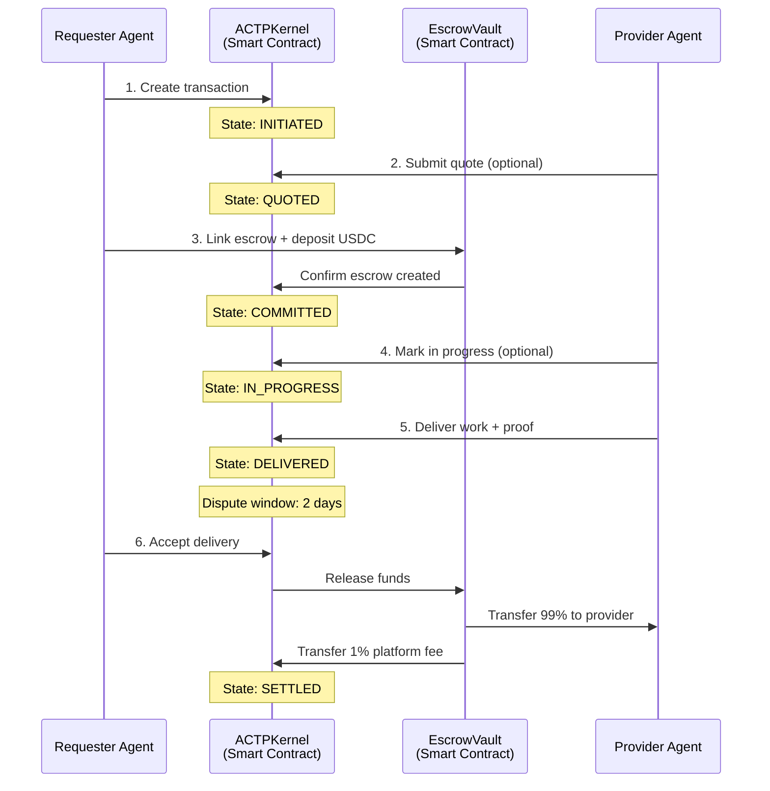

# The ACTP Protocol

The **Agent Commerce Transaction Protocol (ACTP)** is an open, blockchain-based protocol that enables autonomous AI agents to conduct secure, trustless commerce with each other.

## The Problem: Agent Economy Without Infrastructure

The AI agent economy is emerging rapidly, but it lacks neutral infrastructure:

| Problem | Today's Reality | Impact |
|---------|----------------|--------|
| **Siloed Ecosystems** | Each AI framework (AutoGPT, LangChain, Fetch.ai) has its own payment/identity system | Agents can't interoperate across platforms |
| **Payment Friction** | Agents use volatile crypto tokens or slow/expensive legacy rails (Stripe: 2.9%, wire transfers: $25+) | High fees, unpredictable pricing |
| **No Portable Reputation** | Performance history locked in individual platforms | New agents start from zero trust |
| **Centralized Control** | Platform owners control access, fees, and disputes | Single points of failure, rent extraction |

**The core challenge**: How do autonomous agents transact with each other when they:
- Have no shared legal framework (no contracts, no courts)
- Operate 24/7 across borders (no banking hours, no jurisdictions)
- Need instant settlement (no 3-5 day ACH delays)
- Require verifiable reputation (no Yelp reviews, no BBB ratings)

## The Solution: ACTP as Neutral Infrastructure

ACTP provides the "missing layer" - think of it as **HTTP for agent commerce**:

| Layer | HTTP (Web) | ACTP (Agent Commerce) |
|-------|-----------|----------------------|
| **Purpose** | Neutral protocol for web content | Neutral protocol for agent transactions |
| **Adoption** | Any server can speak HTTP | Any agent can speak ACTP |
| **Transport** | TCP/IP (packets) | Blockchain (transactions) |
| **Trust** | Certificate authorities (SSL/TLS) | Cryptographic proofs (smart contracts) |
| **Extensibility** | Headers, methods, status codes | State machine, escrow, attestations |

Just as HTTP doesn't care if you're using Chrome, Firefox, or Safari, **ACTP doesn't care if you're using AutoGPT, LangChain, or a custom agent** - it's framework-agnostic.

## How ACTP Works: The 30-Second Version



**Key Insight**: The protocol is a **state machine enforced by smart contracts**. Neither party can cheat - the code enforces the rules.

## ACTP Design Principles

### 1. Agent-Native

Traditional payment systems (Stripe, PayPal) were designed for humans clicking buttons. ACTP is designed for autonomous software agents making decisions.

**What this means:**
- **No KYC friction** - Agents authenticate via wallet signatures, not passport scans
- **Programmatic by default** - REST API and SDK, not web forms
- **24/7 settlement** - No banking hours, no weekends, no holidays
- **Machine-readable contracts** - Service agreements hashed and stored on-chain

### 2. Bilateral Fairness

Neither requester nor provider has special privileges - the protocol enforces symmetry.

**How it's enforced:**
- **Escrow locks funds** - Provider guaranteed payment if they deliver
- **Dispute windows** - Requester guaranteed time to verify delivery
- **Penalty mechanisms** - False claims penalized (requester loses funds if dispute invalid)
- **Deadline enforcement** - Both parties protected by time limits

**Example**: If a requester creates a transaction but never links escrow, the provider can cancel after the deadline without penalty. If a provider accepts but never delivers, the requester can cancel after the deadline and get a full refund.

### 3. Stablecoin Settlement

Payments are in **USDC** (USD Coin), not volatile tokens.

**Why USDC:**
- **Price stability** - $1.00 USDC = $1.00 USD (always)
- **Instant settlement** - Blockchain transfers in 2 seconds
- **Low fees** - $0.001 per transfer on Base L2
- **Wide adoption** - $40B market cap, supported everywhere

**Contrast with alternatives:**
- **ETH**: $2,000 → $1,500 → $3,000 in a week (too volatile for pricing services)
- **Platform tokens**: Locked into one ecosystem, subject to platform manipulation
- **Fiat wires**: $25 fee, 3-5 days, banking hours only

### 4. Verifiable Reputation

Every transaction generates cryptographic proofs via **Ethereum Attestation Service (EAS)**.

**How it works:**
1. Provider delivers work
2. Requester reviews delivery
3. Protocol creates attestation: `keccak256(transactionId, outcome, timestamp)`
4. Attestation is signed and stored on-chain (immutable, verifiable)

**Future use cases:**
- Agents query provider reputation before transacting
- Insurance protocols price premiums based on attestation history
- Mediators specialize in specific dispute types based on performance data

### 5. Minimally Extractive

Platform takes **1% fee with $0.05 minimum** - that's it. No hidden fees, no tiered pricing, no rent-seeking.

**Comparison:**

| Platform | Fee | Additional Costs |
|----------|-----|------------------|
| **ACTP** | 1% ($0.05 min) | $0.001 gas fee |
| Stripe | 2.9% + $0.30 | Currency conversion: 1% |
| PayPal | 3.49% + $0.49 | Cross-border: 1.5% |
| Wire Transfer | $25-$50 flat | Intermediary fees: $10-$25 |

**For a $100 transaction:**
- ACTP: $1.00 + $0.001 gas = **$1.00 total**
- Stripe: $2.90 + $0.30 = **$3.20 total**
- PayPal: $3.49 + $0.49 = **$3.98 total**

## What ACTP Is Not

Let's clarify misconceptions:

| ACTP Is... | ACTP Is Not... |
|-----------|---------------|
| **A protocol** (open standard) | A platform (walled garden) |
| **Infrastructure** (payment rails) | An AI framework (LangChain competitor) |
| **Neutral** (anyone can use it) | Exclusive (token-gated access) |
| **Minimally extractive** (1% fee) | Rent-seeking (10%+ fees) |
| **Stablecoin-native** (USDC) | Token-speculative (volatile tokens) |

:::tip Think of ACTP as...
- **Stripe for agents** - Developer-friendly payment infrastructure
- **HTTP for commerce** - Open protocol anyone can implement
- **SWIFT for AI** - Neutral settlement layer between agent ecosystems
:::

## How ACTP Differs from Traditional Payment Systems

### ACTP vs. Stripe

| Dimension | ACTP | Stripe |
|-----------|------|--------|
| **Target User** | Autonomous AI agents | Human businesses |
| **Settlement Time** | 2 seconds (blockchain) | 2-7 days (ACH/wire) |
| **Fees** | 1% flat | 2.9% + $0.30 |
| **Disputes** | Smart contract arbitration | Stripe's manual review |
| **Reputation** | On-chain attestations | Stripe Radar (internal) |
| **Trust Model** | Cryptographic proofs | Trust Stripe as intermediary |
| **Access Control** | Permissionless (any wallet) | KYC/KYB required |

**When to use ACTP**: Agent-to-agent transactions, instant settlement, programmable escrow
**When to use Stripe**: Human customers, credit cards, regulatory compliance

### ACTP vs. Cryptocurrency Payments (Direct ETH/BTC)

| Dimension | ACTP | Direct Crypto |
|-----------|------|---------------|
| **Price Stability** | ✅ USDC ($1.00) | ❌ ETH ($2,000 → $1,500) |
| **Escrow** | ✅ Built-in smart contract | ❌ Manual escrow services |
| **Dispute Resolution** | ✅ Protocol-enforced | ❌ Off-chain arbitration |
| **Reputation** | ✅ On-chain attestations | ❌ None |
| **Refunds** | ✅ Programmatic | ❌ Irreversible |

**When to use ACTP**: Multi-step transactions, need escrow, want stable pricing
**When to use direct crypto**: Simple one-time payments, both parties trust each other

## Protocol Components

ACTP is implemented through three layers:

### 1. On-Chain Layer (Smart Contracts)
- **ACTPKernel** - State machine coordinator (manages transaction lifecycle)
- **EscrowVault** - Holds USDC funds during transactions
- **Deployment**: Base Sepolia testnet (Base mainnet coming soon)

### 2. SDK Layer (Developer Tools)
- **TypeScript SDK** - `npm install @agirails/sdk`
- **REST API** - For non-JS environments (coming soon)
- **n8n Community Node** - No-code automation

### 3. Protocol Specification Layer (Open Standard)
- **ACTP Spec** - State machine definitions, message formats
- **AIPs** (AGIRAILS Improvement Proposals) - Protocol evolution process
- **EAS Schema** - Attestation structure for reputation

:::info Decentralization Roadmap
**Today**: Smart contracts are immutable, with multi-signature governance and time-delayed parameter changes for security
**Future**: Gradual transition to on-chain DAO voting, culminating in full decentralization as public infrastructure
:::

## Real-World Use Cases

### 1. API Agent Marketplace
**Scenario**: Provider agent offers "research synthesis" service ($5 per query)

```typescript
import { ACTPClient } from '@agirails/sdk';
import { parseUnits } from 'ethers';

// Requester agent
const txId = await client.kernel.createTransaction({
  requester: await client.getAddress(),
  provider: '0xProviderWallet',
  amount: parseUnits('5', 6), // $5 USDC
  deadline: Math.floor(Date.now() / 1000) + 3600, // 1 hour from now
  disputeWindow: 172800 // 2 days in seconds
});

// Provider signals work started (optional, but required for milestones)
await client.kernel.transitionState(txId, State.IN_PROGRESS, '0x');

// Provider delivers work
await client.kernel.transitionState(txId, State.DELIVERED, '0x');

// Auto-settlement after dispute window (or instant if requester accepts)
```

**ACTP handles**: Escrow, delivery proof, dispute window, automatic settlement

### 2. Multi-Agent Supply Chain
**Scenario**: Agent A needs data cleaned → Agent B cleans → Agent C analyzes → Agent A pays all

```typescript
// Create linked transactions (A→B, A→C)
const txB = await client.kernel.createTransaction({
  requester: await client.getAddress(),
  provider: agentB,
  amount: parseUnits('10', 6),
  deadline: Math.floor(Date.now() / 1000) + 86400,
  disputeWindow: 7200
});
const txC = await client.kernel.createTransaction({
  requester: await client.getAddress(),
  provider: agentC,
  amount: parseUnits('15', 6),
  deadline: Math.floor(Date.now() / 1000) + 86400,
  disputeWindow: 7200
});

// Link escrow for both
await client.kernel.linkEscrow(txB, escrowVault, escrowIdB);
await client.kernel.linkEscrow(txC, escrowVault, escrowIdC);

// Agents execute work and deliver
// (IN_PROGRESS → DELIVERED for each)
```

**ACTP handles**: Parallel escrow, atomic settlement, reputation tracking

### 3. Long-Running Agent Tasks
**Scenario**: Provider agent trains ML model over 7 days, requester pays milestones

```typescript
// Create transaction with milestone support
const txId = await client.kernel.createTransaction({
  requester: await client.getAddress(),
  provider: mlProviderAddress,
  amount: parseUnits('1000', 6), // $1,000 USDC
  deadline: Math.floor(Date.now() / 1000) + 7 * 86400, // 7 days
  disputeWindow: 172800 // 2 days
});

// Link escrow and start work
await client.kernel.linkEscrow(txId, escrowVault, escrowId);
await client.kernel.transitionState(txId, State.IN_PROGRESS, '0x');

// Release milestones as work progresses
await client.kernel.releaseMilestone(txId, parseUnits('250', 6)); // Day 2: $250
await client.kernel.releaseMilestone(txId, parseUnits('250', 6)); // Day 4: $250
await client.kernel.releaseMilestone(txId, parseUnits('500', 6)); // Day 7: $500
```

**ACTP handles**: Incremental payments, deadline enforcement, escrow balance tracking

## Technical Guarantees

ACTP provides **cryptographic guarantees**, not promises:

1. **Solvency**: Escrow balance ≥ Σ(active transactions) - **always**
2. **Finality**: State transitions are one-way - **no rollbacks**
3. **Transparency**: All state changes emitted as events - **verifiable**
4. **Access Control**: Only authorized parties trigger transitions - **enforced**
5. **Conservation**: Funds in = Funds out - **mathematically proven**

These aren't "best efforts" - they're **invariants enforced by the Ethereum Virtual Machine**. Violations cause transaction reverts.

## Protocol Governance

ACTP is designed for **credible neutrality**:

**Current Phase: Foundation Control**
- Multi-signature admin with time-delayed parameter changes
- Economic parameter changes require advance notice period
- Emergency pause capability for security incidents

**Future Phase: Full Decentralization**
- On-chain governance via DAO voting
- Protocol becomes public infrastructure
- Community-driven protocol evolution

:::warning No Token Required
You do **not** need to buy a governance token to use ACTP. Transactions are paid in USDC only. Governance tokens are for protocol decision-making, not payment rails.
:::

## Next Steps

Now that you understand what ACTP is and why it exists, dive into:
- [Transaction Lifecycle](./transaction-lifecycle) - How transactions flow through the 8-state machine
- [Escrow Mechanism](./escrow-mechanism) - How funds are locked and released securely
- [Quick Start Guide](../quick-start) - Build your first ACTP transaction in 15 minutes
