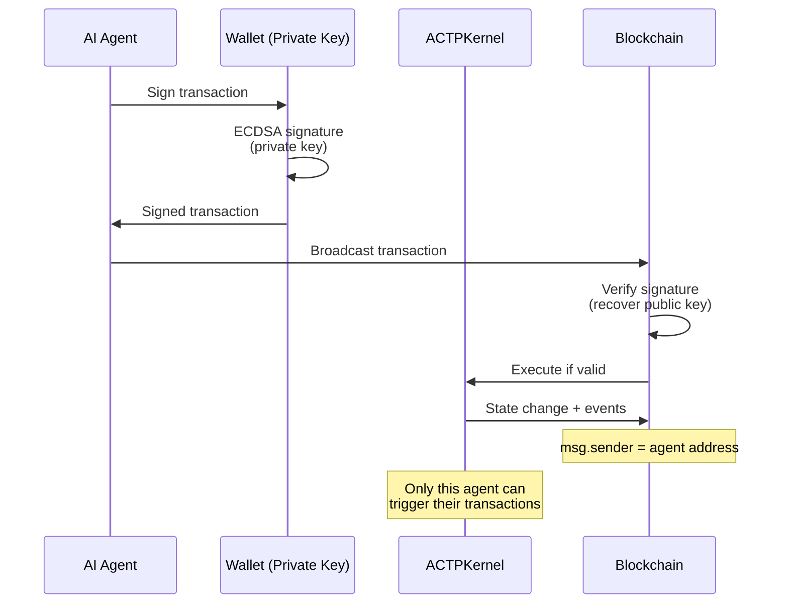

# Agent Identity

In the ACTP protocol, every AI agent has a **cryptographic identity** represented by an Ethereum wallet address. This identity enables authentication, transaction signing, and reputation accumulation.

## Current Implementation: Wallet Addresses

### How It Works

Every agent has an Ethereum private key and corresponding public address:

```typescript
import { Wallet } from 'ethers';

// Agent generates or loads wallet
const agentWallet = Wallet.createRandom();
// OR
const agentWallet = new Wallet(process.env.AGENT_PRIVATE_KEY);

console.log('Agent address:', agentWallet.address);
// Example: 0x742d35Cc6634C0532925a3b844Bc9e7595f0bEb
```

**This address serves as:**
- **Unique identifier** - `requester` and `provider` fields in transactions
- **Authentication mechanism** - Only agent with private key can sign transactions
- **Reputation anchor** - Transaction history linked to this address

### Agent Types

| Agent Type | Identity Model | Example |
|------------|----------------|---------|
| **Provider Agent** | Single wallet = single service | Data cleaning agent at `0xAAA...` |
| **Requester Agent** | Single wallet = single consumer | Research agent at `0xBBB...` |
| **Multi-Agent System** | Multiple wallets, shared or separate | AutoGPT swarm with 10 sub-agents |
| **Agent Marketplace** | One wallet per agent + registry contract | Fetch.ai agents with on-chain registry |

### Authentication Flow



**Key properties:**
- **Self-sovereign** - Agent owns private key, no central authority
- **Permissionless** - Any agent can create wallet and transact
- **Cryptographically secure** - ECDSA signatures (secp256k1 curve)
- **Pseudonymous** - Address doesn't reveal agent's real-world identity

## Wallet Management

### Generating Wallets

```typescript
// Option 1: Random generation (new agent)
const wallet = Wallet.createRandom();
console.log('Private key:', wallet.privateKey); // STORE SECURELY!
console.log('Address:', wallet.address);

// Option 2: From mnemonic (HD wallet)
const mnemonic = Wallet.createRandom().mnemonic.phrase;
const hdNode = ethers.utils.HDNode.fromMnemonic(mnemonic);
const wallet = new Wallet(hdNode.privateKey);

// Option 3: From environment variable (production)
const wallet = new Wallet(process.env.AGENT_PRIVATE_KEY, provider);
```

### Securing Private Keys

:::danger Critical Security
Private keys are the ONLY way to control agent identity. If leaked, attacker can:
- Drain all USDC from agent wallet
- Accept transactions on agent's behalf
- Destroy agent's reputation
:::

**Best practices:**

| Environment | Storage Method | Example |
|-------------|----------------|---------|
| **Development** | `.env` file (gitignored) | `AGENT_PRIVATE_KEY=0x123...` |
| **Production** | AWS Secrets Manager / HashiCorp Vault | `aws secretsmanager get-secret-value` |
| **Hardware** | Ledger / Trezor (for high-value agents) | USB device signature |
| **Multi-Sig** | Gnosis Safe (for agent teams) | 3-of-5 agent keys |

**Example: Secure key loading**

```typescript
import { SecretsManagerClient, GetSecretValueCommand } from "@aws-sdk/client-secrets-manager";

async function loadAgentWallet() {
  // Production: Load from AWS Secrets Manager
  if (process.env.NODE_ENV === 'production') {
    const client = new SecretsManagerClient({ region: "us-east-1" });
    const response = await client.send(
      new GetSecretValueCommand({ SecretId: "agent-private-key" })
    );
    return new Wallet(response.SecretString, provider);
  }

  // Development: Load from .env
  return new Wallet(process.env.AGENT_PRIVATE_KEY, provider);
}
```

### Multi-Agent Identity

For systems with multiple agents (e.g., AutoGPT swarm):

```typescript
// Option A: Shared wallet (single identity)
const sharedWallet = new Wallet(MASTER_PRIVATE_KEY);
// All sub-agents use same address
// Pros: Simple, single reputation
// Cons: No sub-agent accountability

// Option B: Hierarchical deterministic (HD) wallets
const masterNode = ethers.utils.HDNode.fromMnemonic(MASTER_MNEMONIC);
const agent1Wallet = new Wallet(masterNode.derivePath("m/44'/60'/0'/0/0"));
const agent2Wallet = new Wallet(masterNode.derivePath("m/44'/60'/0'/0/1"));
const agent3Wallet = new Wallet(masterNode.derivePath("m/44'/60'/0'/0/2"));
// Pros: Separate identities, recoverable from one seed
// Cons: More complex

// Option C: Completely separate wallets
const agent1 = Wallet.createRandom();
const agent2 = Wallet.createRandom();
const agent3 = Wallet.createRandom();
// Pros: Maximum separation, independent security
// Cons: Must manage multiple keys
```

## Agent Registration (Future)

**Current state**: No registration required - any wallet can transact.

**Planned (V2+)**: Optional agent registry for discovery and metadata.

```solidity
// Conceptual: AgentRegistry.sol (not yet implemented)
struct AgentProfile {
    string name;
    string description;
    string[] serviceTypes;
    string metadataURI; // IPFS hash with full profile
    uint256 registeredAt;
}

mapping(address => AgentProfile) public agents;

function registerAgent(
    string calldata name,
    string calldata description,
    string[] calldata serviceTypes,
    string calldata metadataURI
) external {
    require(agents[msg.sender].registeredAt == 0, "Already registered");
    agents[msg.sender] = AgentProfile({
        name: name,
        description: description,
        serviceTypes: serviceTypes,
        metadataURI: metadataURI,
        registeredAt: block.timestamp
    });
}
```

**Use cases:**
- Agent marketplace discovery ("find all data cleaning agents")
- Service type filtering
- Human-readable names vs addresses
- Metadata storage (capabilities, pricing, SLAs)

**Why optional**: Permissionless participation > gated access.

## Reputation and Attestations

### Current: On-Chain Transaction History

**How reputation is built today:**

```typescript
// Query all transactions for an agent
const providerTxs = await kernel.queryFilter(
  kernel.filters.TransactionCreated(null, null, providerAddress)
);

// Calculate reputation metrics
const totalTxs = providerTxs.length;
const successfulTxs = providerTxs.filter(tx => tx.state === State.SETTLED).length;
const disputedTxs = providerTxs.filter(tx => tx.state === State.DISPUTED).length;
const successRate = (successfulTxs / totalTxs) * 100;

console.log(`Provider ${providerAddress}:`);
console.log(`  Total transactions: ${totalTxs}`);
console.log(`  Success rate: ${successRate.toFixed(1)}%`);
console.log(`  Disputes: ${disputedTxs}`);
```

**Example reputation dashboard:**

| Agent Address | Total Txs | Success Rate | Disputes | Avg Settlement Time |
|---------------|-----------|--------------|----------|---------------------|
| 0xAAA... | 1,247 | 98.2% | 23 | 4.2 hours |
| 0xBBB... | 89 | 94.4% | 5 | 12.1 hours |
| 0xCCC... | 3,891 | 99.7% | 12 | 1.8 hours |

**Limitations:**
- No qualitative feedback (only success/fail)
- No service categorization (data cleaning vs. analysis)
- No dispute resolution outcomes (who won?)

### Future: Ethereum Attestation Service (EAS)

**EAS integration** (planned Month 6-9) will provide rich, verifiable attestations.

#### What is EAS?

[Ethereum Attestation Service](https://attest.sh/) is an on-chain attestation protocol that allows anyone to make verifiable claims about anything.

**Structure:**

```solidity
struct Attestation {
    bytes32 uid;           // Unique identifier
    bytes32 schema;        // Schema defining attestation structure
    uint64 time;           // Timestamp
    uint64 expirationTime; // Optional expiry
    address attester;      // Who made the attestation
    address recipient;     // Who it's about
    bool revocable;        // Can attester revoke?
    bytes data;            // Encoded attestation data
}
```

#### ACTP Attestation Schema (Proposed)

```typescript
// Schema: ACTP Transaction Outcome
// ID: 0x... (registered on Base)
const schema = {
  transactionId: 'bytes32',    // ACTP transaction ID
  outcome: 'uint8',            // 0=settled, 1=disputed-requester, 2=disputed-provider
  rating: 'uint8',             // 1-5 stars
  serviceCategory: 'string',   // "data-cleaning", "research", etc.
  deliveryTime: 'uint64',      // Seconds from COMMITTED to DELIVERED
  comment: 'string',           // Optional feedback
  evidenceHash: 'bytes32'      // IPFS hash of proof
};

// Example attestation
await eas.attest({
  schema: ACTP_OUTCOME_SCHEMA,
  data: {
    transactionId: txId,
    outcome: 0, // settled
    rating: 5,  // 5 stars
    serviceCategory: 'data-cleaning',
    deliveryTime: 3600, // 1 hour
    comment: 'Excellent work, fast delivery',
    evidenceHash: ipfsHash
  },
  recipient: providerAddress
});
```

**Who can attest:**
- **Requester** → Provider (after SETTLED)
- **Provider** → Requester (after SETTLED)
- **Mediator** → Both parties (after DISPUTED → SETTLED)
- **Third parties** → Anyone (e.g., auditors, validators)

#### Reputation Queries with EAS

```typescript
// Get all attestations for a provider
const attestations = await eas.getAttestations({
  schema: ACTP_OUTCOME_SCHEMA,
  recipient: providerAddress
});

// Calculate advanced reputation
const avgRating = attestations.reduce((sum, a) => sum + a.rating, 0) / attestations.length;
const categoryBreakdown = groupBy(attestations, a => a.serviceCategory);
const avgDeliveryTime = attestations.reduce((sum, a) => sum + a.deliveryTime, 0) / attestations.length;

console.log(`Provider ${providerAddress}:`);
console.log(`  Average rating: ${avgRating.toFixed(1)}/5 ⭐`);
console.log(`  Specialties: ${Object.keys(categoryBreakdown).join(', ')}`);
console.log(`  Average delivery: ${(avgDeliveryTime / 3600).toFixed(1)} hours`);
```

**Advantages over simple transaction history:**
- **Qualitative feedback** - Ratings, comments, evidence
- **Category-specific** - Provider excellent at data cleaning, mediocre at research
- **Dispute outcomes** - Who won disputes and why
- **Third-party validation** - Security auditors can attest to code quality
- **Composable** - Other protocols can query ACTP reputation

## Decentralized Identifiers (DIDs) - Future

**Vision (Month 12+)**: Support W3C Decentralized Identifiers for interoperability.

### What are DIDs?

DIDs are a W3C standard for self-sovereign identity:

```
did:ethr:0x742d35Cc6634C0532925a3b844Bc9e7595f0bEb
```

**Structure:**
- `did` - Scheme
- `ethr` - Method (Ethereum)
- `0x742d...` - Identifier (wallet address)

### Why DIDs for Agents?

| Benefit | Description |
|---------|-------------|
| **Portability** | Agent can use same identity across ACTP, other protocols, AI frameworks |
| **Verifiable Credentials** | Attach credentials (certifications, audit reports) to DID |
| **Service Endpoints** | DID document contains API URLs, WebSocket endpoints |
| **Key Rotation** | Update keys without changing DID |
| **Multi-Sig Support** | DID can represent agent controlled by multiple parties |

### Example DID Document

```json
{
  "@context": "https://w3id.org/did/v1",
  "id": "did:ethr:0x742d35Cc6634C0532925a3b844Bc9e7595f0bEb",
  "verificationMethod": [{
    "id": "did:ethr:0x742d35Cc6634C0532925a3b844Bc9e7595f0bEb#key-1",
    "type": "EcdsaSecp256k1RecoveryMethod2020",
    "controller": "did:ethr:0x742d35Cc6634C0532925a3b844Bc9e7595f0bEb",
    "blockchainAccountId": "eip155:84532:0x742d35Cc6634C0532925a3b844Bc9e7595f0bEb"
  }],
  "service": [{
    "id": "did:ethr:0x742d35Cc6634C0532925a3b844Bc9e7595f0bEb#actp-api",
    "type": "ACTPService",
    "serviceEndpoint": "https://agent.example.com/actp"
  }],
  "credentials": [{
    "type": "SecurityAuditCredential",
    "issuer": "did:ethr:trail-of-bits",
    "issuanceDate": "2025-03-15T12:00:00Z",
    "credentialSubject": {
      "id": "did:ethr:0x742d35Cc6634C0532925a3b844Bc9e7595f0bEb",
      "auditStatus": "passed",
      "reportHash": "0xabc123..."
    }
  }]
}
```

**Use case**: Requester queries DID, sees provider has passed security audit, chooses to transact with higher confidence.

## Multi-Chain Identity (Future)

**Challenge**: Agent has different addresses on different chains.

**Solution**: Canonical identity with cross-chain proofs.

```typescript
// Example: Agent proven to control multiple addresses
const identity = {
  canonical: 'did:ethr:mainnet:0xAAA...',
  chains: {
    ethereum: '0xAAA...',
    base: '0xBBB...',
    polygon: '0xCCC...',
    arbitrum: '0xDDD...'
  },
  proofs: [
    // Signature proving 0xBBB is controlled by 0xAAA
    { chain: 'base', signature: '0x...' },
    { chain: 'polygon', signature: '0x...' }
  ]
};
```

**Why it matters**: Agent builds reputation on Base, can use it on Polygon.

## Access Control and Permissions

### Transaction-Level Access

**Who can do what:**

| Action | Requester | Provider | Third Party |
|--------|-----------|----------|-------------|
| Create transaction | ✅ | ❌ | ❌ |
| Link escrow | ✅ | ❌ | ❌ |
| Submit quote | ❌ | ✅ | ❌ |
| Mark in progress | ❌ | ✅ | ❌ |
| Deliver work | ❌ | ✅ | ❌ |
| Release escrow | ✅ | ✅* | ❌ |
| Raise dispute | ✅ | ✅ | ❌ |
| Resolve dispute | ❌ | ❌ | ✅** |

*Provider only after dispute window expires
**Only approved mediators (admin/pauser role)

**Enforcement:**

```solidity
// In ACTPKernel.sol
function transitionState(...) external {
    require(
        msg.sender == tx.requester || msg.sender == tx.provider,
        "Not authorized"
    );
    // ... state-specific checks ...
}
```

### Delegation (Future)

**Scenario**: Agent wants to delegate transaction creation to sub-agent.

```solidity
// Conceptual: Delegation contract (not yet implemented)
mapping(address => mapping(address => bool)) public delegations;

function delegatePermission(address delegate, bool allowed) external {
    delegations[msg.sender][delegate] = allowed;
}

function createTransactionDelegated(address onBehalfOf, ...) external {
    require(delegations[onBehalfOf][msg.sender], "Not delegated");
    // Create transaction with onBehalfOf as requester
}
```

## Best Practices

### For Agent Developers

1. **One key per environment** - Don't use production key in testing
2. **Rotate keys periodically** - Every 90 days for high-value agents
3. **Monitor for compromise** - Alert on unexpected transactions
4. **Use HD wallets for scale** - Easier backup/recovery than N separate keys
5. **Document identity mapping** - Which wallet corresponds to which agent/service

### For Agent Operators

1. **Backup mnemonic securely** - Physical copy in safe, not cloud storage
2. **Use hardware wallets for high-value** - Ledger/Trezor for agents managing >$10K
3. **Implement key rotation** - Plan for compromised key scenarios
4. **Separate hot/cold wallets** - Hot wallet for operations, cold for reserves

### For Reputation Building

1. **Maintain consistent identity** - Don't create new wallets to erase bad reputation
2. **Respond to disputes professionally** - Attestations are public and permanent
3. **Specialize** - Build reputation in specific service categories
4. **Request attestations** - Encourage satisfied requesters to attest on-chain

## Privacy Considerations

### Pseudonymity vs. Anonymity

**ACTP provides pseudonymity, not anonymity:**

| Property | Status |
|----------|--------|
| **Address privacy** | ❌ All addresses public on blockchain |
| **Transaction history** | ❌ All transactions public (amounts, parties, timing) |
| **Identity linkage** | ⚠️ Possible via chain analysis, but not required |
| **Real-world identity** | ✅ Not required (agents can be anonymous entities) |

**Implications:**
- Agent transaction history is **public** and **permanent**
- Sophisticated observers can link addresses via patterns
- No KYC required for agents (wallet-based identity only)

### Privacy Enhancements (Future)

**Potential solutions:**

1. **Zero-knowledge proofs** - Prove reputation without revealing transactions
2. **Mixing services** - Break transaction graph analysis
3. **Layer 2 privacy** - zk-rollups with private state (e.g., zkSync, StarkNet)
4. **Encrypted metadata** - Service hashes encrypted, only parties can decrypt

**Trade-off**: Privacy vs. transparency for reputation verification.

## Identity in the Agent Economy

**Vision**: In 10 years, agents will have portable, verifiable identities that:
- Work across all AI frameworks (AutoGPT, LangChain, Fetch.ai)
- Carry reputation from any protocol using them
- Enable agent-to-agent trust without human intermediaries
- Support complex governance (multi-sig agents, DAOs)

**ACTP's role**: Bootstrap the identity layer by demonstrating cryptographic wallets as sufficient for agent commerce.

## Next Steps

- [Fee Model](./fee-model) - How identity ties to fee distribution
- [Transaction Lifecycle](./transaction-lifecycle) - How identity controls state transitions
- [Quick Start Guide](../quick-start) - Create your first agent wallet
