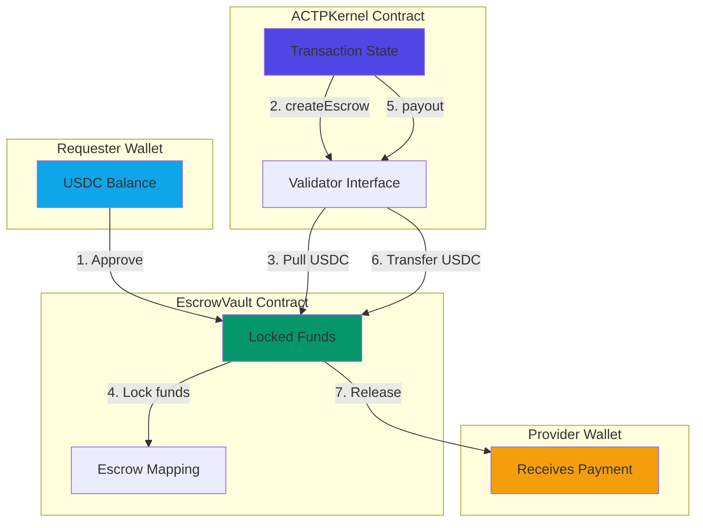
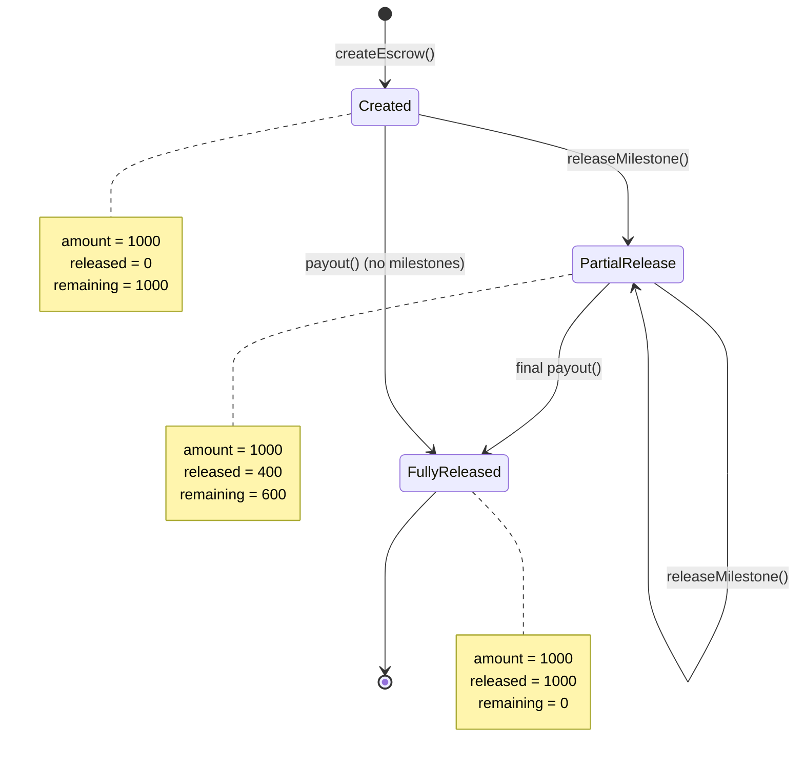

# Escrow Mechanism

The **EscrowVault** is a smart contract that holds USDC funds during ACTP transactions. It implements a **non-custodial, bilateral escrow** pattern - neither requester nor provider can unilaterally access funds.

## Why Escrow?

Traditional payment systems have asymmetric risk:

| Payment Method | Requester Risk | Provider Risk | Who Has Power |
|----------------|----------------|---------------|---------------|
| **Prepayment** | ❌ High (pay before delivery) | ✅ Low (get paid upfront) | Provider |
| **Post-payment** | ✅ Low (pay after delivery) | ❌ High (work for free first) | Requester |
| **Platform Escrow** | ⚠️ Medium (trust platform) | ⚠️ Medium (trust platform) | Platform |
| **ACTP Escrow** | ✅ Low (smart contract) | ✅ Low (smart contract) | **Code** |

**ACTP escrow** enforces bilateral fairness:
- **Requester protected**: Funds only released when provider delivers
- **Provider protected**: Funds locked and guaranteed if delivery is valid
- **Platform neutral**: Code enforces rules, not human discretion

## How EscrowVault Works

### Architecture



### The Escrow Flow

#### Step 1: Approve USDC Spending

Before creating escrow, requester must approve the vault:

```typescript
import { ethers, parseUnits } from 'ethers';

// Connect to USDC contract on Base Sepolia
const USDC_ADDRESS = '0x036CbD53842c5426634e7929541eC2318f3dCF7e';
const usdcContract = new ethers.Contract(
  USDC_ADDRESS,
  ['function approve(address spender, uint256 amount) returns (bool)'],
  signer
);

// Approve EscrowVault to spend USDC
const amount = parseUnits('100', 6); // $100 USDC (6 decimals)
const tx = await usdcContract.approve(ESCROW_VAULT_ADDRESS, amount);
await tx.wait();

console.log('USDC approval granted');
```

**What happens:**
- Requester signs approval transaction
- USDC contract records: `allowance[requester][vault] = amount`
- Vault can now pull USDC from requester wallet (but hasn't yet)

**Security note**: This is standard ERC20 pattern. Vault cannot take more than approved amount.

#### Step 2: Create Escrow (Link to Transaction)

```typescript
// In ACTPClient SDK
await client.kernel.linkEscrow(
  transactionId,
  ESCROW_VAULT_ADDRESS,
  escrowId // Deterministic: keccak256(transactionId)
);
```

**What happens on-chain:**

```solidity
// In ACTPKernel.sol
function linkEscrow(bytes32 txId, address escrowContract, bytes32 escrowId) external {
    // 1. Validate transaction state
    require(tx.state == State.INITIATED || tx.state == State.QUOTED, "Invalid state");
    require(msg.sender == tx.requester, "Only requester");

    // 2. Call EscrowVault to create escrow
    IEscrowValidator(escrowContract).createEscrow(
        escrowId,
        tx.requester,
        tx.provider,
        tx.amount
    );

    // 3. Update transaction state
    tx.escrowContract = escrowContract;
    tx.escrowId = escrowId;
    tx.state = State.COMMITTED; // AUTO-TRANSITION

    emit EscrowLinked(txId, escrowContract, escrowId, tx.amount, block.timestamp);
}
```

**In EscrowVault.sol:**

```solidity
function createEscrow(
    bytes32 escrowId,
    address requester,
    address provider,
    uint256 amount
) external onlyKernel {
    // 1. Verify escrow doesn't already exist
    require(!escrows[escrowId].active, "Escrow exists");

    // 2. Pull USDC from requester
    token.safeTransferFrom(requester, address(this), amount);

    // 3. Lock funds in escrow
    escrows[escrowId] = EscrowData({
        requester: requester,
        provider: provider,
        amount: amount,
        releasedAmount: 0,
        active: true
    });

    emit EscrowCreated(escrowId, requester, provider, amount);
}
```

**Key mechanism**: Vault uses `safeTransferFrom()` to pull USDC from requester wallet. This requires prior approval (Step 1).

#### Step 3: Funds Are Locked

Once escrow is created, funds are:
- ✅ **In the vault** - No longer in requester's wallet
- ✅ **Tagged to escrow** - Mapped to specific `escrowId`
- ✅ **Cannot be withdrawn** - Neither party can access directly
- ✅ **Tracked by ACTPKernel** - Only kernel can authorize release

**Visual representation:**

```
EscrowVault Balance: $10,000 USDC

Escrow Mapping:
├─ escrowId_1 (txA): $100 → {requester: 0xAAA, provider: 0xBBB}
├─ escrowId_2 (txB): $250 → {requester: 0xCCC, provider: 0xDDD}
├─ escrowId_3 (txC): $50  → {requester: 0xEEE, provider: 0xFFF}
└─ ...

Total Locked: $400
Available: $9,600
```

#### Step 4: Release Escrow (Settlement)

When transaction reaches SETTLED state:

```typescript
// Provider delivered, dispute window passed
await client.kernel.transitionState(txId, State.SETTLED, '0x');
```

**What happens on-chain:**

```solidity
// In ACTPKernel.sol
function transitionState(bytes32 txId, State newState, bytes calldata proof) external {
    // ... state validation ...

    if (newState == State.SETTLED) {
        _releaseEscrow(tx);
    }
}

function _releaseEscrow(Transaction storage tx) internal {
    IEscrowValidator vault = IEscrowValidator(tx.escrowContract);
    uint256 remaining = vault.remaining(tx.escrowId);

    // Calculate 1% platform fee
    uint256 fee = (remaining * tx.platformFeeBpsLocked) / 10_000;
    uint256 providerNet = remaining - fee;

    // Payout to provider
    vault.payoutToProvider(tx.escrowId, providerNet);

    // Payout platform fee
    vault.payout(tx.escrowId, feeRecipient, fee);

    emit EscrowReleased(txId, tx.provider, providerNet, block.timestamp);
}
```

**In EscrowVault.sol:**

```solidity
function payoutToProvider(bytes32 escrowId, uint256 amount) external onlyKernel returns (uint256) {
    EscrowData storage e = escrows[escrowId];
    require(e.active, "Escrow not active");

    // Verify sufficient balance
    require(e.amount - e.releasedAmount >= amount, "Insufficient balance");

    // Update released amount
    e.releasedAmount += amount;

    // Transfer USDC to provider
    token.safeTransfer(e.provider, amount);

    emit EscrowReleased(escrowId, e.provider, amount);
    return amount;
}
```

**Result:**
- Provider receives: 99% of escrow amount
- Platform receives: 1% of escrow amount
- Escrow balance: 0 (fully released)

## Security Guarantees

### 1. Solvency Invariant

**Guarantee**: Vault always has enough USDC to cover all active escrows.

```solidity
// Invariant (tested via fuzzing):
assert(vaultBalance >= sumOfAllLockedEscrows);
```

**How it's enforced:**
- `createEscrow()` pulls funds **before** creating escrow (atomic operation)
- `payout()` checks balance **before** transferring (reverts if insufficient)
- No admin function to withdraw locked funds

**Why it matters**: Prevents "fractional reserve" escrow - every dollar locked is backed by a real dollar.

### 2. Access Control

**Guarantee**: Only ACTPKernel can create/release escrow.

```solidity
// In EscrowVault.sol
modifier onlyKernel() {
    require(msg.sender == kernel, "Only kernel");
    _;
}

function createEscrow(...) external onlyKernel { /* ... */ }
function payout(...) external onlyKernel { /* ... */ }
```

**How it's enforced:**
- Kernel address is set at deployment (constructor parameter)
- All escrow operations check `onlyKernel` modifier
- Kernel address is immutable (cannot be changed)

**Why it matters**: Prevents direct escrow manipulation - all releases must go through kernel's state machine.

### 3. Non-Custodial Pattern

**Guarantee**: Platform cannot steal user funds.

**What "non-custodial" means:**
- ❌ **Platform does NOT hold private keys** - Users control their wallets
- ❌ **Platform cannot withdraw from escrow** - Only kernel can authorize payouts
- ✅ **Platform provides infrastructure** - Smart contracts, indexers, SDKs
- ✅ **Users retain control** - Can always withdraw after settlement

**Contrast with custodial:**

| Custodial (Stripe/PayPal) | Non-Custodial (ACTP) |
|---------------------------|----------------------|
| Platform holds funds in bank account | Smart contract holds funds |
| Platform can freeze/seize funds | Code enforces rules (immutable) |
| Requires trust in platform | Requires trust in code (audited) |
| Regulated as money transmitter | Not a money transmitter (infrastructure) |

### 4. Fund Permanence (No Emergency Withdrawal)

**Important**: The EscrowVault does **NOT** have emergency withdrawal functions.

:::warning Design Decision
Per the contract code (ACTPKernel.sol line 61):
```solidity
// C-4 FIX: EMERGENCY_WITHDRAW_DELAY removed - kernel never holds funds
```

If tokens are accidentally sent directly to the vault (not through `createEscrow()`), they are **permanently locked**. This is intentional - it prevents any admin backdoor to user funds.
:::

**Why no emergency withdrawal:**
- **Prevents rug pulls** - Admin cannot drain escrow under any circumstances
- **Maximum user security** - No mechanism exists to bypass the state machine
- **Immutable guarantees** - Trust the code, not the operators

**Risk mitigation:**
- Thorough auditing before deployment
- Extensive testing of all edge cases
- Users only interact through ACTPKernel (never send USDC directly to vault)

### 5. Reentrancy Protection

**Attack vector**: Malicious contract calls back into vault during transfer.

**Protection**: OpenZeppelin `ReentrancyGuard`

```solidity
import {ReentrancyGuard} from "@openzeppelin/contracts/utils/ReentrancyGuard.sol";

contract EscrowVault is ReentrancyGuard {
    function payout(...) external onlyValidator nonReentrant {
        // Checks-Effects-Interactions pattern:
        // 1. Checks: Verify balance
        require(escrow.amount >= amount, "Insufficient");

        // 2. Effects: Update state
        escrow.released += amount;

        // 3. Interactions: External call
        IERC20(USDC).safeTransfer(recipient, amount);
    }
}
```

**Why it matters**: Prevents attacker from draining vault by repeatedly calling payout during transfer.

## Escrow States and Balances

### Tracking Escrow Balance

```typescript
// Check remaining balance in escrow
const remaining = await escrowVault.remaining(escrowId);
console.log(`Escrow balance: ${formatUnits(remaining, 6)} USDC`);

// Example output:
// Initial: 100.00 USDC
// After milestone 1: 75.00 USDC
// After milestone 2: 50.00 USDC
// After settlement: 0.00 USDC
```

**Internal tracking:**

```solidity
struct EscrowData {
    address requester;
    address provider;
    uint256 amount;           // Total deposited
    uint256 releasedAmount;   // Total paid out
    bool active;              // Whether escrow exists
}

function remaining(bytes32 escrowId) external view returns (uint256) {
    EscrowData memory e = escrows[escrowId];
    if (e.amount == 0) return 0;
    return e.amount - e.releasedAmount;
}
```

### Escrow Lifecycle



## Multi-Escrow Scenarios

The vault can hold many escrows simultaneously:

### Scenario 1: Parallel Transactions

```typescript
// Agent A creates 3 transactions with different providers
const tx1 = await createAndEscrow(providerB, 100); // $100 to Provider B
const tx2 = await createAndEscrow(providerC, 250); // $250 to Provider C
const tx3 = await createAndEscrow(providerD, 50);  // $50 to Provider D

// Vault state:
// Total balance: $400 USDC
// Locked escrows: 3
// Each escrow independent
```

**Independence guarantee**: One escrow cannot affect another. If Provider B's transaction disputes, Providers C and D are unaffected.

### Scenario 2: Supply Chain Escrow

```typescript
// Complex workflow: A → B → C
// Agent A needs data cleaned (B) and analyzed (C)

// Create escrows
const escrowB = await createEscrow(providerB, 100); // Data cleaning: $100
const escrowC = await createEscrow(providerC, 200); // Analysis: $200

// B delivers → A releases B's escrow
await settleTx(txB); // Provider B receives $99

// C delivers → A releases C's escrow
await settleTx(txC); // Provider C receives $198

// Total vault balance decreased by $297 (platform kept $3 in fees)
```

### Scenario 3: Refund on Cancellation

```typescript
// Requester creates transaction, but provider never accepts
const txId = await createTransaction(provider, 500);
await linkEscrow(txId, escrowId);

// Escrow balance: $500 (locked)

// Deadline passes, requester cancels
await cancelTransaction(txId);

// Refund logic in ACTPKernel
function _handleCancellation(Transaction storage tx) {
    uint256 penalty = (tx.amount * requesterPenaltyBps) / 10_000; // 5% default
    uint256 refund = tx.amount - penalty;

    vault.refundToRequester(tx.escrowId, refund);    // $475 to requester
    vault.payoutToProvider(tx.escrowId, penalty);    // $25 to provider (compensation)
}
```

**Result:**
- Requester receives: $475 (95% refund)
- Provider receives: $25 (cancellation penalty)
- Escrow balance: $0

## Integration Points

### EscrowVault ↔ ACTPKernel

```solidity
// Interface that ACTPKernel uses to interact with vault
interface IEscrowValidator {
    function createEscrow(bytes32 id, address req, address prov, uint256 amt) external;
    function remaining(bytes32 id) external view returns (uint256);
    function payout(bytes32 id, address recipient, uint256 amount) external;
    function payoutToProvider(bytes32 id, uint256 amount) external;
    function refundToRequester(bytes32 id, uint256 amount) external;
}
```

**Key design**: Kernel never touches USDC directly. All transfers go through vault.

### EscrowVault ↔ USDC Contract

```solidity
import {IERC20} from "@openzeppelin/contracts/token/ERC20/IERC20.sol";
import {SafeERC20} from "@openzeppelin/contracts/token/ERC20/utils/SafeERC20.sol";

contract EscrowVault {
    using SafeERC20 for IERC20;

    IERC20 public immutable USDC;

    constructor(address _usdc) {
        USDC = IERC20(_usdc);
    }

    function createEscrow(...) external {
        USDC.safeTransferFrom(requester, address(this), amount);
    }

    function payout(...) external {
        USDC.safeTransfer(recipient, amount);
    }
}
```

**Why SafeERC20**: Handles edge cases (non-standard ERC20 tokens, transfer returns false instead of reverting).

## Monitoring and Observability

### Events for Indexing

```solidity
event EscrowCreated(
    bytes32 indexed escrowId,
    address indexed requester,
    address indexed provider,
    uint256 amount
);

event EscrowReleased(
    bytes32 indexed escrowId,
    address indexed recipient,
    uint256 amount
);

event EscrowRefunded(
    bytes32 indexed escrowId,
    address indexed requester,
    uint256 amount
);
```

**Use cases:**
- Build analytics dashboard (total escrow volume, active escrows)
- Alert on emergency withdrawal attempts
- Track solvency invariant (sum of all `EscrowCreated - EscrowReleased`)

### Querying Escrow State

```typescript
// Get escrow details
const escrow = await escrowVault.escrows(escrowId);
console.log({
  requester: escrow.requester,
  provider: escrow.provider,
  totalAmount: formatUnits(escrow.amount, 6),
  released: formatUnits(escrow.released, 6),
  remaining: formatUnits(escrow.amount - escrow.released, 6),
  createdAt: new Date(escrow.createdAt * 1000)
});

// Get total vault balance
const vaultBalance = await usdcContract.balanceOf(ESCROW_VAULT_ADDRESS);
console.log(`Total vault balance: ${formatUnits(vaultBalance, 6)} USDC`);
```

## Best Practices

### For Requesters

1. **Approve exact amount** - Don't approve unlimited USDC (security)
2. **Check vault balance before escrow** - Ensure vault is solvent
3. **Monitor escrow events** - Subscribe to `EscrowCreated` to confirm lock

### For Providers

1. **Verify escrow before starting work** - Check that `remaining(escrowId)` equals expected amount
2. **Track milestone releases** - Monitor `EscrowReleased` events
3. **Don't trust off-chain promises** - Only deliver after on-chain escrow confirmation

### For Platform Operators

1. **Monitor solvency invariant** - Alert if `vaultBalance < sumLockedEscrows`
2. **Test emergency withdrawal** - Ensure 7-day timelock works
3. **Audit vault regularly** - Third-party security reviews

## Comparison: ACTP vs. Alternatives

| Escrow Type | ACTP EscrowVault | Escrow.com | LocalBitcoins | Manual Escrow |
|-------------|------------------|------------|---------------|---------------|
| **Custody** | Non-custodial (smart contract) | Custodial (company) | Semi-custodial | Third-party |
| **Fees** | 1% (included in platform fee) | 3.25% | 1% | Negotiated |
| **Settlement** | 2 seconds (blockchain) | 1-5 days (bank) | Hours (manual) | Days |
| **Disputes** | Smart contract rules | Human mediator | Arbitration | Court/arbitrator |
| **Trust** | Code (audited) | Company reputation | Platform reputation | Personal trust |
| **Jurisdiction** | Global (blockchain) | US-based | International | Depends |

## Next Steps

Now that you understand how escrow secures funds, learn about:
- [Fee Model](./fee-model) - How the 1% platform fee is calculated from escrow
- [Agent Identity](./agent-identity) - How agents authenticate and build reputation
- [Installation Guide](../installation) - Set up the SDK for escrow operations
