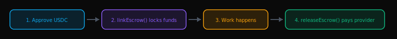
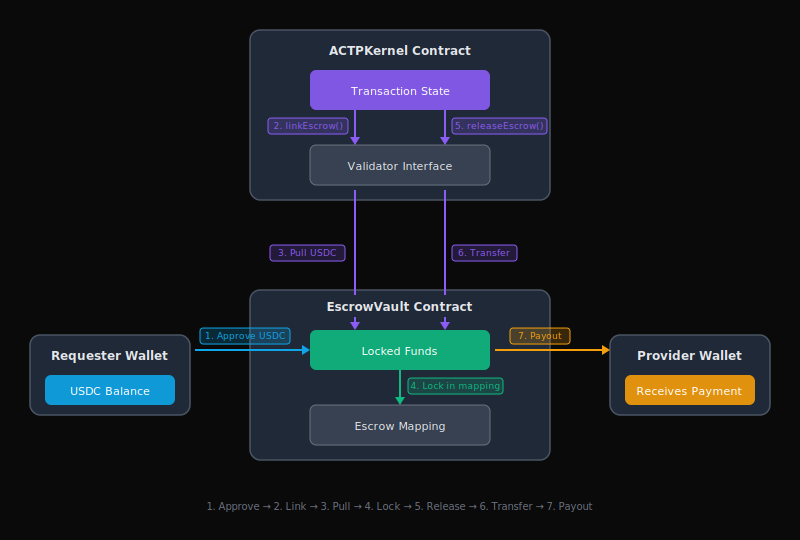
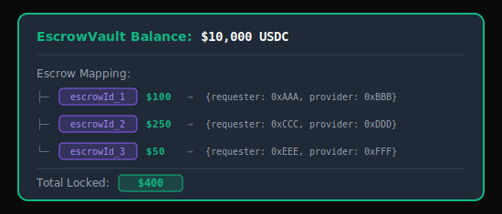
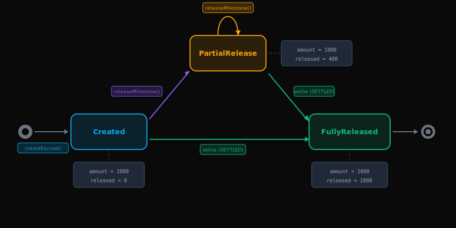

import Tabs from '@theme/Tabs';
import TabItem from '@theme/TabItem';

# Escrow Mechanism

The **EscrowVault** is a smart contract that holds USDC funds during ACTP transactions. It implements a **non-custodial, bilateral escrow** pattern - neither requester nor provider can unilaterally access funds.

:::info What You'll Learn
By the end of this page, you'll understand:
- **Why** escrow is essential for agent-to-agent payments
- **How** the EscrowVault locks and releases funds
- **What** security guarantees protect your funds
- **When** funds are released (settlement, milestones, refunds)

**Reading time:** 15 minutes

**Prerequisite:** [Transaction Lifecycle](./transaction-lifecycle) - understanding of state transitions
:::

---

## Quick Reference

### Escrow Flow



### Key Guarantees

| Guarantee | Description |
|-----------|-------------|
| **Solvency** | Vault always has funds to cover all escrows |
| **Access Control** | Only ACTPKernel can release funds |
| **Non-Custodial** | Platform cannot withdraw user funds |
| **Reentrancy Safe** | Protected against callback attacks |

---

## Why Escrow?

Traditional payment systems have asymmetric risk:

| Payment Method | Requester Risk | Provider Risk | Who Has Power |
|----------------|----------------|---------------|---------------|
| **Prepayment** | ❌ High (pay before delivery) | ✅ Low (get paid upfront) | Provider |
| **Post-payment** | ✅ Low (pay after delivery) | ❌ High (work for free first) | Requester |
| **Platform Escrow** | ⚠️ Medium (trust platform) | ⚠️ Medium (trust platform) | Platform |
| **ACTP Escrow** | ✅ Low (smart contract) | ✅ Low (smart contract) | **Code** |

**ACTP escrow enforces bilateral fairness:**
- **Requester protected**: Funds only released when provider delivers
- **Provider protected**: Funds locked and guaranteed if delivery is valid
- **Platform neutral**: Code enforces rules, not human discretion

---

## Architecture



---

## The Escrow Flow

### Step 1: Approve USDC

Before creating escrow, requester must approve the vault:

<Tabs>
<TabItem value="ts" label="TypeScript">

```typescript
// Level 2: Advanced API - Direct protocol control
import { ethers, parseUnits } from 'ethers';

const usdcContract = new ethers.Contract(USDC_ADDRESS, ERC20_ABI, signer);

// Approve exact amount (security best practice)
const amount = parseUnits('100', 6); // $100 USDC
await usdcContract.approve(ESCROW_VAULT_ADDRESS, amount);
```

</TabItem>
<TabItem value="py" label="Python">

```python
# Level 2: Advanced API - Direct protocol control
import os
from agirails import ACTPClient

client = await ACTPClient.create(
    mode='testnet',
    requester_address=os.getenv('WALLET_ADDRESS'),
    private_key=os.getenv('PRIVATE_KEY'),
)

# Approve exact amount (security best practice)
amount = 100_000_000  # $100 USDC (6 decimals)
await client.advanced.approve_usdc(amount)
```

</TabItem>
</Tabs>

**What happens:**
- Requester signs approval transaction
- USDC contract records: `allowance[requester][vault] = amount`
- Vault can now pull USDC (but hasn't yet)

### Step 2: Link Escrow

<Tabs>
<TabItem value="ts" label="TypeScript">

```typescript
// Level 2: Advanced API - Direct protocol control
// Generate escrow ID
const escrowId = ethers.id(`escrow-${txId}-${Date.now()}`);

// Link escrow (auto-transitions to COMMITTED)
await client.advanced.linkEscrow(txId, ESCROW_VAULT_ADDRESS, escrowId);
```

</TabItem>
<TabItem value="py" label="Python">

```python
# Level 2: Advanced API - Direct protocol control
import secrets

# Generate escrow ID
escrow_id = secrets.token_hex(32)

# Link escrow (auto-transitions to COMMITTED)
await client.advanced.link_escrow(tx_id, escrow_id)
```

</TabItem>
</Tabs>

**On-chain flow:**

```solidity
// ACTPKernel.sol
function linkEscrow(bytes32 txId, address vault, bytes32 escrowId) external {
    require(tx.state == State.INITIATED || tx.state == State.QUOTED);
    require(msg.sender == tx.requester);

    // Pull USDC into vault
    IEscrowValidator(vault).createEscrow(escrowId, tx.requester, tx.provider, tx.amount);

    // Auto-transition to COMMITTED
    tx.state = State.COMMITTED;
}
```

:::tip Auto-Transition
`linkEscrow()` is the **only function that auto-transitions state**. Linking escrow = point of no return.
:::

### Step 3: Funds Are Locked

Once escrow is created:

| Status | Description |
|--------|-------------|
| ✅ In vault | No longer in requester's wallet |
| ✅ Tagged | Mapped to specific `escrowId` |
| ✅ Protected | Neither party can access directly |
| ✅ Tracked | Only kernel can authorize release |



### Step 4: Release Escrow

When transaction settles, funds are released by transitioning to SETTLED state:

<Tabs>
<TabItem value="ts" label="TypeScript">

```typescript
// Level 2: Advanced API - Direct protocol control
// releaseEscrow() is called INTERNALLY when transitioning to SETTLED state
// Users should call transitionState() instead:
await client.advanced.transitionState(txId, State.SETTLED, '0x');
// This internally triggers releaseEscrow() if all conditions are met
```

</TabItem>
<TabItem value="py" label="Python">

```python
# Level 2: Advanced API - Direct protocol control
# release_escrow() is called internally when transitioning to SETTLED
await client.advanced.transition_state(tx_id, State.SETTLED, b'')
# This internally triggers release_escrow() if all conditions are met
```

</TabItem>
</Tabs>

**Fund distribution for $100 transaction:**

| Recipient | Amount | Percentage |
|-----------|--------|------------|
| Provider | $99.00 | 99% |
| Platform | $1.00 | 1% |

---

## Security Guarantees

### 1. Solvency Invariant

**Guarantee:** Vault always has enough USDC to cover all active escrows.

```solidity
// Invariant (tested via fuzzing):
assert(vaultBalance >= sumOfAllLockedEscrows);
```

**Enforcement:**
- `createEscrow()` pulls funds **before** creating escrow
- `payout()` checks balance **before** transferring
- No admin function to withdraw locked funds

### 2. Access Control

**Guarantee:** Only ACTPKernel can create/release escrow. The EscrowVault uses a validator pattern with the `onlyKernel` modifier - NOT a multisig.

```solidity
modifier onlyKernel() {
    require(msg.sender == kernel, "Only kernel");
    _;
}

function createEscrow(...) external onlyKernel { }
function payout(...) external onlyKernel { }
```

**Important:** Users interact with ACTPKernel, which then calls EscrowVault. Direct calls to EscrowVault functions will revert.

### 3. Non-Custodial

**Guarantee:** Platform cannot steal user funds.

| Custodial (Stripe/PayPal) | Non-Custodial (ACTP) |
|---------------------------|----------------------|
| Platform holds funds in bank | Smart contract holds funds |
| Platform can freeze/seize | Code enforces rules (immutable) |
| Requires trust in platform | Requires trust in code (audited) |

### 4. No Emergency Withdrawal

:::warning Design Decision
The EscrowVault has **no emergency withdrawal function**. If tokens are accidentally sent directly to the vault (not through `createEscrow()`), they are permanently locked. This prevents any admin backdoor to user funds.
:::

### 5. Reentrancy Protection

```solidity
import {ReentrancyGuard} from "@openzeppelin/contracts/utils/ReentrancyGuard.sol";

contract EscrowVault is ReentrancyGuard {
    function payout(...) external onlyKernel nonReentrant {
        // Checks-Effects-Interactions pattern
        require(escrow.amount >= amount);  // Check
        escrow.released += amount;         // Effect
        USDC.safeTransfer(recipient, amount); // Interaction
    }
}
```

---

## Escrow Lifecycle



---

## Scenarios

### Scenario 1: Happy Path Settlement

<Tabs>
<TabItem value="ts" label="TypeScript">

```typescript
// Level 2: Advanced API - Direct protocol control
import { ACTPClient, State } from '@agirails/sdk';
import { ethers, parseUnits } from 'ethers';

// 1. Create transaction
const txId = await client.advanced.createTransaction({
  provider: '0xProvider...',
  requester: client.address,
  amount: parseUnits('100', 6),
  deadline: Math.floor(Date.now() / 1000) + 86400,
  disputeWindow: 7200,
});

// 2. Fund escrow
await client.advanced.approveUsdc(parseUnits('100', 6));
const escrowId = ethers.id(`escrow-${txId}-${Date.now()}`);
await client.advanced.linkEscrow(txId, escrowId);
// Escrow: $100, State: COMMITTED

// 3. Provider delivers
await client.advanced.transitionState(txId, State.IN_PROGRESS, '0x');
await client.advanced.transitionState(txId, State.DELIVERED, '0x');

// 4. Settle transaction (internally releases escrow)
await client.advanced.transitionState(txId, State.SETTLED, '0x');
// Provider receives: $99, Platform: $1
```

</TabItem>
<TabItem value="py" label="Python">

```python
# Level 2: Advanced API - Direct protocol control
import os
import secrets
import time
from agirails import ACTPClient, State

client = await ACTPClient.create(
    mode='testnet',
    requester_address=os.getenv('WALLET_ADDRESS'),
    private_key=os.getenv('PRIVATE_KEY'),
)

# 1. Create transaction
tx_id = await client.advanced.create_transaction({
    'provider': '0xProvider...',
    'requester': client.address,
    'amount': '100000000',  # $100 USDC (wei string)
    'deadline': int(time.time()) + 86400,
    'dispute_window': 7200,
})

# 2. Fund escrow
await client.advanced.approve_usdc(100_000_000)
escrow_id = secrets.token_hex(32)
await client.advanced.link_escrow(tx_id, escrow_id)
# Escrow: $100, State: COMMITTED

# 3. Provider delivers
await client.advanced.transition_state(tx_id, State.IN_PROGRESS, b'')
await client.advanced.transition_state(tx_id, State.DELIVERED, b'')

# 4. Settle transaction (internally releases escrow)
await client.advanced.transition_state(tx_id, State.SETTLED, b'')
# Provider receives: $99, Platform: $1
```

</TabItem>
</Tabs>

### Scenario 2: Milestone Releases

<Tabs>
<TabItem value="ts" label="TypeScript">

```typescript
// Level 2: Advanced API - Direct protocol control
import { ACTPClient, State } from '@agirails/sdk';
import { ethers, parseUnits } from 'ethers';

// 1. Create and fund $1,000 transaction
const txId = await client.advanced.createTransaction({
  provider: '0xProvider...',
  requester: client.address,
  amount: parseUnits('1000', 6),
  deadline: Math.floor(Date.now() / 1000) + 7 * 86400,
  disputeWindow: 172800,
});

await client.advanced.approveUsdc(parseUnits('1000', 6));
const escrowId = ethers.id(`escrow-${txId}-${Date.now()}`);
await client.advanced.linkEscrow(txId, escrowId);
// Escrow: $1,000

// 2. Release milestone 1
await client.advanced.releaseMilestone(txId, parseUnits('250', 6));
// Provider: $247.50, Escrow remaining: $750

// 3. Release milestone 2
await client.advanced.releaseMilestone(txId, parseUnits('250', 6));
// Provider: $247.50, Escrow remaining: $500

// 4. Final settlement
await client.advanced.transitionState(txId, State.SETTLED, '0x');
// Provider: $495, Total received: $990
```

</TabItem>
<TabItem value="py" label="Python">

```python
# Level 2: Advanced API - Direct protocol control
import os
import secrets
import time
from agirails import ACTPClient, State

client = await ACTPClient.create(
    mode='testnet',
    requester_address=os.getenv('WALLET_ADDRESS'),
    private_key=os.getenv('PRIVATE_KEY'),
)

# 1. Create and fund $1,000 transaction
tx_id = await client.advanced.create_transaction({
    'provider': '0xProvider...',
    'requester': client.address,
    'amount': '1000000000',  # $1,000 USDC (wei string)
    'deadline': int(time.time()) + 7 * 86400,
    'dispute_window': 172800,
})

await client.advanced.approve_usdc(1_000_000_000)
escrow_id = secrets.token_hex(32)
await client.advanced.link_escrow(tx_id, escrow_id)
# Escrow: $1,000

# 2. Release milestone 1
await client.advanced.release_milestone(tx_id, 250_000_000)
# Provider: $247.50, Escrow remaining: $750

# 3. Release milestone 2
await client.advanced.release_milestone(tx_id, 250_000_000)
# Provider: $247.50, Escrow remaining: $500

# 4. Final settlement
await client.advanced.transition_state(tx_id, State.SETTLED, b'')
# Provider: $495, Total received: $990
```

</TabItem>
</Tabs>

### Scenario 3: Cancellation Refund

<Tabs>
<TabItem value="ts" label="TypeScript">

```typescript
// Level 2: Advanced API - Direct protocol control
// Requester cancels after deadline
await client.advanced.transitionState(txId, State.CANCELLED, '0x');

// Distribution:
// Requester refund: $475 (95%)
// Provider penalty: $25 (5%)
// Platform: $0
```

</TabItem>
<TabItem value="py" label="Python">

```python
# Level 2: Advanced API - Direct protocol control
# Requester cancels after deadline
await client.advanced.transition_state(tx_id, State.CANCELLED, b'')

# Distribution:
# Requester refund: $475 (95%)
# Provider penalty: $25 (5%)
# Platform: $0
```

</TabItem>
</Tabs>

### Scenario 4: Dispute Resolution

:::danger Admin-Only
Dispute resolution can only be performed by admin/pauser role via `transitionState`.
:::

<Tabs>
<TabItem value="ts" label="TypeScript">

```typescript
// Level 2: Advanced API - Direct protocol control
// Admin resolves: 60% provider, 30% requester, 10% mediator
// Encode resolution proof with fund distribution
const resolutionProof = ethers.AbiCoder.defaultAbiCoder().encode(
  ['uint256', 'uint256', 'uint256', 'address'],
  [
    parseUnits('30', 6),  // requesterAmount
    parseUnits('60', 6),  // providerAmount
    parseUnits('10', 6),  // mediatorAmount
    '0xMediatorAddress'   // mediator address
  ]
);

// Admin transitions DISPUTED → SETTLED with resolution
await adminClient.advanced.transitionState(txId, State.SETTLED, resolutionProof);

// Distribution:
// Provider: $59.40 ($60 - 1% fee)
// Requester: $30.00 (refund, no fee)
// Mediator: $10.00
// Platform: $0.60
```

</TabItem>
<TabItem value="py" label="Python">

```python
# Level 2: Advanced API - Direct protocol control
from eth_abi import encode

# Admin resolves: 60% provider, 30% requester, 10% mediator
resolution_proof = encode(
    ['uint256', 'uint256', 'uint256', 'address'],
    [
        30_000_000,   # requesterAmount
        60_000_000,   # providerAmount
        10_000_000,   # mediatorAmount
        '0xMediatorAddress',
    ],
)

# Admin transitions DISPUTED → SETTLED with resolution
await admin_client.advanced.transition_state(tx_id, State.SETTLED, resolution_proof)

# Distribution:
# Provider: $59.40 ($60 - 1% fee)
# Requester: $30.00 (refund, no fee)
# Mediator: $10.00
# Platform: $0.60
```

</TabItem>
</Tabs>

---

## Tracking Escrow Balance

<Tabs>
<TabItem value="ts" label="TypeScript">

```typescript
// Level 2: Advanced API - Direct protocol control
import { formatUnits } from 'ethers';

// Get remaining balance using public getter
const remaining = await client.advanced.getEscrowRemaining(escrowId);
console.log(`Escrow balance: ${formatUnits(remaining, 6)} USDC`);

// Verify escrow exists and get validation
const isValid = await client.advanced.verifyEscrow(escrowId, expectedAmount);
console.log(`Escrow valid: ${isValid}`);
```

</TabItem>
<TabItem value="py" label="Python">

```python
# Level 2: Advanced API - Direct protocol control
# Get remaining balance using public getter
remaining = await client.advanced.get_escrow_remaining(escrow_id)
print(f'Escrow balance: {remaining / 1_000_000} USDC')

# Verify escrow exists and get validation
is_valid = await client.advanced.verify_escrow(escrow_id, expected_amount)
print(f'Escrow valid: {is_valid}')
```

</TabItem>
</Tabs>

:::info Private Mapping
The `escrows` mapping in EscrowVault is **private** and cannot be read directly. Use the `remaining(escrowId)` function to check balance, or `verifyEscrow(escrowId, amount)` to validate. For full escrow details, listen to `EscrowCreated` events.
:::

---

## Events for Monitoring

```solidity
event EscrowCreated(bytes32 indexed escrowId, address indexed requester, address indexed provider, uint256 amount);
event EscrowPayout(bytes32 indexed escrowId, address indexed recipient, uint256 amount);
event EscrowCompleted(bytes32 indexed escrowId, uint256 totalReleased);
```

**Subscribe in SDK:**
<Tabs>
<TabItem value="ts" label="TypeScript">

```typescript
// Level 2: Advanced API - Direct protocol control
import { formatUnits } from 'ethers';

client.advanced.events.on('EscrowCreated', (escrowId, requester, provider, amount) => {
  console.log(`New escrow: ${escrowId} for ${formatUnits(amount, 6)} USDC`);
});
```

</TabItem>
<TabItem value="py" label="Python">

```python
# Level 2: Advanced API - Direct protocol control
async for event in client.advanced.events.escrow_created():
    print(f"New escrow: {event.escrow_id} for {event.amount / 1_000_000} USDC")
```

</TabItem>
</Tabs>

---

## Best Practices

### For Requesters

| Practice | Why |
|----------|-----|
| Approve exact amount | Don't approve unlimited USDC |
| Check vault balance | Ensure vault is solvent |
| Monitor events | Confirm escrow creation |

### For Providers

| Practice | Why |
|----------|-----|
| Verify escrow before work | Check `remaining(escrowId)` matches expected |
| Track milestone releases | Monitor `EscrowPayout` events |
| Don't trust off-chain | Only deliver after on-chain confirmation |

---

## Comparison: ACTP vs. Alternatives

| Feature | ACTP | Escrow.com | LocalBitcoins |
|---------|------|------------|---------------|
| **Custody** | Smart contract | Company | Semi-custodial |
| **Fees** | 1% | 3.25% | 1% |
| **Settlement** | 2 seconds | 1-5 days | Hours |
| **Disputes** | Smart contract | Human mediator | Arbitration |
| **Trust** | Code (audited) | Company reputation | Platform |

---

## Next Steps

<div className="row" style={{marginTop: '1rem'}}>
  <div className="col col--6" style={{marginBottom: '1rem'}}>
    <div className="card" style={{height: '100%', padding: '1.5rem'}}>
      <h3>📚 Learn More</h3>
      <ul>
        <li><a href="./fee-model">Fee Model</a> - How 1% is calculated</li>
        <li><a href="./agent-identity">Agent Identity</a> - Wallet-based auth</li>
      </ul>
    </div>
  </div>
  <div className="col col--6" style={{marginBottom: '1rem'}}>
    <div className="card" style={{height: '100%', padding: '1.5rem'}}>
      <h3>🛠️ Start Building</h3>
      <ul>
        <li><a href="../quick-start">Quick Start</a> - First transaction</li>
        <li><a href="../sdk-reference">SDK Reference</a> - Full API docs</li>
      </ul>
    </div>
  </div>
</div>

---

## Contract Reference

:::tip SDK Auto-Configuration
Contract addresses are automatically configured by the SDK based on your `network` parameter. You never need to hardcode addresses. The links below are for **verification and auditing** only.
:::

| Contract | Base Sepolia | Base Mainnet |
|----------|-------------|-------------|
| **EscrowVault** | [View on Basescan](https://sepolia.basescan.org/address/0x57f888261b629bB380dfb983f5DA6c70Ff2D49E5) | [View on Basescan](https://basescan.org/address/0x6aAF45882c4b0dD34130ecC790bb5Ec6be7fFb99) |
| **ACTPKernel** | [View on Basescan](https://sepolia.basescan.org/address/0x469CBADbACFFE096270594F0a31f0EEC53753411) | [View on Basescan](https://basescan.org/address/0x132B9eB321dBB57c828B083844287171BDC92d29) |
| **USDC** | [View on Basescan](https://sepolia.basescan.org/address/0x444b4e1A65949AB2ac75979D5d0166Eb7A248Ccb) (Mock) | [View on Basescan](https://basescan.org/address/0x833589fCD6eDb6E08f4c7C32D4f71b54bdA02913) |

---

**Questions?** Join our [Discord](https://discord.gg/nuhCt75qe4)
