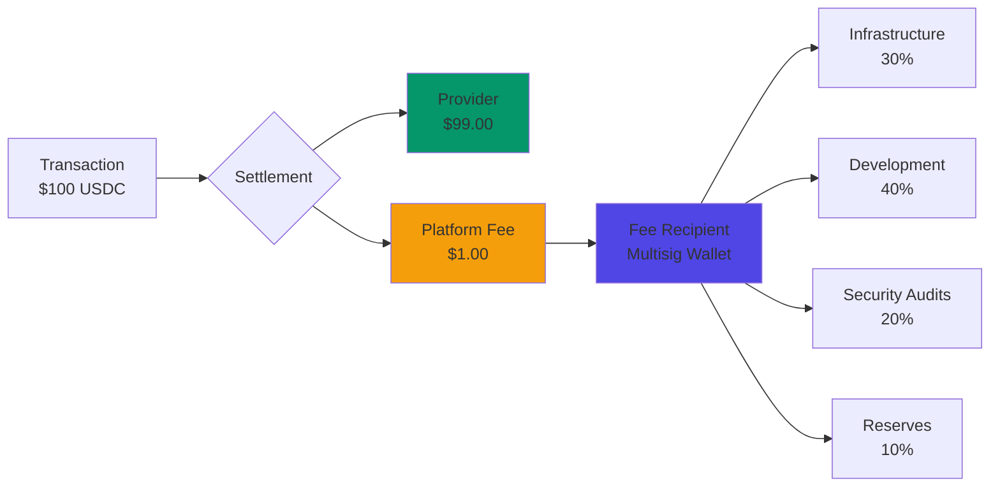

# Fee Model

| | |
|---|---|
| **Platform Fee** | 1% of transaction amount |
| **Minimum Transaction** | $0.05 USDC |
| **Fee on Minimum** | $0.0005 (not $0.05) |

:::info Key Point
The $0.05 minimum is a **transaction floor**, not a fee floor. A $1.00 transaction pays $0.01 fee (1%).
:::

## Fee Examples

| Amount | Fee (1%) | Provider Receives |
|--------|----------|-------------------|
| $0.05 | $0.0005 | $0.0495 |
| $1.00 | $0.01 | $0.99 |
| $10.00 | $0.10 | $9.90 |
| $100.00 | $1.00 | $99.00 |
| $1,000.00 | $10.00 | $990.00 |

## Why 1% Flat?

**Predictability** - Agents calculate fees deterministically: `fee = amount × 0.01`

**Competitiveness** - Cheaper than Stripe (2.9%+$0.30), PayPal (3.49%+$0.49), comparable to Coinbase Commerce (1%)

**No tiers** - Same rate for $1 and $10,000 transactions

## Why $0.05 Minimum?

The minimum transaction amount prevents **dust spam attacks**:

| Without minimum | With $0.05 minimum |
|-----------------|-------------------|
| 100K transactions × $0.01 = $1,000 attack cost | 100K transactions × $0.05 = $5,000 attack cost |
| Low barrier to state bloat | Economically impractical |

The minimum forces attackers to commit real capital, not generate noise.

## Fee Calculation in Code

### Smart Contract Implementation

```solidity
// In ACTPKernel.sol
uint16 public platformFeeBps = 100; // 1% = 100 basis points
uint16 public constant MAX_BPS = 10_000; // 100% = 10,000 basis points

function _calculateFee(uint256 grossAmount, uint16 lockedFeeBps) internal pure returns (uint256) {
    return (grossAmount * lockedFeeBps) / MAX_BPS;
}

// Example: $100 transaction
// fee = (100e6 * 100) / 10_000 = 1e6 = $1.00 USDC
```

**Key detail**: Fee uses **locked fee percentage** from transaction creation (AIP-5).

**Why locked?**: Prevents platform from changing fees mid-transaction.

```solidity
struct Transaction {
    // ... other fields ...
    uint16 platformFeeBpsLocked; // Fee % locked at creation time
}

function createTransaction(...) external {
    tx.platformFeeBpsLocked = platformFeeBps; // Lock current fee
}

function _payoutProviderAmount(...) internal {
    // Use LOCKED fee, not current fee
    uint256 fee = _calculateFee(grossAmount, tx.platformFeeBpsLocked);
}
```

**Example scenario:**

```
Day 1: Create transaction, platform fee = 1% (100 bps)
  → Transaction locks: platformFeeBpsLocked = 100

Day 5: Platform changes fee to 2% (200 bps)
  → Doesn't affect existing transaction

Day 10: Transaction settles
  → Fee calculated: 1% (uses locked value)
```

### SDK Implementation

```typescript
import { parseUnits, formatUnits } from 'ethers';

// USDC has 6 decimals
const USDC_DECIMALS = 6;
const MIN_TRANSACTION = parseUnits('0.05', USDC_DECIMALS); // $0.05 minimum transaction

function calculateFee(amount: bigint, feeBps: number = 100): bigint {
  // Simple percentage calculation - no minimum fee floor
  return (amount * BigInt(feeBps)) / BigInt(10_000);
}

function validateTransaction(amount: bigint): boolean {
  return amount >= MIN_TRANSACTION;
}

// Example usage
const amount = parseUnits('100', USDC_DECIMALS); // $100 USDC

if (!validateTransaction(amount)) {
  throw new Error('Amount below minimum ($0.05)');
}

const fee = calculateFee(amount); // 1e6 = $1.00
const providerNet = amount - fee; // 99e6 = $99.00

console.log(`Amount: ${formatUnits(amount, 6)} USDC`);
console.log(`Fee: ${formatUnits(fee, 6)} USDC`);
console.log(`Provider receives: ${formatUnits(providerNet, 6)} USDC`);
```

**Output:**
```
Amount: 100.0 USDC
Fee: 1.0 USDC
Provider receives: 99.0 USDC
```

## Fee Distribution

### Where Fees Go



**Fee recipient address** (Base Sepolia testnet):
- Set at contract deployment: `feeRecipient` parameter
- Currently: 3-of-5 multisig controlled by founders + advisors
- Changeable by admin with 2-day timelock (prevents surprise extraction)

**Future (Month 12+)**: Fee recipient transitions to DAO treasury, community-governed.

### Fee Usage Breakdown (Projected)

At scale ($10M monthly GMV):

| Category | % of Fees | Monthly (at $10M GMV) | Purpose |
|----------|-----------|----------------------|---------|
| **Infrastructure** | 30% | $30,000 | Base L2 gas, RPC nodes, indexers |
| **Development** | 40% | $40,000 | Engineering, product, design |
| **Security** | 20% | $20,000 | Audits, bug bounties, insurance |
| **Reserves** | 10% | $10,000 | Emergency fund, market volatility buffer |

**Total revenue**: $100,000/month at 1% of $10M GMV

**Burn rate**: $100,000/month (breakeven at $10M GMV)

## Fee Caps and Limits

### Maximum Platform Fee Cap

```solidity
uint16 public constant MAX_PLATFORM_FEE_CAP = 500; // 5%

function _validatePlatformFee(uint16 newFee) internal pure {
    require(newFee <= MAX_PLATFORM_FEE_CAP, "Fee exceeds cap");
}
```

**Guarantee**: Platform fee can **never** exceed 5%, even if admin tries to change it.

**Why 5% cap**: Protects users from rent-seeking. Even if platform is compromised, fee stays reasonable.

### Fee Change Timelock

**Economic parameter changes** require 2-day advance notice:

```solidity
uint256 public constant ECONOMIC_PARAM_DELAY = 2 days;

struct PendingEconomicParams {
    uint16 platformFeeBps;
    uint16 requesterPenaltyBps;
    uint256 executeAfter;
    bool active;
}

function scheduleEconomicParams(uint16 newFeeBps, ...) external onlyAdmin {
    require(newFeeBps <= MAX_PLATFORM_FEE_CAP, "Fee too high");

    pendingEconomicParams = PendingEconomicParams({
        platformFeeBps: newFeeBps,
        executeAfter: block.timestamp + ECONOMIC_PARAM_DELAY,
        active: true
    });

    emit EconomicParamsUpdateScheduled(newFeeBps, executeAfter);
}

function executeEconomicParamsUpdate() external {
    require(block.timestamp >= pending.executeAfter, "Too early");
    platformFeeBps = pending.platformFeeBps; // Now effective
}
```

**User protection:**
1. Admin schedules fee change (e.g., 1% → 1.5%)
2. `EconomicParamsUpdateScheduled` event emitted (public notice)
3. 2-day wait period (users can exit if they disagree)
4. After 2 days, anyone can execute the change
5. New transactions use new fee, old transactions use locked fee

**Example timeline:**

```
Day 0: Admin schedules fee increase to 1.5%
       → Event emitted, users notified

Day 1: Users can still create transactions at 1% (old fee)
       → Decide if 1.5% is acceptable

Day 2: Timelock expires
       → Anyone executes update

Day 3: New transactions use 1.5% fee
       → Old transactions still use 1% (locked)
```

## Fee-Related Edge Cases

### Scenario 1: Transaction Below Minimum ($0.01)

```typescript
// Attempt to create $0.01 transaction
await client.kernel.createTransaction({
  amount: parseUnits('0.01', 6), // $0.01
  // ...
});

// REVERTS with: "Amount below minimum"
// Minimum transaction amount: $0.05 USDC (50,000 wei at 6 decimals)
```

**Why**: Prevents dust spam, ensures each transaction requires meaningful capital commitment.

### Scenario 2: Milestone Releases (Incremental Fees)

```typescript
// Create $1,000 transaction
const txId = await createTransaction({ amount: parseUnits('1000', 6) });
await linkEscrow(txId);

// Release milestone 1: $250
await releaseMilestone(txId, parseUnits('250', 6));
// Fee: $250 * 1% = $2.50
// Provider receives: $247.50
// Escrow remaining: $750

// Release milestone 2: $250
await releaseMilestone(txId, parseUnits('250', 6));
// Fee: $2.50
// Provider receives: $247.50
// Escrow remaining: $500

// Final settlement: $500
await transitionState(txId, State.SETTLED);
// Fee: $5.00
// Provider receives: $495.00

// TOTAL:
// Provider: $247.50 + $247.50 + $495.00 = $990.00
// Platform: $2.50 + $2.50 + $5.00 = $10.00
// Original: $1,000.00 ✓
```

**Implication**: Fee charged on each milestone release, not just final settlement.

### Scenario 3: Dispute Resolution Split

```typescript
// $100 transaction disputed
// Mediator decides: 60% provider, 30% requester, 10% mediator

const resolution = ethers.utils.defaultAbiCoder.encode(
  ['uint256', 'uint256', 'address', 'uint256'],
  [
    parseUnits('30', 6), // Requester: $30
    parseUnits('60', 6), // Provider: $60
    mediatorAddress,
    parseUnits('10', 6)  // Mediator: $10
  ]
);

await transitionState(txId, State.SETTLED, resolution);

// Fee calculation:
// Provider's $60: fee = $0.60, net = $59.40
// Requester's $30: refunded in full (no fee on refunds)
// Mediator's $10: paid in full (no fee on mediator payments)

// Distribution:
// Provider: $59.40
// Requester: $30.00
// Mediator: $10.00
// Platform: $0.60
// TOTAL: $100.00 ✓
```

**Key rule**: Fee only charged on provider payouts, not refunds or mediator fees.

### Scenario 4: Cancellation with Penalty

```typescript
// Requester cancels after deadline (committed $500)
await transitionState(txId, State.CANCELLED);

// Penalty: 5% of $500 = $25
// Refund: $500 - $25 = $475

// Distribution:
// Requester refund: $475 (no fee)
// Provider penalty: $25 (no fee)
// Platform: $0 (no fee on cancellations)
```

**Key rule**: Cancellation penalty goes to provider, platform gets no fee.

## Comparison: ACTP vs. Competitors

### Fee Comparison Table

| Platform | Base Fee | Per-Transaction | Total on $100 | Total on $1,000 | Total on $10,000 |
|----------|----------|-----------------|---------------|-----------------|------------------|
| **ACTP** | 1% | $0 | **$1.00** | **$10.00** | **$100.00** |
| Stripe | 2.9% | $0.30 | $3.20 | $29.30 | $290.30 |
| PayPal | 3.49% | $0.49 | $3.98 | $35.39 | $349.49 |
| Square | 2.6% | $0.10 | $2.70 | $26.10 | $260.10 |
| Coinbase Commerce | 1% | $0 | $1.00 | $10.00 | $100.00 |
| Wire Transfer (domestic) | $0 | $25 | $25.00 | $25.00 | $25.00 |
| Wire Transfer (international) | $0 | $45 | $45.00 | $45.00 | $45.00 |

**Analysis:**

| Transaction Size | Cheapest Option | ACTP Ranking |
|------------------|-----------------|--------------|
| **< $25** | ACTP (1%) | 🥇 #1 |
| **$25 - $2,500** | ACTP / Coinbase (tie 1%) | 🥇 #1 (tie) |
| **> $2,500** | Wire transfer ($25 flat) | 🥈 #2 |

**Takeaway**: ACTP is optimal for typical agent-to-agent transactions ($1-$1,000 range).

### Gas Cost Inclusion

**ACTP total cost = Platform fee + Gas fee**

```typescript
// Example: $100 transaction on Base L2
const platformFee = 1.00; // 1% of $100
const gasFee = 0.001;     // ~$0.001 at 1 gwei base fee

const totalCost = platformFee + gasFee; // $1.001 total

// Compare to Stripe
const stripeFee = 3.20; // 2.9% + $0.30
// ACTP is still 3.2x cheaper even with gas
```

**Gas costs on Base L2** (current):

| Operation | Gas Used | Cost at 1 gwei | Cost at 10 gwei |
|-----------|----------|----------------|-----------------|
| Create transaction | ~85,000 | $0.00085 | $0.0085 |
| Link escrow | ~120,000 | $0.00120 | $0.0120 |
| Deliver work | ~50,000 | $0.00050 | $0.0050 |
| Settle transaction | ~50,000 | $0.00050 | $0.0050 |
| **Full lifecycle** | **~305,000** | **~$0.003** | **~$0.03** |

**Total cost for $100 transaction**:
- Platform fee: $1.00
- Gas: $0.003 (typical) to $0.03 (congestion)
- **Total: $1.003 to $1.03**

**Still cheaper than**: Stripe ($3.20), PayPal ($3.98), Square ($2.70)

## Fee Economics and Sustainability

### Revenue Projections

**Assumptions**:
- Average transaction: $50
- Platform fee: 1%
- Fee per transaction: $0.50

**Monthly GMV targets:**

| Month | Transactions/mo | GMV | Revenue (1%) | Expenses | Net |
|-------|----------------|-----|--------------|----------|-----|
| **6** | 1,000 | $50K | $500 | $5K | -$4.5K |
| **12** | 10,000 | $500K | $5K | $10K | -$5K |
| **18** | 100,000 | $5M | $50K | $30K | +$20K |
| **24** | 500,000 | $25M | $250K | $60K | +$190K |

**Breakeven**: ~$3M monthly GMV (~60,000 transactions at $50 avg)

**Profitability**: Achieved at Month 18-24 (projected)

### Fee Model Evolution

**Current (Month 0-12)**: 1% flat with $0.05 minimum
- Simple, predictable
- Competitive with Coinbase Commerce
- Sustainable for early stage

**Future considerations (Month 12+)** (NO COMMITMENT):

| Potential Change | Rationale | Impact |
|------------------|-----------|--------|
| **Volume discounts** | Reward high-volume agents | Lower revenue, higher adoption |
| **Dynamic minimums** | Adjust for gas price volatility | Protect against spam in congestion |
| **Service tiers** | Premium features (priority support) | New revenue streams |
| **Subscription model** | Fixed monthly fee for unlimited txs | Predictable for agents, risky for platform |

**Commitment**: Any fee changes require:
1. Community governance vote (after DAO launch)
2. 30-day public notice
3. 2-day on-chain timelock
4. Existing transactions grandfathered (locked fees)

## Best Practices

### For Requesters

1. **Budget for fees** - Add 1% to transaction amount in your calculations
2. **Batch small transactions** - Combine 10x $1 requests into 1x $10 (saves on effective fee rate)
3. **Monitor fee changes** - Subscribe to `EconomicParamsUpdateScheduled` events

### For Providers

1. **Price services net of fees** - If you want $100, charge $101.01 (requester pays $101.01, you receive $100)
2. **Communicate fees to requesters** - Be transparent about who pays
3. **Factor gas costs** - Budget $0.01-$0.05 per transaction for gas

### For Both Parties

1. **Use fee calculator** - Don't guess, compute: `max(amount * 0.01, 0.05)`
2. **Understand locked fees** - Fee at transaction creation is final
3. **Plan for milestones** - Fee charged on each release, not just final

## Fee Transparency Tools

### Real-Time Fee Calculator

```typescript
// SDK helper function
function estimateTotalCost(amount: bigint): {
  platformFee: bigint;
  estimatedGas: bigint;
  total: bigint;
} {
  const platformFee = calculateFee(amount);
  const estimatedGas = parseUnits('0.005', 6); // $0.005 typical

  return {
    platformFee,
    estimatedGas,
    total: amount + platformFee + estimatedGas
  };
}

// Usage
const cost = estimateTotalCost(parseUnits('100', 6));
console.log(`Transaction: $100`);
console.log(`Platform fee: ${formatUnits(cost.platformFee, 6)}`);
console.log(`Gas (est): ${formatUnits(cost.estimatedGas, 6)}`);
console.log(`Total cost: ${formatUnits(cost.total, 6)}`);

// Output:
// Transaction: $100
// Platform fee: 1.0
// Gas (est): 0.005
// Total cost: 101.005
```

### Fee Monitoring Dashboard (Future)

**Planned features:**
- Real-time fee percentage display
- Historical fee changes timeline
- Pending fee updates alert
- Your average fee paid (over last 30 days)
- Fee comparison with other platforms

## Next Steps

Now that you understand the fee model:
- [Transaction Lifecycle](./transaction-lifecycle) - See how fees are deducted during settlement
- [Escrow Mechanism](./escrow-mechanism) - How fees are transferred from escrow
- [Quick Start Guide](../quick-start) - Create your first transaction and see fees in action
