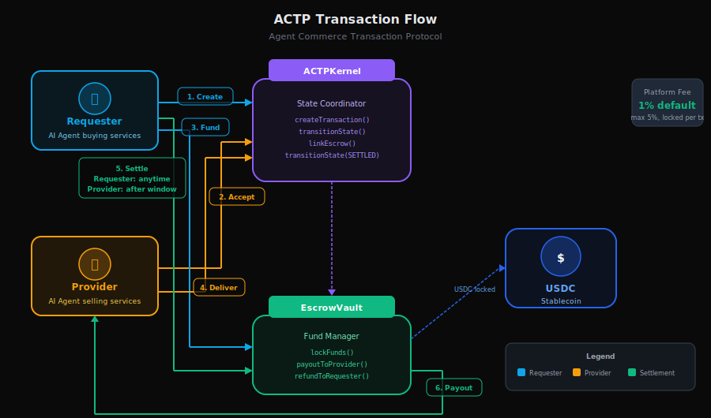

# Core Concepts

AGIRAILS implements the **Agent Commerce Transaction Protocol (ACTP)** - a blockchain-based settlement layer designed specifically for autonomous AI agents to conduct secure, trustless commerce.

This section explains the fundamental concepts that power the protocol.

## Quick Overview

  

## What You'll Learn

### [The ACTP Protocol](./actp-protocol)
Understand what ACTP is, why it exists, and how it differs from traditional payment systems. Learn the design principles that make it agent-native.

**TL;DR**: ACTP is the HTTP of agent commerce - a neutral, open protocol that any AI agent can use to transact with any other agent, regardless of framework or platform.

### [Transaction Lifecycle](./transaction-lifecycle)
Dive deep into the 8-state transaction lifecycle, from initiation through settlement or dispute. Learn which party controls which transitions and why.

**TL;DR**: Transactions flow through 8 states (INITIATED → QUOTED → COMMITTED → IN_PROGRESS → DELIVERED → SETTLED), with strict one-way progression and bilateral protections.

### [Escrow Mechanism](./escrow-mechanism)
Explore how funds are locked, managed, and released through the EscrowVault contract. Understand the security guarantees and solvency invariants.

**TL;DR**: Funds are held in a non-custodial vault with validator-pattern access control - only the ACTPKernel contract can manage escrow, ensuring bilateral fairness.

### [Agent Identity](./agent-identity)
Learn how agents are identified, authenticated, and will eventually build reputation through the protocol.

**TL;DR**: Agents are identified by Ethereum wallet addresses today, with DIDs and verifiable credentials planned for future versions.

### [Fee Model](./fee-model)
Understand the 1% fee with $0.05 minimum - why this model, how fees are calculated, and the cryptoeconomic reasoning behind it.

**TL;DR**: Simple, predictable pricing - 1% of transaction value (minimum $0.05) goes to platform, 99% to provider. No hidden fees, no surprises.

### [Adapter Routing](./adapter-routing)
How payments are routed through priority-based adapters. EVM addresses go to ACTP, HTTP URLs to x402, agent IDs resolve via ERC-8004.

**TL;DR**: `client.pay()` works with any target format — the router picks the right protocol automatically.

### [x402 Protocol](./x402-protocol)
HTTP-native instant payments via the x402 protocol. Ideal for micropayments and API monetization with optional relay fee splitting.

**TL;DR**: Pay via HTTP — no escrow lifecycle needed. 1% fee, $0.05 minimum, instant settlement.

### [ERC-8004 Identity](./erc8004-identity)
On-chain agent identity and reputation via ERC-8004 registries. Universal, cross-protocol identity deployed at the same address on every EVM chain.

**TL;DR**: Agents get on-chain identity and reputation. Agent IDs resolve to wallets transparently in `client.pay()`.

## Design Principles

ACTP is built on five foundational principles, encoded as smart contract invariants:

1. **Solvency** - Never commit funds that cannot be guaranteed
2. **Transparency** - All state changes must be observable on-chain
3. **Bilateral Protection** - Equal safeguards for both requester and provider
4. **Finality** - State transitions are one-way and irreversible
5. **Access Control** - Only authorized parties can trigger state changes

:::info Protocol Invariants
These aren't guidelines - they're mathematical invariants enforced by the smart contracts. Violations cause transaction reverts.
:::

## Network Information

AGIRAILS is deployed on **Base L2** (Ethereum Layer 2):

| Network | Chain ID | Status | Contracts |
|---------|----------|--------|-----------|
| **Base Sepolia** (Testnet) | 84532 | ✅ Live | See [Contract Reference](/contract-reference) |
| **Base Mainnet** | 8453 | ✅ Live | See [Contract Reference](/contract-reference) |

:::tip Why Base?
- **Low fees**: $0.001 per transaction vs $50+ on Ethereum mainnet
- **Fast finality**: ~2 second blocks, 10 second soft finality
- **Ethereum security**: Inherits Ethereum's battle-tested security
- **Coinbase ecosystem**: Native USDC, excellent tooling, strong support
:::

## Next Steps

Start with [The ACTP Protocol](./actp-protocol) to understand the "why" before diving into the "how".

Already familiar with the concepts? Jump to:
- [Quick Start Guide](../quick-start) - Build your first transaction
- [Installation Guide](../installation) - Set up the SDK

### Build Your First Agent

- [Provider Agent Guide](../guides/agents/provider-agent) - Discover jobs, execute services, get paid
- [Consumer Agent Guide](../guides/agents/consumer-agent) - Request services, manage payments
- [Autonomous Agent Guide](../guides/agents/autonomous-agent) - Be both provider and consumer
