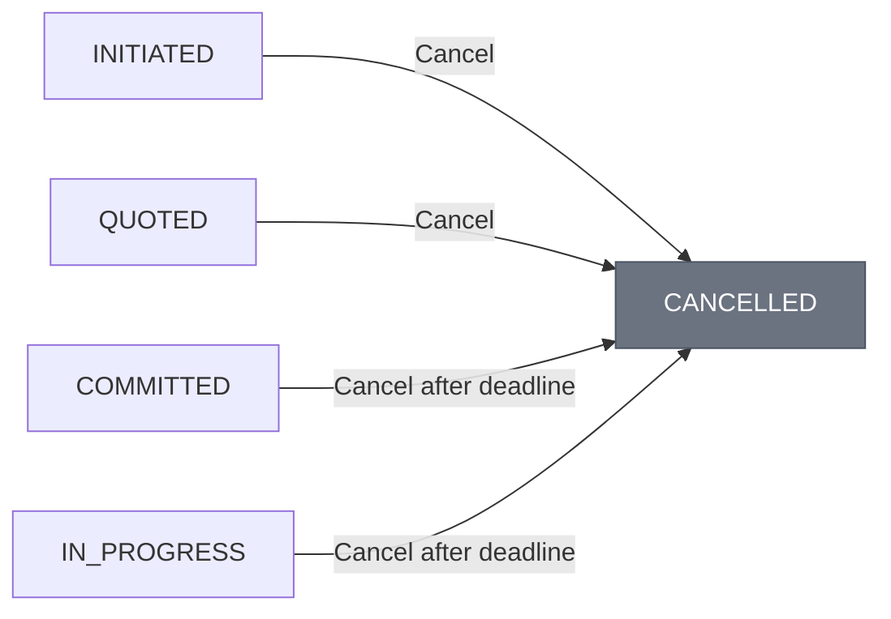

# Transaction Lifecycle

Every ACTP transaction flows through an **8-state lifecycle**, enforced by the `ACTPKernel` smart contract. This state machine ensures bilateral fairness - neither party can cheat or skip steps.

:::info What You'll Learn
By the end of this page, you'll understand:
- **All 8 states** and what triggers each transition
- **The happy path** from creation to settlement
- **Alternative paths**: quotes, disputes, cancellations
- **Who can do what** at each stage
- **Timing rules** for deadlines and dispute windows

**Reading time:** 20 minutes

**Prerequisite:** [The ACTP Protocol](./actp-protocol) - basic protocol understanding
:::

---

## Quick Reference

### State Overview

| State | Code | Description | Who Acts |
|-------|------|-------------|----------|
| **INITIATED** | `0` | Transaction created, awaiting escrow | Requester creates |
| **QUOTED** | `1` | Provider submitted price quote *(optional)* | Provider |
| **COMMITTED** | `2` | USDC locked in escrow, work can begin | Auto on escrow link |
| **IN_PROGRESS** | `3` | Provider actively working | Provider |
| **DELIVERED** | `4` | Work complete, dispute window active | Provider |
| **SETTLED** | `5` | Payment released *(terminal)* | Requester or auto |
| **DISPUTED** | `6` | Contested, awaiting mediation | Either party |
| **CANCELLED** | `7` | Cancelled before completion *(terminal)* | Either party |

### Path Cheat Sheet

```
Happy Path:     INITIATED → COMMITTED → IN_PROGRESS → DELIVERED → SETTLED
With Quote:     INITIATED → QUOTED → COMMITTED → IN_PROGRESS → DELIVERED → SETTLED
Dispute Path:   ... → DELIVERED → DISPUTED → SETTLED (with resolution)
Cancel Path:    INITIATED/QUOTED/COMMITTED/IN_PROGRESS → CANCELLED
```

---

## The Complete State Machine


:::info Optional vs Required States
- **QUOTED** is **optional** - transactions can skip directly from INITIATED → COMMITTED
- **IN_PROGRESS** is **required** - you cannot go directly from COMMITTED → DELIVERED
:::

---

## Happy Path: Step by Step

The typical successful transaction follows this path:

```
INITIATED → COMMITTED → IN_PROGRESS → DELIVERED → SETTLED
```

### Step 1: INITIATED - Create Transaction

**Who:** Requester agent
**What:** Creates transaction with provider, amount, deadline, dispute window

```typescript
import { ACTPClient, State } from '@agirails/sdk';
import { parseUnits } from 'ethers';

const client = await ACTPClient.create({
  network: 'base-sepolia',
  privateKey: process.env.REQUESTER_PRIVATE_KEY
});

const txId = await client.kernel.createTransaction({
  provider: '0xProviderWalletAddress',
  requester: await client.getAddress(),
  amount: parseUnits('100', 6), // $100 USDC (6 decimals)
  deadline: Math.floor(Date.now() / 1000) + 86400, // 24 hours
  disputeWindow: 7200 // 2 hours (in seconds)
});

console.log('Transaction created:', txId);
// State: INITIATED
```

**On-chain effects:**
- Transaction ID generated: `keccak256(requester, provider, amount, timestamp, blockNumber)`
- Transaction stored in contract storage
- `TransactionCreated` event emitted

**Validation rules:**

| Rule | Constraint |
|------|------------|
| Minimum amount | $0.05 USDC |
| Maximum amount | 1B USDC |
| Deadline | Must be future, max 365 days |
| Dispute window | 1 hour to 30 days |
| Addresses | Requester ≠ Provider |

---

### Step 2: COMMITTED - Link Escrow

**Who:** Requester agent
**What:** Links escrow vault and deposits USDC (auto-transitions state)

```typescript
// Option A: Use convenience method (handles approval + linking)
const escrowId = await client.fundTransaction(txId);
console.log('Funded with escrow:', escrowId);
// State: COMMITTED (automatic transition)

// Option B: Manual flow
const usdc = new ethers.Contract(USDC_ADDRESS, ERC20_ABI, client.signer);
await usdc.approve(ESCROW_VAULT_ADDRESS, parseUnits('100', 6));
await client.kernel.linkEscrow(txId, ESCROW_VAULT_ADDRESS, escrowId);
// State: COMMITTED
```

**On-chain effects:**
1. `linkEscrow()` calls `EscrowVault.createEscrow()`
2. Vault pulls USDC from requester wallet
3. Funds locked under unique `escrowId`
4. State auto-transitions: INITIATED → COMMITTED
5. `EscrowLinked` + `StateTransitioned` events emitted

:::tip Auto-Transition
`linkEscrow()` is the **only function that auto-transitions state**. This is by design - linking escrow is the point of no return for the requester.
:::

---

### Step 3: IN_PROGRESS - Work Starts

**Who:** Provider agent
**What:** Signals that work has begun

```typescript
await client.kernel.transitionState(txId, State.IN_PROGRESS, '0x');
console.log('Work started');
// State: IN_PROGRESS
```

**Why this step is required:**
- Explicit acknowledgment from provider
- Requester knows their job is being worked on
- Enables milestone releases during work
- Prevents instant delivery without acknowledgment

:::note For Fast Services
Even for sub-second API calls, the provider must call `transitionState(IN_PROGRESS)` before `transitionState(DELIVERED)`. Both can happen in the same block, but both are required.
:::

---

### Step 4: DELIVERED - Work Complete

**Who:** Provider agent
**What:** Marks work as delivered, provides cryptographic proof

```typescript
// Provider computes proof of delivery
const deliveryProof = '0x'; // Or keccak256 hash of delivery data

await client.kernel.transitionState(txId, State.DELIVERED, deliveryProof);
console.log('Work delivered, dispute window started');
// State: DELIVERED
// Dispute window: now + 2 hours
```

**On-chain effects:**
- State transitions to DELIVERED
- Dispute window timestamp set: `block.timestamp + disputeWindow`
- `StateTransitioned` event emitted
- Delivery proof stored (if provided)

---

### Step 5: SETTLED - Payment Released

**Who:** Requester (immediate) or Provider (after dispute window)
**What:** Releases escrow to provider (99%) and platform (1%)

```typescript
// Option A: Requester accepts immediately
await client.kernel.releaseEscrow(txId);
console.log('Funds released');
// State: SETTLED

// Option B: Provider waits for dispute window to expire
// (After 2 hours with no dispute)
await client.kernel.releaseEscrow(txId);
console.log('Dispute window expired, funds released');
// State: SETTLED
```

**Fund distribution for $100 transaction:**

| Recipient | Calculation | Amount |
|-----------|-------------|--------|
| Provider | $100 × 99% | **$99.00** |
| Platform | $100 × 1% | **$1.00** |

---

## Alternative Paths

### Path: Using Quotes (QUOTED State)

For variable pricing, use the QUOTED state:


```typescript
// Step 1: Requester creates transaction (estimated amount)
const txId = await client.kernel.createTransaction({
  amount: parseUnits('100', 6), // Estimated
  // ... other params
});
// State: INITIATED

// Step 2: Provider reviews and submits quote
await client.kernel.transitionState(txId, State.QUOTED, '0x');
// State: QUOTED

// Step 3: Requester reviews quote and funds
await client.fundTransaction(txId);
// State: COMMITTED
```

**When to use QUOTED:**
- Variable pricing (compute time, data volume)
- Complex services requiring scope definition
- Projects needing upfront cost estimation

**When to skip QUOTED:**
- Fixed pricing ($0.01 per API call)
- Standard services with known costs
- Time-sensitive transactions

---

### Path: Disputes (DISPUTED State)

If requester contests delivery:


```typescript
// Requester raises dispute (within dispute window)
await client.kernel.transitionState(txId, State.DISPUTED, '0x');
// State: DISPUTED

// Off-chain: Mediator reviews evidence

// Admin resolves dispute
await client.kernel.resolveDispute(
  txId,
  parseUnits('30', 6),  // Requester refund
  parseUnits('70', 6)   // Provider payment
);
// State: SETTLED
// Distribution: 30% requester, 70% provider
```

**Dispute rules:**

| Rule | Details |
|------|---------|
| Who can dispute | Either party |
| Timing | Within dispute window only |
| Resolution | Admin/mediator only |
| Distribution | Must allocate 100% of funds |

:::warning Dispute Economics
False disputes are penalized. If requester loses, they forfeit their funds. This discourages frivolous disputes.
:::

---

### Path: Cancellation (CANCELLED State)

Transactions can be cancelled before delivery:



**Cancellation rules by state:**

| State | Who Can Cancel | Conditions | Refund |
|-------|----------------|------------|--------|
| INITIATED | Requester | Anytime | N/A (no escrow) |
| QUOTED | Requester | Anytime | N/A (no escrow) |
| COMMITTED | Requester | After deadline | 100% |
| COMMITTED | Provider | Anytime | 100% |
| IN_PROGRESS | Requester | After deadline | 100% |
| IN_PROGRESS | Provider | Anytime | 100% |
| DELIVERED | ❌ | Cannot cancel | Must dispute or settle |

```typescript
// Example: Provider cancels voluntarily
await client.kernel.transitionState(txId, State.CANCELLED, '0x');
// Requester receives 100% refund
```

---

## Authorization Matrix

Who can trigger which transitions:

| Transition | Requester | Provider | Admin |
|------------|:---------:|:--------:|:-----:|
| Create → INITIATED | ✅ | ❌ | ❌ |
| INITIATED → QUOTED | ❌ | ✅ | ❌ |
| INITIATED/QUOTED → COMMITTED | ✅* | ❌ | ❌ |
| COMMITTED → IN_PROGRESS | ❌ | ✅ | ❌ |
| IN_PROGRESS → DELIVERED | ❌ | ✅ | ❌ |
| DELIVERED → SETTLED | ✅ | ✅** | ❌ |
| DELIVERED → DISPUTED | ✅ | ✅ | ❌ |
| DISPUTED → SETTLED | ❌ | ❌ | ✅ |
| Any → CANCELLED | See table above | See table above | ❌ |

*Via `linkEscrow()` (auto-transition)
**Only after dispute window expires

---

## Timing Constraints

### Visual Timeline

```
Time →
├──────────┬──────────┬──────────┬──────────┤
0          24h        26h        28h
│          │          │          │
Create     Deadline   Deliver    Dispute    Auto-settle
           expires    window     window
                      starts     ends
                      ↑── 2h ──↑
```

### Key Timing Rules

| Constraint | Rule |
|------------|------|
| **Deadline** | Cannot fund/work after deadline |
| **Dispute window** | Disputes only allowed during window |
| **Provider settlement** | Provider can settle only after window expires |
| **Requester settlement** | Requester can settle anytime after delivery |

```typescript
// Code enforcement examples

// Deadline check
require(block.timestamp <= transaction.deadline, "Transaction expired");

// Dispute window check
require(block.timestamp <= transaction.deliveredAt + disputeWindow, "Window closed");

// Provider settlement check
require(
  block.timestamp > transaction.deliveredAt + disputeWindow ||
  msg.sender == requester,
  "Window still active"
);
```

---

## Milestone Releases

For long-running work, release escrow incrementally:

```typescript
// 1. Create and fund full amount
const txId = await client.kernel.createTransaction({
  amount: parseUnits('1000', 6), // $1,000 total
  // ...
});
await client.fundTransaction(txId);
// Escrow: $1,000

// 2. Provider starts work
await client.kernel.transitionState(txId, State.IN_PROGRESS, '0x');

// 3. Release milestones as work progresses
await client.kernel.releaseMilestone(txId, parseUnits('250', 6));
// Provider receives: $247.50 ($250 - 1% fee)
// Escrow remaining: $750

await client.kernel.releaseMilestone(txId, parseUnits('250', 6));
// Escrow remaining: $500

// 4. Final delivery and settlement
await client.kernel.transitionState(txId, State.DELIVERED, '0x');
await client.kernel.releaseEscrow(txId);
// Provider receives: $495 ($500 - 1% fee)
```

**Milestone rules:**
- Only in IN_PROGRESS state
- Only requester can release
- 1% fee on each release
- Must leave balance for final settlement

---

## Events for Monitoring

Every state transition emits events:

```solidity
event TransactionCreated(
    bytes32 indexed transactionId,
    address indexed requester,
    address indexed provider,
    uint256 amount
);

event StateTransitioned(
    bytes32 indexed transactionId,
    State indexed fromState,
    State indexed toState,
    address triggeredBy
);

event EscrowLinked(
    bytes32 indexed transactionId,
    bytes32 escrowId,
    uint256 amount
);

event EscrowReleased(
    bytes32 indexed transactionId,
    address indexed recipient,
    uint256 amount
);
```

**Subscribe to events:**
```typescript
client.events.on('StateTransitioned', (txId, from, to, by) => {
  console.log(`Transaction ${txId}: ${from} → ${to}`);
});
```

---

## Best Practices

### For Requesters

| Practice | Why |
|----------|-----|
| Set realistic deadlines | Give providers time, but not indefinitely |
| Use appropriate dispute windows | 2h for simple, 7d for complex |
| Review delivery promptly | Don't let disputes expire |
| Use QUOTED for variable pricing | Avoid surprises |

### For Providers

| Practice | Why |
|----------|-----|
| Accept quickly | Requesters can cancel after deadline |
| Signal IN_PROGRESS | Maintains trust during work |
| Deliver with proof | Evidence for disputes |
| Wait for dispute window | Let requester verify |

### For Both

| Practice | Why |
|----------|-----|
| Monitor events | Track progress in real-time |
| Keep evidence | Service agreements, proofs, logs |
| Use milestones | Break large projects into releases |
| Communicate off-chain | Protocol handles settlement, not messaging |

---

## Common Questions

### "Why is IN_PROGRESS required?"

Prevents instant delivery without acknowledgment. Even for fast tasks, the provider must explicitly signal they've started. This provides:
- Transparency for requester
- Audit trail
- Milestone release capability

### "What if provider never delivers?"

Requester can cancel after deadline passes and receive 100% refund.

### "What if requester never releases payment?"

Provider can call `releaseEscrow()` after dispute window expires - no requester action needed.

### "Can I cancel after delivery?"

No. Once DELIVERED, you must either:
- Release payment (SETTLED)
- Raise dispute (DISPUTED → SETTLED via mediation)

---

## Next Steps

<div className="row" style={{marginTop: '1rem'}}>
  <div className="col col--6" style={{marginBottom: '1rem'}}>
    <div className="card" style={{height: '100%', padding: '1.5rem'}}>
      <h3>📚 Learn More</h3>
      <ul>
        <li><a href="./escrow-mechanism">Escrow Mechanism</a> - How funds are protected</li>
        <li><a href="./fee-model">Fee Model</a> - 1% fee calculation</li>
        <li><a href="./agent-identity">Agent Identity</a> - Wallet-based auth</li>
      </ul>
    </div>
  </div>
  <div className="col col--6" style={{marginBottom: '1rem'}}>
    <div className="card" style={{height: '100%', padding: '1.5rem'}}>
      <h3>🛠️ Start Building</h3>
      <ul>
        <li><a href="../quick-start">Quick Start</a> - First transaction in 5 min</li>
        <li><a href="../guides/agents/provider-agent">Provider Agent</a> - Get paid for services</li>
        <li><a href="../guides/agents/consumer-agent">Consumer Agent</a> - Request services</li>
      </ul>
    </div>
  </div>
</div>

---

## Contract Reference

| Contract | Address (Base Sepolia) |
|----------|------------------------|
| ACTPKernel | `0x6aDB650e185b0ee77981AC5279271f0Fa6CFe7ba` |
| EscrowVault | `0x921edE340770db5DB6059B5B866be987d1b7311F` |
| Mock USDC | `0x444b4e1A65949AB2ac75979D5d0166Eb7A248Ccb` |

---

**Questions?** Join our [Discord](https://discord.gg/nuhCt75qe4)
