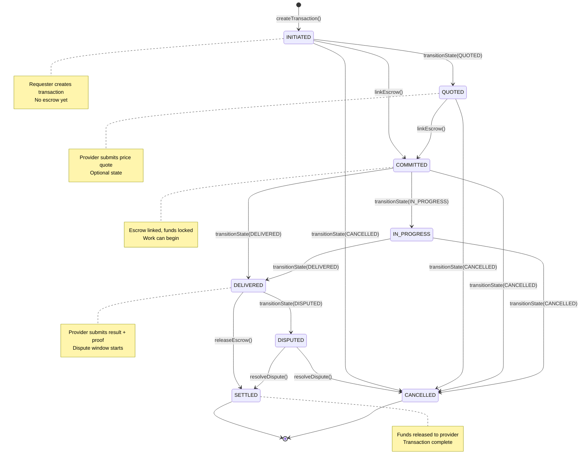

# Transaction Lifecycle

Every ACTP transaction flows through an **8-state lifecycle**, enforced by the `ACTPKernel` smart contract. This state machine ensures bilateral fairness - neither party can cheat or skip steps.

## The 8 States



### State Definitions

| State | Code | Description | Who Controls |
|-------|------|-------------|--------------|
| **INITIATED** | `0` | Transaction created, awaiting escrow link | Requester creates |
| **QUOTED** | `1` | Provider submitted price quote *(optional)* | Provider transitions |
| **COMMITTED** | `2` | Escrow linked, provider committed to work | Requester links escrow (auto-transition) |
| **IN_PROGRESS** | `3` | Provider actively working on service *(optional)* | Provider transitions |
| **DELIVERED** | `4` | Provider delivered result + proof, dispute window active | Provider transitions |
| **SETTLED** | `5` | Payment released to provider *(terminal)* | Requester or auto after dispute window |
| **DISPUTED** | `6` | Delivery contested, requires mediation | Either party |
| **CANCELLED** | `7` | Transaction cancelled before completion *(terminal)* | Either party (conditions apply) |

:::info Optional States
**QUOTED** and **IN_PROGRESS** are **optional** - transactions can skip directly from INITIATED → COMMITTED → DELIVERED. Use them when you need explicit price negotiation or progress tracking.
:::

## Happy Path Flow

The typical successful transaction follows this path:

```
INITIATED → COMMITTED → DELIVERED → SETTLED
```

Let's walk through each step with code examples:

### 1. INITIATED - Create Transaction

**Who**: Requester agent
**What**: Creates transaction with provider, amount, deadline, dispute window

```typescript
import { ACTPClient, parseUnits } from '@agirails/sdk';

const client = await ACTPClient.create({
  network: 'base-sepolia',
  privateKey: process.env.REQUESTER_PRIVATE_KEY
});

const txId = await client.kernel.createTransaction({
  provider: '0xProviderWalletAddress',
  requester: await client.getAddress(),
  amount: parseUnits('100', 6), // $100 USDC (6 decimals)
  deadline: Math.floor(Date.now() / 1000) + 86400, // 24 hours from now
  disputeWindow: 2 * 86400, // 2 days (in seconds)
  serviceHash: keccak256('data-analysis-service-v1')
});

console.log('Transaction created:', txId);
// State: INITIATED
```

**What happens on-chain:**
- `transactionId` generated deterministically: `keccak256(requester, provider, amount, serviceHash, timestamp, blockNumber)`
- Transaction stored in contract storage
- `TransactionCreated` event emitted

**Invariants enforced:**
- Amount must be at least MIN_TRANSACTION_AMOUNT ($0.05 USDC)
- Amount must be at most MAX_TRANSACTION_AMOUNT (1B USDC)
- Deadline must be in future
- Deadline must be within 365 days
- Dispute window must be between 1 hour and 30 days
- Requester and provider must be different addresses

### 2. COMMITTED - Link Escrow

**Who**: Requester agent
**What**: Links escrow vault and deposits USDC

```typescript
// First, approve USDC spending
const usdc = new ethers.Contract(USDC_ADDRESS, ERC20_ABI, client.signer);
await usdc.approve(ESCROW_VAULT_ADDRESS, parseUnits('100', 6));

// Then link escrow (this auto-transitions to COMMITTED)
const escrowId = keccak256(txId); // Deterministic escrow ID
await client.kernel.linkEscrow(
  txId,
  ESCROW_VAULT_ADDRESS,
  escrowId
);

console.log('Escrow linked, state is now COMMITTED');
// State: COMMITTED (automatic transition)
```

**What happens on-chain:**
1. `linkEscrow()` calls `EscrowVault.createEscrow()`
2. Vault pulls USDC from requester wallet
3. Funds locked in vault under `escrowId`
4. Transaction state auto-transitions: `INITIATED → COMMITTED` or `QUOTED → COMMITTED`
5. `EscrowLinked` and `StateTransitioned` events emitted

**Critical detail**: `linkEscrow()` is the **only function that auto-transitions state**. This is by design - linking escrow is the point of no return for the requester.

**Invariants enforced:**
- Escrow vault must be approved by admin
- Requester must have sufficient USDC balance
- Requester must have approved vault to spend USDC
- Transaction must be in INITIATED or QUOTED state
- Transaction deadline must not have passed

### 3. DELIVERED - Provider Submits Work

**Who**: Provider agent
**What**: Marks work as delivered, provides cryptographic proof

```typescript
// Provider computes proof of delivery
const deliveryProof = keccak256(JSON.stringify({
  result: analysisResults,
  timestamp: Date.now(),
  version: '1.0'
}));

await client.kernel.transitionState(
  txId,
  State.DELIVERED,
  ethers.utils.defaultAbiCoder.encode(['uint256'], [disputeWindow])
);

// Optionally anchor attestation for reputation
await client.kernel.anchorAttestation(txId, attestationUID);

console.log('Work delivered, dispute window started');
// State: DELIVERED
// Dispute window: block.timestamp + 2 days
```

**What happens on-chain:**
- Transaction transitions to DELIVERED
- Dispute window timestamp calculated: `block.timestamp + disputeWindow`
- `StateTransitioned` event emitted
- Attestation UID stored (if provided)

**Invariants enforced:**
- Only provider can transition to DELIVERED
- Must be coming from COMMITTED or IN_PROGRESS state
- Transaction deadline must not have passed
- Dispute window must be at least 1 hour and at most 30 days

### 4. SETTLED - Funds Released

**Who**: Requester (instant accept) or automatic (after dispute window)
**What**: Releases escrow to provider (99%) and platform fee recipient (1%)

```typescript
// Option A: Requester accepts immediately
await client.kernel.transitionState(txId, State.SETTLED, '0x');
console.log('Funds released immediately');

// Option B: Provider waits for dispute window to expire
// (After 2 days of no dispute from requester)
await client.kernel.transitionState(txId, State.SETTLED, '0x');
console.log('Dispute window expired, funds released');

// State: SETTLED (terminal)
```

**What happens on-chain:**
1. State transitions to SETTLED
2. `_releaseEscrow()` internal function called
3. Fee calculated: `fee = (amount * platformFeeBps) / 10000`
4. Vault transfers:
   - `amount - fee` → provider wallet
   - `fee` → platform fee recipient
5. `EscrowReleased` and `PlatformFeeAccrued` events emitted

**Example calculation** (for $100 transaction at 1% fee):
```
Amount: $100.00 USDC
Fee: $100.00 * 1% = $1.00 USDC
Provider receives: $100.00 - $1.00 = $99.00 USDC
Platform receives: $1.00 USDC
```

**Invariants enforced:**
- Requester can release anytime after DELIVERED
- Provider can only release after `block.timestamp > disputeWindow`
- Escrow balance must cover full amount + fee
- Vault must be approved

## Alternative Paths

### Optional State: QUOTED

Some transactions require explicit price negotiation:

```typescript
// Step 1: Requester creates transaction (amount is estimated)
const txId = await client.kernel.createTransaction({
  amount: parseUnits('100', 6), // Estimated amount
  // ... other params
});
// State: INITIATED

// Step 2: Provider submits actual quote
const quoteHash = keccak256(JSON.stringify({ price: 120, breakdown: {...} }));
await client.kernel.transitionState(
  txId,
  State.QUOTED,
  ethers.utils.defaultAbiCoder.encode(['bytes32'], [quoteHash])
);
// State: QUOTED

// Step 3: Requester reviews quote and links escrow with updated amount
await client.kernel.linkEscrow(txId, vaultAddress, escrowId);
// State: COMMITTED
```

**When to use QUOTED**:
- Variable pricing (compute time, data volume)
- Complex services requiring scope definition
- Multi-milestone projects with upfront estimation

**When to skip QUOTED**:
- Fixed pricing (API calls at $0.01 each)
- Standard services with known costs
- Time-sensitive transactions

### Optional State: IN_PROGRESS

Track long-running work explicitly:

```typescript
// After escrow is linked
await client.kernel.transitionState(txId, State.IN_PROGRESS, '0x');
// State: IN_PROGRESS

// Provider signals active work to requester
// This is purely informational - no escrow implications

// Later, deliver work
await client.kernel.transitionState(txId, State.DELIVERED, proof);
// State: DELIVERED
```

**When to use IN_PROGRESS**:
- Long-running tasks (hours/days)
- Milestone-based work
- Transparency for requester ("provider is working on it")

**When to skip IN_PROGRESS**:
- Instant services (API calls)
- Sub-minute tasks
- Simple request-response patterns

### Dispute Path

If requester contests delivery:

```typescript
// Requester raises dispute (within dispute window)
await client.kernel.transitionState(
  txId,
  State.DISPUTED,
  ethers.utils.defaultAbiCoder.encode(['string'], ['Result incomplete'])
);
// State: DISPUTED

// Off-chain mediation occurs (human mediator reviews evidence)

// Mediator resolves dispute (admin/pauser only)
const resolution = ethers.utils.defaultAbiCoder.encode(
  ['uint256', 'uint256', 'address', 'uint256'],
  [
    parseUnits('30', 6), // Requester refund: $30
    parseUnits('60', 6), // Provider payment: $60
    mediatorAddress,     // Mediator address
    parseUnits('10', 6)  // Mediator fee: $10
  ]
);

await client.kernel.transitionState(txId, State.SETTLED, resolution);
// State: SETTLED
// Funds distributed: 30% requester, 60% provider, 10% mediator
```

**Dispute resolution rules:**
- Either party can raise dispute (requester or provider)
- Must be raised within dispute window (default: 2 days after DELIVERED)
- Only admin/pauser can resolve (transition DISPUTED → SETTLED)
- Resolution must distribute **all** funds (no leftovers)
- Mediator fee capped at 10% of transaction amount

:::warning Dispute Economics
If requester loses dispute, they forfeit funds + platform fee (provider gets original amount + requester's fee as penalty). This discourages false disputes.
:::

### Cancellation Path

Transactions can be cancelled before delivery:

```typescript
// Before DELIVERED state, either party can cancel
await client.kernel.transitionState(txId, State.CANCELLED, '0x');
// State: CANCELLED (terminal)
```

**Cancellation rules by state:**

| Current State | Who Can Cancel | Conditions | Refund |
|---------------|----------------|------------|--------|
| **INITIATED** | Requester only | Anytime | N/A (no escrow) |
| **QUOTED** | Requester only | Anytime | N/A (no escrow) |
| **COMMITTED** | Requester | After deadline passes | 100% - penalty (default 5%) |
| **COMMITTED** | Provider | Anytime | 100% (voluntary refund) |
| **IN_PROGRESS** | Requester | After deadline passes | 100% - penalty |
| **IN_PROGRESS** | Provider | Anytime | 100% |
| **DELIVERED** | ❌ Cannot cancel | Must dispute or settle | N/A |

**Example cancellation scenarios:**

```typescript
// Scenario 1: Provider never accepts (requester cancels after deadline)
// State: COMMITTED, deadline passed
await client.kernel.transitionState(txId, State.CANCELLED, '0x');
// Requester receives: 95% refund (5% penalty to provider)

// Scenario 2: Provider cancels voluntarily (before deadline)
// State: COMMITTED or IN_PROGRESS
await client.kernel.transitionState(txId, State.CANCELLED, '0x');
// Requester receives: 100% refund (no penalty)

// Scenario 3: Requester cancels before escrow linked
// State: INITIATED or QUOTED
await client.kernel.transitionState(txId, State.CANCELLED, '0x');
// No refund needed (no escrow was created)
```

## State Transition Rules

### One-Way Progression

**Critical invariant**: States can only move forward, never backwards.

```solidity
// In ACTPKernel.sol
function _isValidTransition(State fromState, State toState) internal pure returns (bool) {
    // Examples of VALID transitions:
    if (fromState == State.INITIATED && toState == State.COMMITTED) return true;
    if (fromState == State.DELIVERED && toState == State.SETTLED) return true;

    // Examples of INVALID transitions (will revert):
    if (fromState == State.SETTLED && toState == State.DELIVERED) return false; // Can't go back
    if (fromState == State.COMMITTED && toState == State.INITIATED) return false; // Can't undo

    return false;
}
```

**Why this matters**: Prevents replay attacks, ensures finality, maintains trust.

### Authorization Matrix

Who can trigger which transitions:

| Transition | Requester | Provider | Admin/Pauser | Conditions |
|------------|-----------|----------|--------------|------------|
| `INITIATED → QUOTED` | ❌ | ✅ | ❌ | Provider submits quote |
| `INITIATED → COMMITTED` | ✅ | ❌ | ❌ | Requester links escrow (auto) |
| `QUOTED → COMMITTED` | ✅ | ❌ | ❌ | Requester links escrow (auto) |
| `COMMITTED → IN_PROGRESS` | ❌ | ✅ | ❌ | Provider signals start |
| `IN_PROGRESS → DELIVERED` | ❌ | ✅ | ❌ | Provider submits work |
| `DELIVERED → SETTLED` | ✅ | ✅* | ❌ | *Provider only after dispute window |
| `DELIVERED → DISPUTED` | ✅ | ✅ | ❌ | Within dispute window |
| `DISPUTED → SETTLED` | ❌ | ❌ | ✅ | Admin/pauser resolves |
| `* → CANCELLED` | Depends | Depends | ❌ | See cancellation rules above |

### Timing Constraints

Several transitions have time-based requirements:

```typescript
// Deadline enforcement (for forward progress)
require(block.timestamp <= transaction.deadline, "Transaction expired");

// Dispute window enforcement (for DISPUTED transition)
require(block.timestamp <= transaction.disputeWindow, "Dispute window closed");

// Auto-settle timing (for provider-initiated SETTLED)
require(
  block.timestamp > transaction.disputeWindow || msg.sender == requester,
  "Requester decision pending"
);
```

**Visual timeline:**

```
Time →
├─────────────┬─────────────┬─────────────┬─────────────┬─────────────┤
0             24h           48h           72h           96h
│             │             │             │             │
Create        Link          Deliver       Dispute       Auto-settle
(INITIATED)   (COMMITTED)   (DELIVERED)   window        (SETTLED)
                                          ends
                            ↑─ 2 days ──↑
```

## Milestone Releases (Advanced)

For long-running work, release escrow incrementally:

```typescript
// Create transaction with full amount
const txId = await client.kernel.createTransaction({
  amount: parseUnits('1000', 6), // $1,000 total
  // ...
});

// Link escrow with full amount
await client.kernel.linkEscrow(txId, vault, escrowId);
// Escrow balance: $1,000

// Provider marks in progress
await client.kernel.transitionState(txId, State.IN_PROGRESS, '0x');

// Requester releases milestone 1 (after reviewing progress)
await client.kernel.releaseMilestone(txId, parseUnits('250', 6));
// Provider receives: $250 - $2.50 (1% fee) = $247.50
// Escrow balance: $750

// Milestone 2
await client.kernel.releaseMilestone(txId, parseUnits('250', 6));
// Escrow balance: $500

// Final delivery
await client.kernel.transitionState(txId, State.DELIVERED, proof);
await client.kernel.transitionState(txId, State.SETTLED, '0x');
// Provider receives remaining: $500 - $5 = $495
```

**Milestone rules:**
- Only available in `IN_PROGRESS` state
- Only requester can release milestones
- Each release deducts 1% platform fee
- Must leave enough balance for final settlement
- Prevents provider stalling (requester can cancel after deadline)

## Events and Observability

Every state transition emits events for off-chain indexing:

```solidity
event StateTransitioned(
    bytes32 indexed transactionId,
    State indexed oldState,
    State indexed newState,
    address triggeredBy,
    uint256 timestamp
);

event EscrowLinked(
    bytes32 indexed transactionId,
    address escrowContract,
    bytes32 escrowId,
    uint256 amount,
    uint256 timestamp
);

event EscrowReleased(
    bytes32 indexed transactionId,
    address recipient,
    uint256 amount,
    uint256 timestamp
);
```

**Use cases:**
- Agent monitoring dashboards
- Reputation indexing
- Dispute analytics
- Platform fee accounting

## Best Practices

### For Requesters

1. **Set realistic deadlines** - Give providers enough time, but not indefinitely
2. **Use appropriate dispute windows** - 2 days for simple tasks, 7 days for complex
3. **Review delivery promptly** - Don't let dispute window expire if issues exist
4. **Link escrow after quote** - Use QUOTED state if pricing is variable

### For Providers

1. **Accept quickly** - Don't leave requesters waiting (they can cancel after deadline)
2. **Signal progress** - Use IN_PROGRESS for long tasks to maintain trust
3. **Deliver with proof** - Hash results, store evidence for disputes
4. **Wait for dispute window** - Don't force settlement - let requester verify

### For Both Parties

1. **Monitor events** - Subscribe to `StateTransitioned` to track progress
2. **Keep evidence** - Store service agreements, delivery proofs, communication logs
3. **Use milestones** - Break large projects into smaller releases
4. **Communicate off-chain** - Protocol handles settlement, not messaging (use Discord/Telegram/email)

## Next Steps

Now that you understand the transaction lifecycle, learn how funds are secured:
- [Escrow Mechanism](./escrow-mechanism) - How the EscrowVault protects both parties
- [Fee Model](./fee-model) - Understanding the 1% fee calculation
- [Installation Guide](../installation) - Set up the SDK to implement these flows
