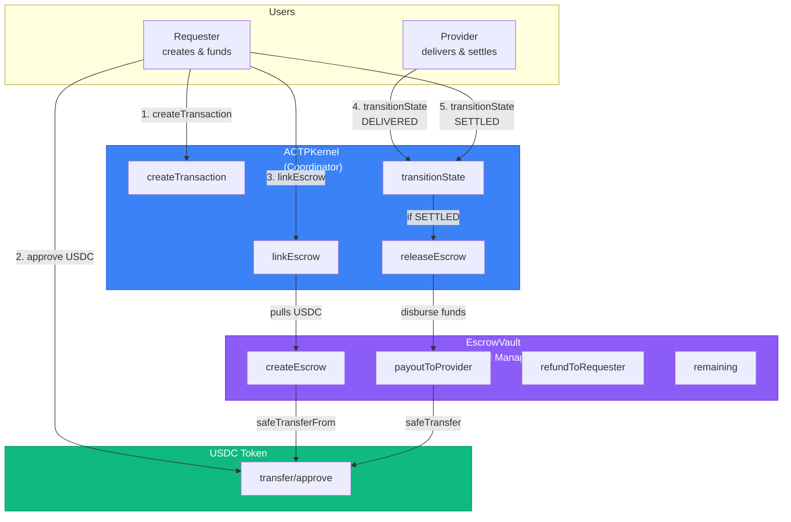
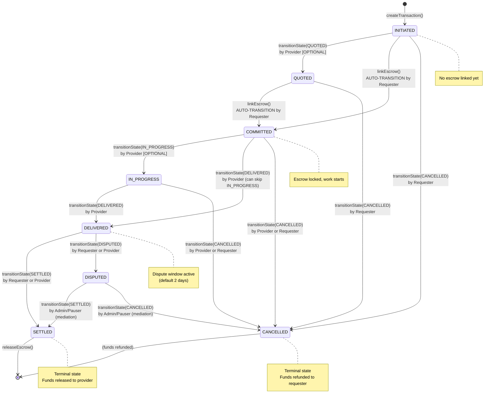

# Smart Contract Reference

Complete API documentation for AGIRAILS smart contracts on Base L2. This reference covers the ACTPKernel coordinator and EscrowVault escrow manager.

:::info Before You Begin
Make sure you have:
- [ ] **ethers.js v6** or **viem** for contract interaction ([ethers docs](https://docs.ethers.org))
- [ ] **Foundry** for contract testing and deployment ([getfoundry.sh](https://getfoundry.sh))
- [ ] **Base Sepolia** testnet access with ETH for gas
- [ ] **Contract addresses** from the [Deployed Addresses](#deployed-addresses) section
- [ ] Basic understanding of **Solidity** and **EVM** concepts

**Estimated time to first contract call:** ~3 minutes

**Want to see real contract interaction?** Check our SDK Reference for TypeScript examples.
:::

---

## Quick Reference

:::tip Most Used Contract Functions

| Task | Contract | Function | Who Can Call |
|------|----------|----------|--------------|
| **Create transaction** | ACTPKernel | `createTransaction()` | Requester |
| **Link escrow** | ACTPKernel | `linkEscrow()` | Requester |
| **Check status** | ACTPKernel | `getTransaction()` | Anyone (view) |
| **Transition state** | ACTPKernel | `transitionState()` | Provider/Requester |
| **Release funds** | ACTPKernel | `releaseEscrow()` | Anyone (if settled) |
| **Check escrow** | EscrowVault | `remaining()` | Anyone (view) |

**Common Flow:** createTransaction → linkEscrow (auto-commits) → transitionState(DELIVERED) → transitionState(SETTLED) → releaseEscrow

See [Common Patterns](#common-patterns) for complete workflows.
:::

---

## Deployed Addresses

### Base Sepolia (Testnet)

```solidity
// Deployed 2025-11-25 by Arha (optimizer-runs 200)
ACTPKernel:   0x6aDB650e185b0ee77981AC5279271f0Fa6CFe7ba
EscrowVault:  0x921edE340770db5DB6059B5B866be987d1b7311F
MockUSDC:     0x444b4e1A65949AB2ac75979D5d0166Eb7A248Ccb

// EAS (Ethereum Attestation Service - Base native)
EAS:          0x4200000000000000000000000000000000000021
SchemaReg:    0x4200000000000000000000000000000000000020
```

**Block Explorer:** [https://sepolia.basescan.org](https://sepolia.basescan.org)

**Verification:** All contracts verified on Basescan

### Base Mainnet

```solidity
// TODO: Not yet deployed to mainnet
ACTPKernel:   0x0000000000000000000000000000000000000000
EscrowVault:  0x0000000000000000000000000000000000000000
USDC:         0x833589fCD6eDb6E08f4c7C32D4f71b54bdA02913 // Official USDC

// EAS (Ethereum Attestation Service - Base native)
EAS:          0x4200000000000000000000000000000000000021
SchemaReg:    0x4200000000000000000000000000000000000020
```

**Block Explorer:** [https://basescan.org](https://basescan.org)

:::warning Mainnet Deployment Pending
AGIRAILS contracts are currently testnet-only. Mainnet deployment scheduled for Q2 2025 after final security audit.
:::

---

## Architecture Overview



**Key Design Principles:**

1. **Separation of Concerns**: Kernel handles state logic, Vault handles funds
2. **Immutable**: No proxy patterns, no upgrades - deploy V2 if changes needed
3. **Non-Custodial**: Kernel never holds user funds, all USDC in Vault
4. **Pausable**: Emergency pause for state transitions (funds always withdrawable)
5. **Access Control**: State transitions restricted by role (requester/provider/admin)

---

## State Machine

### State Enum

```solidity
enum State {
    INITIATED,    // 0 - Transaction created, no escrow
    QUOTED,       // 1 - Provider submitted quote (optional)
    COMMITTED,    // 2 - Escrow linked, provider committed
    IN_PROGRESS,  // 3 - Provider actively working (optional)
    DELIVERED,    // 4 - Provider delivered result + proof
    SETTLED,      // 5 - Payment released (terminal)
    DISPUTED,     // 6 - Consumer disputed delivery
    CANCELLED     // 7 - Transaction cancelled (terminal)
}
```

### Valid State Transitions

| From State | To States | Who Can Trigger | Notes |
|------------|-----------|-----------------|-------|
| **INITIATED** (0) | QUOTED, COMMITTED, CANCELLED | Provider (QUOTED), Requester (CANCELLED) | COMMITTED via linkEscrow() auto-transition |
| **QUOTED** (1) | COMMITTED, CANCELLED | Requester | Optional state, can skip |
| **COMMITTED** (2) | IN_PROGRESS, DELIVERED, CANCELLED | Provider (IN_PROGRESS/DELIVERED), Both (CANCELLED) | Escrow locked |
| **IN_PROGRESS** (3) | DELIVERED, CANCELLED | Provider (DELIVERED), Both (CANCELLED) | Optional state, can skip |
| **DELIVERED** (4) | SETTLED, DISPUTED | Both (SETTLED/DISPUTED) | Dispute window active |
| **DISPUTED** (6) | SETTLED, CANCELLED | Admin/Pauser | Mediation required |
| **SETTLED** (5) | *none* | - | Terminal state |
| **CANCELLED** (7) | *none* | - | Terminal state |

### State Transition Diagram



**Key Rules:**
- ✅ All transitions are **one-way** (monotonic progression, no backwards)
- ✅ `linkEscrow()` **auto-transitions** INITIATED/QUOTED → COMMITTED
- ✅ QUOTED and IN_PROGRESS are **optional** (can skip)
- ✅ Deadline enforced for forward progressions (not cancellation/dispute)
- ✅ Pause blocks all state transitions except view functions

---

## ACTPKernel

The core transaction coordinator implementing the ACTP protocol.

**Contract Address (Base Sepolia):** `0x6aDB650e185b0ee77981AC5279271f0Fa6CFe7ba`

**Source Code:** [ACTPKernel.sol](https://github.com/agirails/agirails/blob/main/Protocol/actp-kernel/src/ACTPKernel.sol)

**Inheritance:** `IACTPKernel`, `ReentrancyGuard`

### Constants

| Name | Type | Value | Description |
|------|------|-------|-------------|
| `DEFAULT_DISPUTE_WINDOW` | `uint256` | `2 days` | Default dispute period (172,800 seconds) |
| `MIN_DISPUTE_WINDOW` | `uint256` | `1 hours` | Minimum dispute window (3,600 seconds) |
| `MAX_DISPUTE_WINDOW` | `uint256` | `30 days` | Maximum dispute window (2,592,000 seconds) |
| `MAX_BPS` | `uint256` | `10_000` | Basis points denominator (100%) |
| `MAX_PLATFORM_FEE_CAP` | `uint16` | `500` | Maximum platform fee (5%) |
| `MAX_REQUESTER_PENALTY_CAP` | `uint16` | `5_000` | Maximum requester penalty (50%) |
| `MAX_MEDIATOR_FEE_BPS` | `uint16` | `1_000` | Maximum mediator fee (10%) |
| `MIN_TRANSACTION_AMOUNT` | `uint256` | `50_000` | Minimum transaction ($0.05 USDC, 6 decimals) |
| `MAX_TRANSACTION_AMOUNT` | `uint256` | `1_000_000_000e6` | Maximum transaction (1B USDC) |
| `MAX_DEADLINE` | `uint256` | `365 days` | Maximum deadline (31,536,000 seconds) |
| `ECONOMIC_PARAM_DELAY` | `uint256` | `2 days` | Timelock for fee changes (172,800 seconds) |
| `MEDIATOR_APPROVAL_DELAY` | `uint256` | `2 days` | Timelock for mediator approvals (172,800 seconds) |

### State Variables

#### Governance

```solidity
address public admin;           // Current admin (can update params)
address public pauser;          // Pauser role (can pause/unpause)
address public feeRecipient;    // Platform fee recipient
address public pendingAdmin;    // Pending admin transfer
uint16 public platformFeeBps;   // Current platform fee (basis points)
uint16 public requesterPenaltyBps; // Cancellation penalty (basis points)
bool public paused;             // Emergency pause status
```

#### Mappings

```solidity
mapping(bytes32 => Transaction) private transactions;  // Transaction data
mapping(address => bool) public approvedEscrowVaults;  // Approved vaults
mapping(address => bool) public approvedMediators;     // Approved mediators
mapping(address => uint256) public mediatorApprovedAt; // Mediator timelock
```

### Structs

#### Transaction

```solidity
struct Transaction {
    bytes32 transactionId;       // Unique transaction identifier
    address requester;           // Requester address
    address provider;            // Provider address
    State state;                 // Current state (0-7)
    uint256 amount;              // Transaction amount (USDC wei)
    uint256 createdAt;           // Creation timestamp
    uint256 updatedAt;           // Last update timestamp
    uint256 deadline;            // Expiry timestamp
    bytes32 serviceHash;         // Service agreement hash
    address escrowContract;      // Linked escrow vault address
    bytes32 escrowId;            // Escrow identifier
    bytes32 attestationUID;      // EAS attestation UID
    uint256 disputeWindow;       // Dispute expiry timestamp
    bytes32 metadata;            // Quote hash (AIP-2) or other data
    uint16 platformFeeBpsLocked; // Locked platform fee % at creation
}
```

#### TransactionView

```solidity
struct TransactionView {
    bytes32 transactionId;
    address requester;
    address provider;
    State state;
    uint256 amount;
    uint256 createdAt;
    uint256 updatedAt;
    uint256 deadline;
    bytes32 serviceHash;
    address escrowContract;
    bytes32 escrowId;
    bytes32 attestationUID;
    uint256 disputeWindow;
    bytes32 metadata;
    uint16 platformFeeBpsLocked;
}
```

**Note:** `TransactionView` is used for external reads via `getTransaction()`.

---

### Read Functions (View)

#### getTransaction()

<span className="badge badge--success">🟢 Basic</span>

Returns complete transaction details.

```solidity
function getTransaction(bytes32 transactionId)
    external
    view
    returns (TransactionView memory)
```

**Parameters:**

| Name | Type | Description |
|------|------|-------------|
| `transactionId` | `bytes32` | Unique transaction identifier |

**Returns:**

`TransactionView` struct containing all transaction data.

**Reverts:**

- `"Tx missing"` - Transaction does not exist

**Gas Cost:** ~3,000 gas (view function)

**Example (ethers.js v6):**

```typescript
import { ethers } from 'ethers';

const provider = new ethers.JsonRpcProvider('https://sepolia.base.org');
const kernel = new ethers.Contract(
  '0x6aDB650e185b0ee77981AC5279271f0Fa6CFe7ba',
  KERNEL_ABI,
  provider
);

const txId = '0x1234...5678';
const tx = await kernel.getTransaction(txId);

console.log('State:', tx.state); // 0-7
console.log('Amount:', ethers.formatUnits(tx.amount, 6)); // USDC has 6 decimals
console.log('Requester:', tx.requester);
console.log('Provider:', tx.provider);
```

**Example (Foundry cast):**

```bash
cast call 0x6aDB650e185b0ee77981AC5279271f0Fa6CFe7ba \
  "getTransaction(bytes32)" 0x1234...5678 \
  --rpc-url https://sepolia.base.org
```

**See Also:**
- [SDK: client.kernel.getTransaction()](/sdk-reference#gettransaction)

---

#### getPendingEconomicParams()

<span className="badge badge--success">🟢 Basic</span>

Returns pending fee/penalty changes scheduled by admin.

```solidity
function getPendingEconomicParams()
    external
    view
    returns (
        uint16 platformFeeBps,
        uint16 requesterPenaltyBps,
        uint256 executeAfter,
        bool active
    )
```

**Returns:**

| Name | Type | Description |
|------|------|-------------|
| `platformFeeBps` | `uint16` | Pending platform fee (basis points) |
| `requesterPenaltyBps` | `uint16` | Pending requester penalty (basis points) |
| `executeAfter` | `uint256` | Timestamp when params can be executed |
| `active` | `bool` | Whether a pending update exists |

**Gas Cost:** ~2,000 gas (view function)

**Example:**

```typescript
const [feeBps, penaltyBps, executeAfter, active] =
  await kernel.getPendingEconomicParams();

if (active) {
  const canExecuteAt = new Date(Number(executeAfter) * 1000);
  console.log(`Pending fee change: ${feeBps/100}%`);
  console.log(`Can execute at: ${canExecuteAt}`);
}
```

---

### Write Functions (State-Changing)

#### createTransaction()

<span className="badge badge--success">🟢 Basic</span>

Creates a new transaction between requester and provider.

```solidity
function createTransaction(
    address provider,
    address requester,
    uint256 amount,
    uint256 deadline,
    uint256 disputeWindow,
    bytes32 serviceHash
) external returns (bytes32 transactionId)
```

**Parameters:**

| Name | Type | Description | Validation |
|------|------|-------------|------------|
| `provider` | `address` | Service provider address | Not zero, not same as requester |
| `requester` | `address` | Service requester address | Must equal `msg.sender` |
| `amount` | `uint256` | Transaction amount (USDC wei) | MIN_TRANSACTION_AMOUNT ≤ amount ≤ MAX_TRANSACTION_AMOUNT |
| `deadline` | `uint256` | Expiry timestamp | `block.timestamp < deadline ≤ block.timestamp + MAX_DEADLINE` |
| `disputeWindow` | `uint256` | Dispute period (seconds) | MIN_DISPUTE_WINDOW ≤ disputeWindow ≤ MAX_DISPUTE_WINDOW |
| `serviceHash` | `bytes32` | Hash of service agreement | Any bytes32 value |

**Returns:**

`bytes32 transactionId` - Deterministically generated transaction ID

**Access Control:** Anyone (but `requester` must equal `msg.sender`)

**Modifiers:** `whenNotPaused`

**Reverts:**

- `"Requester mismatch"` - msg.sender != requester
- `"Zero provider"` - provider is zero address
- `"Self-transaction not allowed"` - requester == provider
- `"Amount below minimum"` - amount < MIN_TRANSACTION_AMOUNT ($0.05)
- `"Amount exceeds maximum"` - amount > MAX_TRANSACTION_AMOUNT (1B)
- `"Deadline in past"` - deadline ≤ block.timestamp
- `"Deadline too far"` - deadline > block.timestamp + 365 days
- `"Dispute window too short"` - disputeWindow < 1 hour
- `"Dispute window too long"` - disputeWindow > 30 days
- `"Tx exists"` - transactionId collision (extremely rare)
- `"Kernel paused"` - Contract is paused

**Gas Cost:** ~85,000 gas

**Emitted Events:**
- `TransactionCreated(transactionId, requester, provider, amount, serviceHash, deadline, timestamp)`

**State Changes:**
- Creates new transaction in INITIATED state
- Locks current `platformFeeBps` value in transaction

**Example (Solidity):**

```solidity
import {IACTPKernel} from "./interfaces/IACTPKernel.sol";

contract MyAgent {
    IACTPKernel public kernel = IACTPKernel(0x6aDB650e185b0ee77981AC5279271f0Fa6CFe7ba);

    function requestService(address provider, uint256 amountUSDC) external {
        bytes32 txId = kernel.createTransaction(
            provider,
            msg.sender,
            amountUSDC * 1e6, // USDC has 6 decimals
            block.timestamp + 1 days,
            2 days, // Default dispute window
            keccak256(abi.encodePacked("AI image generation service"))
        );

        // txId is now ready to link escrow
    }
}
```

**Example (ethers.js v6):**

```typescript
import { ethers } from 'ethers';

const wallet = new ethers.Wallet(privateKey, provider);
const kernel = new ethers.Contract(KERNEL_ADDR, KERNEL_ABI, wallet);

const tx = await kernel.createTransaction(
  providerAddress,              // provider
  await wallet.getAddress(),    // requester (must match signer)
  ethers.parseUnits('10', 6),   // $10 USDC
  Math.floor(Date.now() / 1000) + 86400, // 1 day deadline
  172800,                       // 2 day dispute window
  ethers.id('AI service')       // serviceHash (keccak256 of description)
);

const receipt = await tx.wait();
const event = receipt.logs.find(log => log.eventName === 'TransactionCreated');
const transactionId = event.args.transactionId;
console.log('Transaction created:', transactionId);
```

**Example (Foundry):**

```bash
cast send 0x6aDB650e185b0ee77981AC5279271f0Fa6CFe7ba \
  "createTransaction(address,address,uint256,uint256,uint256,bytes32)" \
  0xPROVIDER \
  0xREQUESTER \
  10000000 \
  $(date -d '+1 day' +%s) \
  172800 \
  0x$(echo -n "AI service" | sha256sum | cut -d' ' -f1) \
  --private-key $PRIVATE_KEY \
  --rpc-url https://sepolia.base.org
```

**Important Notes:**
- ⚠️ Transaction is in INITIATED state - **no escrow linked yet**
- ⚠️ Requester must call `linkEscrow()` next to commit funds
- ✅ Platform fee is **locked at creation time** (AIP-5 guarantee)
- ✅ Transaction ID is **deterministic** (hash of inputs + block data)

**See Also:**
- [linkEscrow()](#linkescrow) - Next step to commit funds
- [SDK: client.kernel.createTransaction()](/sdk-reference#createtransaction)

---

#### linkEscrow()

<span className="badge badge--warning">🟡 Intermediate</span>

Links an escrow to a transaction and **auto-transitions to COMMITTED state**.

```solidity
function linkEscrow(
    bytes32 transactionId,
    address escrowContract,
    bytes32 escrowId
) external
```

**Parameters:**

| Name | Type | Description |
|------|------|-------------|
| `transactionId` | `bytes32` | Transaction to link escrow to |
| `escrowContract` | `address` | Approved EscrowVault address |
| `escrowId` | `bytes32` | Unique escrow identifier |

**Access Control:** Only transaction requester

**Modifiers:** `whenNotPaused`, `nonReentrant`

**Reverts:**

- `"Escrow addr"` - escrowContract is zero address
- `"Escrow not approved"` - escrowContract not in approvedEscrowVaults
- `"Tx missing"` - Transaction does not exist
- `"Invalid state for linking escrow"` - State is not INITIATED or QUOTED
- `"Only requester"` - msg.sender is not transaction requester
- `"Transaction expired"` - block.timestamp > deadline
- `"Kernel paused"` - Contract is paused

**Gas Cost:** ~120,000 gas (includes USDC transfer)

**Emitted Events:**
- `EscrowLinked(transactionId, escrowContract, escrowId, amount, timestamp)`
- `StateTransitioned(transactionId, oldState, COMMITTED, msg.sender, timestamp)`

**State Changes:**
- Updates transaction: `escrowContract`, `escrowId`, `state = COMMITTED`, `updatedAt = block.timestamp`
- Calls `escrowContract.createEscrow()` which pulls USDC from requester

**Example (Solidity):**

```solidity
import {IERC20} from "@openzeppelin/contracts/token/ERC20/IERC20.sol";

contract MyAgent {
    IACTPKernel public kernel = IACTPKernel(0x6aDB650e185b0ee77981AC5279271f0Fa6CFe7ba);
    address public escrowVault = 0x921edE340770db5DB6059B5B866be987d1b7311F;
    IERC20 public usdc = IERC20(0x444b4e1A65949AB2ac75979D5d0166Eb7A248Ccb);

    function fundTransaction(bytes32 txId) external {
        // 1. Get transaction details
        IACTPKernel.TransactionView memory tx = kernel.getTransaction(txId);

        // 2. Approve USDC transfer
        usdc.approve(escrowVault, tx.amount);

        // 3. Link escrow (auto-transitions to COMMITTED)
        bytes32 escrowId = keccak256(abi.encodePacked(txId, "escrow"));
        kernel.linkEscrow(txId, escrowVault, escrowId);
    }
}
```

**Example (ethers.js v6):**

```typescript
// Step 1: Approve USDC
const usdc = new ethers.Contract(USDC_ADDR, ERC20_ABI, wallet);
const tx = await kernel.getTransaction(transactionId);
await usdc.approve(ESCROW_VAULT_ADDR, tx.amount);

// Step 2: Link escrow
const escrowId = ethers.id(`escrow-${transactionId}`);
await kernel.linkEscrow(transactionId, ESCROW_VAULT_ADDR, escrowId);

// Transaction is now in COMMITTED state, funds locked
```

**Important Notes:**
- ⚠️ **Auto-transitions to COMMITTED** - This is NOT a manual state transition
- ⚠️ Requester must **approve USDC** to EscrowVault BEFORE calling this
- ✅ USDC is pulled from requester to vault via `safeTransferFrom`
- ✅ Funds are now locked, provider can begin work
- ✅ Can skip QUOTED state and link directly from INITIATED

**See Also:**
- [EscrowVault.createEscrow()](#createescrow) - Internal call made by linkEscrow
- [SDK: client.fundTransaction()](/sdk-reference#fundtransaction)

---

#### transitionState()

<span className="badge badge--warning">🟡 Intermediate</span>

Transitions a transaction to a new state with validation and authorization.

```solidity
function transitionState(
    bytes32 transactionId,
    State newState,
    bytes calldata proof
) external
```

**Parameters:**

| Name | Type | Description |
|------|------|-------------|
| `transactionId` | `bytes32` | Transaction to transition |
| `newState` | `State` | Target state (0-7) |
| `proof` | `bytes` | Context-specific proof data (see below) |

**Proof Data by Target State:**

| Target State | Proof Format | Description |
|--------------|--------------|-------------|
| `QUOTED (1)` | `bytes32` (32 bytes) or empty | Quote hash (optional, for AIP-2 verification) |
| `DELIVERED (4)` | `uint256` (32 bytes) or empty | Custom dispute window (0 = use DEFAULT_DISPUTE_WINDOW) |
| `SETTLED (5)` | empty or resolution | Empty for happy path, resolution for dispute |
| `DISPUTED (6)` | empty | No proof needed |
| `CANCELLED (7)` | empty or resolution | Empty for refund, resolution for dispute settlement |
| Others | empty | No proof needed |

**Resolution Proof Format** (for SETTLED from DISPUTED):
```solidity
// 64 bytes: Requester/Provider split only
abi.encode(requesterAmount, providerAmount)

// 128 bytes: Requester/Provider split + mediator fee
abi.encode(requesterAmount, providerAmount, mediatorAddress, mediatorAmount)
```

**Access Control:** Depends on state transition (see [Valid State Transitions](#valid-state-transitions))

**Modifiers:** `whenNotPaused`, `nonReentrant`

**Reverts:**

- `"Tx missing"` - Transaction does not exist
- `"No-op"` - newState == currentState
- `"Invalid transition"` - State transition not allowed
- `"Only provider"` / `"Only requester"` / `"Party only"` - Unauthorized caller
- `"Transaction expired"` - Deadline passed (for forward progressions)
- `"Dispute window closed"` - Dispute period ended
- `"Requester decision pending"` - Provider cannot settle during dispute window
- `"Kernel paused"` - Contract is paused

**Gas Cost:**
- ~45,000 gas (simple transition)
- ~50,000 gas (DELIVERED with dispute window)
- ~65,000 gas (SETTLED with fund release)

**Emitted Events:**
- `StateTransitioned(transactionId, oldState, newState, msg.sender, timestamp)`
- Additional events if funds released (EscrowReleased, EscrowRefunded, etc.)

**State Changes:**
- Updates `state` and `updatedAt`
- If DELIVERED: Sets `disputeWindow = block.timestamp + window`
- If QUOTED with proof: Stores quote hash in `metadata`
- If SETTLED/CANCELLED: Triggers fund distribution

**Example: Provider Delivers Work**

```solidity
// Provider marks work as delivered with 1-hour dispute window
bytes memory proof = abi.encode(uint256(3600)); // 1 hour
kernel.transitionState(txId, IACTPKernel.State.DELIVERED, proof);
```

**Example: Requester Accepts Delivery**

```typescript
// Requester settles (releases funds to provider)
await kernel.transitionState(
  transactionId,
  5, // State.SETTLED
  '0x' // No proof needed
);

// Funds are released, transaction complete
```

**Example: Dispute Resolution**

```typescript
// Admin resolves dispute: 60% to provider, 40% to requester
const resolution = ethers.AbiCoder.defaultAbiCoder().encode(
  ['uint256', 'uint256'],
  [
    ethers.parseUnits('4', 6),  // 40% to requester
    ethers.parseUnits('6', 6)   // 60% to provider
  ]
);

await kernel.transitionState(transactionId, 5, resolution); // SETTLED
```

**Important Notes:**
- ⚠️ State transitions are **one-way only** (cannot go backwards)
- ⚠️ Deadlines are **strictly enforced** for forward progressions
- ⚠️ DISPUTED → SETTLED/CANCELLED requires **admin/pauser** role
- ✅ QUOTED and IN_PROGRESS states are **optional** (can skip)
- ✅ Setting state to SETTLED **automatically releases funds**

**See Also:**
- [State Machine](#state-machine) - Valid transitions
- [SDK: client.kernel.transitionState()](/sdk-reference#transitionstate)

---

#### releaseEscrow()

<span className="badge badge--success">🟢 Basic</span>

Releases escrowed funds to provider (call after transaction is SETTLED).

```solidity
function releaseEscrow(bytes32 transactionId) external
```

**Parameters:**

| Name | Type | Description |
|------|------|-------------|
| `transactionId` | `bytes32` | Transaction to release funds for |

**Access Control:** Anyone (if transaction is in SETTLED state)

**Modifiers:** `nonReentrant`

**Reverts:**

- `"Tx missing"` - Transaction does not exist
- `"Not settled"` - Transaction state is not SETTLED
- `"Escrow missing"` - No escrow linked
- `"Escrow empty"` - No funds remaining (already released)

**Gas Cost:** ~50,000 gas

**Emitted Events:**
- `EscrowReleased(transactionId, provider, amountNet, timestamp)` - Provider payout
- `PlatformFeeAccrued(transactionId, feeRecipient, feeAmount, timestamp)` - Platform fee

**State Changes:**
- Calls `escrowVault.payoutToProvider()` for net amount (amount - fee)
- Calls `escrowVault.payout()` for platform fee
- Escrow is marked as complete if fully disbursed

**Example (ethers.js v6):**

```typescript
// After transaction is settled, release funds
await kernel.releaseEscrow(transactionId);

// Provider receives: amount * (1 - platformFeeBps/10000)
// Platform receives: amount * platformFeeBps/10000
```

**Example (Foundry):**

```bash
cast send 0x6aDB650e185b0ee77981AC5279271f0Fa6CFe7ba \
  "releaseEscrow(bytes32)" 0x1234...5678 \
  --private-key $PRIVATE_KEY \
  --rpc-url https://sepolia.base.org
```

**Important Notes:**
- ✅ Can be called by **anyone** once transaction is SETTLED
- ✅ Platform fee is **deducted automatically** (locked rate from creation)
- ✅ Default fee: **1%** (platformFeeBps = 100)
- ⚠️ Must be in SETTLED state (call `transitionState(SETTLED)` first)

**See Also:**
- [releaseMilestone()](#releasemilestone) - For partial releases during IN_PROGRESS

---

#### releaseMilestone()

<span className="badge badge--danger">🔴 Advanced</span>

Releases partial funds to provider during IN_PROGRESS state (milestone-based payments).

```solidity
function releaseMilestone(
    bytes32 transactionId,
    uint256 amount
) external
```

**Parameters:**

| Name | Type | Description |
|------|------|-------------|
| `transactionId` | `bytes32` | Transaction to release milestone for |
| `amount` | `uint256` | Amount to release (USDC wei) |

**Access Control:** Only transaction requester

**Modifiers:** `whenNotPaused`, `nonReentrant`

**Reverts:**

- `"Amount zero"` - amount is 0
- `"Tx missing"` - Transaction does not exist
- `"Not in progress"` - Transaction state is not IN_PROGRESS
- `"Only requester"` - msg.sender is not transaction requester
- `"Escrow missing"` - No escrow linked
- `"Insufficient escrow"` - amount > remaining escrow balance

**Gas Cost:** ~55,000 gas

**Emitted Events:**
- `EscrowMilestoneReleased(transactionId, amount, timestamp)`
- `EscrowReleased(transactionId, provider, amountNet, timestamp)` - Provider payout
- `PlatformFeeAccrued(transactionId, feeRecipient, feeAmount, timestamp)` - Platform fee

**State Changes:**
- Updates `updatedAt`
- Releases funds to provider (gross amount minus platform fee)
- Reduces remaining escrow balance

**Example (Solidity):**

```solidity
// Release 25% milestone payment ($2.50 of $10 transaction)
kernel.releaseMilestone(txId, 2_500_000); // $2.50 USDC (6 decimals)
```

**Example (ethers.js v6):**

```typescript
// Transaction total: $100 USDC
// Release first milestone: $25 USDC

const milestoneAmount = ethers.parseUnits('25', 6);
await kernel.releaseMilestone(transactionId, milestoneAmount);

// Provider receives: $25 * 0.99 = $24.75
// Platform fee: $25 * 0.01 = $0.25
// Remaining escrow: $75
```

**Important Notes:**
- ⚠️ **Only works in IN_PROGRESS state** (use `transitionState(IN_PROGRESS)` first)
- ⚠️ Only **requester** can release milestones (manual approval)
- ✅ Platform fee **deducted from each milestone** (1% per release)
- ✅ Can call multiple times until escrow is empty
- ✅ Use this for **long-running work** with incremental delivery

**See Also:**
- [releaseEscrow()](#releaseescrow) - For final settlement
- [EscrowVault.remaining()](#remaining) - Check remaining balance

---

#### anchorAttestation()

<span className="badge badge--warning">🟡 Intermediate</span>

Anchors an EAS (Ethereum Attestation Service) attestation UID to a transaction.

```solidity
function anchorAttestation(
    bytes32 transactionId,
    bytes32 attestationUID
) external
```

**Parameters:**

| Name | Type | Description |
|------|------|-------------|
| `transactionId` | `bytes32` | Transaction to attach attestation to |
| `attestationUID` | `bytes32` | EAS attestation UID |

**Access Control:** Only transaction requester or provider

**Modifiers:** `whenNotPaused`

**Reverts:**

- `"Attestation missing"` - attestationUID is bytes32(0)
- `"Tx missing"` - Transaction does not exist
- `"Only settled"` - Transaction state is not SETTLED
- `"Not participant"` - msg.sender is not requester or provider
- `"Kernel paused"` - Contract is paused

**Gas Cost:** ~28,000 gas

**Emitted Events:**
- `AttestationAnchored(transactionId, attestationUID, msg.sender, timestamp)`

**State Changes:**
- Updates `attestationUID` field in transaction

**Example (ethers.js v6):**

```typescript
import { EAS } from '@ethereum-attestation-service/eas-sdk';

// 1. Create EAS attestation for delivery proof
const eas = new EAS('0x4200000000000000000000000000000000000021');
eas.connect(wallet);

const schemaUID = '0x1b0ebdf0bd20c28ec9d5362571ce8715a55f46e81c3de2f9b0d8e1b95fb5ffce';
const attestationTx = await eas.attest({
  schema: schemaUID,
  data: {
    recipient: providerAddress,
    data: ethers.AbiCoder.defaultAbiCoder().encode(
      ['bytes32', 'string', 'uint256'],
      [transactionId, deliveryUrl, rating]
    )
  }
});

const attestationUID = await attestationTx.wait();

// 2. Anchor attestation to ACTP transaction
await kernel.anchorAttestation(transactionId, attestationUID);
```

**Important Notes:**
- ✅ Links **on-chain proof** to transaction (immutable record)
- ✅ Used for **reputation systems** and **dispute evidence**
- ⚠️ Must be called **after transaction is SETTLED**
- ⚠️ Both parties can anchor attestations (requester reviews, provider proof)

**See Also:**
- [EAS Documentation](https://docs.attest.sh/)
- [SDK: client.eas.attestDeliveryProof()](/sdk-reference#attestdeliveryproof)

---

### Admin Functions

#### pause()

<span className="badge badge--danger">🔴 Advanced</span>

Pauses all state transitions (emergency control).

```solidity
function pause() external
```

**Access Control:** Only pauser or admin

**Reverts:**
- `"Not pauser"` - msg.sender is not pauser or admin
- `"Already paused"` - Contract is already paused

**Gas Cost:** ~25,000 gas

**Emitted Events:**
- `KernelPaused(msg.sender, timestamp)`

**State Changes:**
- Sets `paused = true`
- Blocks all `whenNotPaused` functions (createTransaction, transitionState, etc.)
- View functions still work
- Emergency withdrawals NOT affected (users can always recover funds)

**Example:**

```typescript
// Emergency pause (only pauser/admin)
await kernel.pause();

// All state transitions blocked until unpause()
```

---

#### unpause()

<span className="badge badge--danger">🔴 Advanced</span>

Resumes normal operations after pause.

```solidity
function unpause() external
```

**Access Control:** Only pauser or admin

**Reverts:**
- `"Not pauser"` - msg.sender is not pauser or admin
- `"Not paused"` - Contract is not paused

**Gas Cost:** ~25,000 gas

**Emitted Events:**
- `KernelUnpaused(msg.sender, timestamp)`

**State Changes:**
- Sets `paused = false`
- Resumes all state transitions

---

#### approveEscrowVault()

<span className="badge badge--danger">🔴 Advanced</span>

Approves an EscrowVault for use with transactions.

```solidity
function approveEscrowVault(address vault, bool approved) external
```

**Parameters:**

| Name | Type | Description |
|------|------|-------------|
| `vault` | `address` | EscrowVault contract address |
| `approved` | `bool` | Approval status |

**Access Control:** Only admin

**Gas Cost:** ~30,000 gas

**Emitted Events:**
- `EscrowVaultApproved(vault, approved)`

---

#### approveMediator()

<span className="badge badge--danger">🔴 Advanced</span>

Approves a mediator for dispute resolution (with 2-day timelock).

```solidity
function approveMediator(address mediator, bool approved) external
```

**Parameters:**

| Name | Type | Description |
|------|------|-------------|
| `mediator` | `address` | Mediator address |
| `approved` | `bool` | Approval status |

**Access Control:** Only admin

**Gas Cost:** ~35,000 gas

**Emitted Events:**
- `MediatorApproved(mediator, approved)`

**Important Notes:**
- ⚠️ Mediator cannot act until **2 days after approval** (MEDIATOR_APPROVAL_DELAY)
- ✅ Prevents instant rug-pull by compromised admin
- ✅ Re-approval **resets timelock** (prevents revoke → re-approve bypass)

---

#### scheduleEconomicParams()

<span className="badge badge--danger">🔴 Advanced</span>

Schedules platform fee and penalty changes (with 2-day timelock).

```solidity
function scheduleEconomicParams(
    uint16 newPlatformFeeBps,
    uint16 newRequesterPenaltyBps
) external
```

**Parameters:**

| Name | Type | Description | Validation |
|------|------|-------------|------------|
| `newPlatformFeeBps` | `uint16` | New platform fee (basis points) | ≤ MAX_PLATFORM_FEE_CAP (500 = 5%) |
| `newRequesterPenaltyBps` | `uint16` | New requester penalty (basis points) | ≤ MAX_REQUESTER_PENALTY_CAP (5000 = 50%) |

**Access Control:** Only admin

**Reverts:**
- `"Pending update exists - cancel first"` - Another update is pending
- `"Fee cap"` - newPlatformFeeBps > 500
- `"Penalty cap"` - newRequesterPenaltyBps > 5000

**Gas Cost:** ~40,000 gas

**Emitted Events:**
- `EconomicParamsUpdateScheduled(newPlatformFeeBps, newRequesterPenaltyBps, executeAfter)`

**Important Notes:**
- ⚠️ Changes take effect **2 days after scheduling** (ECONOMIC_PARAM_DELAY)
- ⚠️ Existing transactions **use locked fee from creation** (AIP-5 guarantee)
- ✅ Prevents surprise fee increases

**Example:**

```typescript
// Schedule fee change from 1% to 1.5%
await kernel.scheduleEconomicParams(
  150,  // 1.5% platform fee
  500   // 5% requester penalty (unchanged)
);

// Wait 2 days, then call executeEconomicParamsUpdate()
```

---

#### executeEconomicParamsUpdate()

<span className="badge badge--danger">🔴 Advanced</span>

Executes pending economic parameter changes.

```solidity
function executeEconomicParamsUpdate() external
```

**Access Control:** Anyone (if timelock expired)

**Reverts:**
- `"No pending"` - No pending update exists
- `"Too early"` - block.timestamp < executeAfter (timelock active)

**Gas Cost:** ~35,000 gas

**Emitted Events:**
- `EconomicParamsUpdated(platformFeeBps, requesterPenaltyBps, timestamp)`

**State Changes:**
- Updates `platformFeeBps` and `requesterPenaltyBps`
- Clears pending update

---

#### cancelEconomicParamsUpdate()

<span className="badge badge--danger">🔴 Advanced</span>

Cancels pending economic parameter update.

```solidity
function cancelEconomicParamsUpdate() external
```

**Access Control:** Only admin

**Reverts:**
- `"No pending"` - No pending update exists

**Gas Cost:** ~30,000 gas

**Emitted Events:**
- `EconomicParamsUpdateCancelled(platformFeeBps, requesterPenaltyBps, timestamp)`

---

#### transferAdmin()

<span className="badge badge--danger">🔴 Advanced</span>

Initiates admin transfer (2-step process).

```solidity
function transferAdmin(address newAdmin) external
```

**Access Control:** Only admin

**Gas Cost:** ~30,000 gas

**Emitted Events:**
- `AdminTransferInitiated(currentAdmin, newAdmin)`

**Important Notes:**
- ⚠️ New admin must call `acceptAdmin()` to complete transfer

---

#### acceptAdmin()

<span className="badge badge--danger">🔴 Advanced</span>

Accepts pending admin transfer.

```solidity
function acceptAdmin() external
```

**Access Control:** Only pendingAdmin

**Gas Cost:** ~30,000 gas

**Emitted Events:**
- `AdminTransferred(oldAdmin, newAdmin)`

---

#### updatePauser()

<span className="badge badge--danger">🔴 Advanced</span>

Updates pauser role.

```solidity
function updatePauser(address newPauser) external
```

**Access Control:** Only admin

**Gas Cost:** ~30,000 gas

**Emitted Events:**
- `PauserUpdated(oldPauser, newPauser)`

---

#### updateFeeRecipient()

<span className="badge badge--danger">🔴 Advanced</span>

Updates platform fee recipient address.

```solidity
function updateFeeRecipient(address newRecipient) external
```

**Access Control:** Only admin

**Gas Cost:** ~30,000 gas

**Emitted Events:**
- `FeeRecipientUpdated(oldRecipient, newRecipient)`

---

### Events

#### TransactionCreated

```solidity
event TransactionCreated(
    bytes32 indexed transactionId,
    address indexed requester,
    address indexed provider,
    uint256 amount,
    bytes32 serviceHash,
    uint256 deadline,
    uint256 timestamp
)
```

Emitted when a new transaction is created.

---

#### StateTransitioned

```solidity
event StateTransitioned(
    bytes32 indexed transactionId,
    State indexed oldState,
    State indexed newState,
    address triggeredBy,
    uint256 timestamp
)
```

Emitted when transaction state changes.

---

#### EscrowLinked

```solidity
event EscrowLinked(
    bytes32 indexed transactionId,
    address escrowContract,
    bytes32 escrowId,
    uint256 amount,
    uint256 timestamp
)
```

Emitted when escrow is linked to transaction.

---

#### EscrowReleased

```solidity
event EscrowReleased(
    bytes32 indexed transactionId,
    address recipient,
    uint256 amount,
    uint256 timestamp
)
```

Emitted when funds are released to provider.

---

#### EscrowRefunded

```solidity
event EscrowRefunded(
    bytes32 indexed transactionId,
    address recipient,
    uint256 amount,
    uint256 timestamp
)
```

Emitted when funds are refunded to requester.

---

#### EscrowMilestoneReleased

```solidity
event EscrowMilestoneReleased(
    bytes32 indexed transactionId,
    uint256 amount,
    uint256 timestamp
)
```

Emitted when partial funds released during IN_PROGRESS.

---

#### PlatformFeeAccrued

```solidity
event PlatformFeeAccrued(
    bytes32 indexed transactionId,
    address indexed recipient,
    uint256 amount,
    uint256 timestamp
)
```

Emitted when platform fee is collected.

---

#### EscrowMediatorPaid

```solidity
event EscrowMediatorPaid(
    bytes32 indexed transactionId,
    address indexed mediator,
    uint256 amount,
    uint256 timestamp
)
```

Emitted when mediator receives dispute resolution fee.

---

#### AttestationAnchored

```solidity
event AttestationAnchored(
    bytes32 indexed transactionId,
    bytes32 indexed attestationUID,
    address attester,
    uint256 timestamp
)
```

Emitted when EAS attestation is anchored to transaction.

---

#### KernelPaused

```solidity
event KernelPaused(
    address indexed by,
    uint256 timestamp
)
```

Emitted when contract is paused.

---

#### KernelUnpaused

```solidity
event KernelUnpaused(
    address indexed by,
    uint256 timestamp
)
```

Emitted when contract is unpaused.

---

#### EscrowVaultApproved

```solidity
event EscrowVaultApproved(
    address indexed vault,
    bool approved
)
```

Emitted when escrow vault approval status changes.

---

#### MediatorApproved

```solidity
event MediatorApproved(
    address indexed mediator,
    bool approved
)
```

Emitted when mediator approval status changes.

---

#### AdminTransferInitiated

```solidity
event AdminTransferInitiated(
    address indexed currentAdmin,
    address indexed pendingAdmin
)
```

Emitted when admin transfer is initiated.

---

#### AdminTransferred

```solidity
event AdminTransferred(
    address indexed oldAdmin,
    address indexed newAdmin
)
```

Emitted when admin transfer is completed.

---

#### PauserUpdated

```solidity
event PauserUpdated(
    address indexed oldPauser,
    address indexed newPauser
)
```

Emitted when pauser role is updated.

---

#### FeeRecipientUpdated

```solidity
event FeeRecipientUpdated(
    address indexed oldRecipient,
    address indexed newRecipient
)
```

Emitted when fee recipient is updated.

---

#### EconomicParamsUpdateScheduled

```solidity
event EconomicParamsUpdateScheduled(
    uint16 newPlatformFeeBps,
    uint16 newRequesterPenaltyBps,
    uint256 executeAfter
)
```

Emitted when economic parameter update is scheduled.

---

#### EconomicParamsUpdateCancelled

```solidity
event EconomicParamsUpdateCancelled(
    uint16 pendingPlatformFeeBps,
    uint16 pendingRequesterPenaltyBps,
    uint256 timestamp
)
```

Emitted when pending economic update is cancelled.

---

#### EconomicParamsUpdated

```solidity
event EconomicParamsUpdated(
    uint16 platformFeeBps,
    uint16 requesterPenaltyBps,
    uint256 timestamp
)
```

Emitted when economic parameters are updated.

---

## EscrowVault

Non-custodial escrow vault for holding USDC during transactions.

**Contract Address (Base Sepolia):** `0x921edE340770db5DB6059B5B866be987d1b7311F`

**Source Code:** [EscrowVault.sol](https://github.com/agirails/agirails/blob/main/Protocol/actp-kernel/src/escrow/EscrowVault.sol)

**Inheritance:** `IEscrowValidator`, `ReentrancyGuard`

### State Variables

```solidity
IERC20 public immutable token;   // USDC token contract
address public immutable kernel; // ACTPKernel address (only authorized caller)
```

### Structs

#### EscrowData

```solidity
struct EscrowData {
    address requester;       // Requester address
    address provider;        // Provider address
    uint256 amount;          // Total escrow amount
    uint256 releasedAmount;  // Amount already released
    bool active;             // Escrow status
}
```

**Note:** Escrow is deleted when fully released (`releasedAmount == amount`), allowing escrowId reuse.

---

### Read Functions (View)

#### verifyEscrow()

<span className="badge badge--success">🟢 Basic</span>

Verifies escrow exists and matches expected parameters.

```solidity
function verifyEscrow(
    bytes32 escrowId,
    address requester,
    address provider,
    uint256 amount
) external view returns (bool isActive, uint256 escrowAmount)
```

**Parameters:**

| Name | Type | Description |
|------|------|-------------|
| `escrowId` | `bytes32` | Escrow identifier |
| `requester` | `address` | Expected requester |
| `provider` | `address` | Expected provider |
| `amount` | `uint256` | Minimum expected amount |

**Returns:**

| Name | Type | Description |
|------|------|-------------|
| `isActive` | `bool` | True if escrow matches parameters and is active |
| `escrowAmount` | `uint256` | Actual escrow amount |

**Gas Cost:** ~5,000 gas (view function)

**Example:**

```typescript
const [isActive, escrowAmount] = await escrowVault.verifyEscrow(
  escrowId,
  requesterAddress,
  providerAddress,
  ethers.parseUnits('10', 6) // Minimum $10
);

if (isActive) {
  console.log('Escrow verified:', ethers.formatUnits(escrowAmount, 6), 'USDC');
}
```

---

#### remaining()

<span className="badge badge--success">🟢 Basic</span>

Returns remaining escrow balance.

```solidity
function remaining(bytes32 escrowId) external view returns (uint256)
```

**Parameters:**

| Name | Type | Description |
|------|------|-------------|
| `escrowId` | `bytes32` | Escrow identifier |

**Returns:**

`uint256` - Remaining balance (USDC wei)

**Gas Cost:** ~3,000 gas (view function)

**Example:**

```typescript
const remaining = await escrowVault.remaining(escrowId);
console.log('Remaining:', ethers.formatUnits(remaining, 6), 'USDC');
```

---

### Write Functions (State-Changing)

:::warning Kernel-Only Functions
All write functions can **only be called by ACTPKernel**. Direct calls will revert with `"Only kernel"`.
:::

#### createEscrow()

<span className="badge badge--danger">🔴 Advanced</span>

Creates new escrow and pulls USDC from requester.

```solidity
function createEscrow(
    bytes32 escrowId,
    address requester,
    address provider,
    uint256 amount
) external
```

**Access Control:** Only kernel

**Modifiers:** `onlyKernel`, `nonReentrant`

**Reverts:**
- `"Only kernel"` - msg.sender is not kernel
- `"Escrow exists"` - escrowId already in use
- `"Zero address"` - requester or provider is zero
- `"Amount zero"` - amount is 0

**Gas Cost:** ~100,000 gas (includes USDC transfer)

**Emitted Events:**
- `EscrowCreated(escrowId, requester, provider, amount)`

**State Changes:**
- Creates escrow with initial `releasedAmount = 0`, `active = true`
- Pulls USDC from requester via `safeTransferFrom`

**Important Notes:**
- ⚠️ Requester must **approve vault** to spend USDC before calling
- ⚠️ Called internally by `ACTPKernel.linkEscrow()`
- ✅ Escrow IDs can be **reused after completion** (data deleted when fully released)

---

#### payoutToProvider()

<span className="badge badge--danger">🔴 Advanced</span>

Pays out funds to provider.

```solidity
function payoutToProvider(
    bytes32 escrowId,
    uint256 amount
) external returns (uint256)
```

**Access Control:** Only kernel

**Reverts:**
- `"Only kernel"` - msg.sender is not kernel
- `"Escrow missing"` - Escrow does not exist
- `"Escrow inactive"` - Escrow already completed
- `"Amount zero"` - amount is 0
- `"Insufficient escrow"` - amount > remaining balance

**Gas Cost:** ~45,000 gas

**Emitted Events:**
- `EscrowPayout(escrowId, provider, amount)`
- `EscrowCompleted(escrowId, totalReleased)` - If fully released

**State Changes:**
- Increases `releasedAmount`
- Transfers USDC to provider via `safeTransfer`
- If fully released: Sets `active = false`, deletes escrow data

---

#### refundToRequester()

<span className="badge badge--danger">🔴 Advanced</span>

Refunds funds to requester.

```solidity
function refundToRequester(
    bytes32 escrowId,
    uint256 amount
) external returns (uint256)
```

**Access Control:** Only kernel

**Reverts:**
- Same as `payoutToProvider()`

**Gas Cost:** ~45,000 gas

**Emitted Events:**
- `EscrowPayout(escrowId, requester, amount)`
- `EscrowCompleted(escrowId, totalReleased)` - If fully released

**State Changes:**
- Same as `payoutToProvider()` but sends to requester

---

#### payout()

<span className="badge badge--danger">🔴 Advanced</span>

Generic payout to any recipient (used for platform fees and mediators).

```solidity
function payout(
    bytes32 escrowId,
    address recipient,
    uint256 amount
) external returns (uint256)
```

**Access Control:** Only kernel

**Reverts:**
- `"Zero recipient"` - recipient is zero address
- Same other reverts as `payoutToProvider()`

**Gas Cost:** ~45,000 gas

**Emitted Events:**
- `EscrowPayout(escrowId, recipient, amount)`
- `EscrowCompleted(escrowId, totalReleased)` - If fully released

**State Changes:**
- Same as `payoutToProvider()` but sends to arbitrary recipient

---

### Events

#### EscrowCreated

```solidity
event EscrowCreated(
    bytes32 indexed escrowId,
    address indexed requester,
    address indexed provider,
    uint256 amount
)
```

Emitted when escrow is created.

---

#### EscrowPayout

```solidity
event EscrowPayout(
    bytes32 indexed escrowId,
    address indexed recipient,
    uint256 amount
)
```

Emitted when funds are paid out.

---

#### EscrowCompleted

```solidity
event EscrowCompleted(
    bytes32 indexed escrowId,
    uint256 totalReleased
)
```

Emitted when escrow is fully released and deleted.

---

## Security Considerations

### Access Control

| Function | Who Can Call | Enforcement |
|----------|--------------|-------------|
| `createTransaction` | Anyone (requester must match msg.sender) | `require(msg.sender == requester)` |
| `linkEscrow` | Only requester | `require(msg.sender == txn.requester)` |
| `transitionState` | Depends on state (see table) | `_enforceAuthorization()` |
| `releaseEscrow` | Anyone (if settled) | `require(tx.state == SETTLED)` |
| `releaseMilestone` | Only requester | `require(msg.sender == txn.requester)` |
| `pause/unpause` | Only pauser or admin | `onlyPauser` modifier |
| `approveEscrowVault` | Only admin | `onlyAdmin` modifier |
| `approveMediator` | Only admin | `onlyAdmin` modifier |
| `scheduleEconomicParams` | Only admin | `onlyAdmin` modifier |
| `EscrowVault.*` | Only kernel | `onlyKernel` modifier |

### Reentrancy Protection

All state-changing functions use OpenZeppelin's `ReentrancyGuard`:

```solidity
function linkEscrow(...) external whenNotPaused nonReentrant {
    // CHECKS: Validate inputs
    // EFFECTS: Update state
    // INTERACTIONS: External calls (USDC transfer)
}
```

**Pattern:** Checks-Effects-Interactions (CEI)
1. ✅ Validate inputs and permissions
2. ✅ Update state variables
3. ✅ Make external calls last

### Emergency Controls

#### Pause Mechanism

```solidity
// Immediate pause (no timelock)
kernel.pause(); // Only pauser/admin

// Blocks:
- createTransaction()
- transitionState()
- linkEscrow()
- releaseMilestone()
- anchorAttestation()

// NOT blocked:
- getTransaction() (view)
- remaining() (view)
- releaseEscrow() (if already settled)
```

**Use Cases:**
- Critical bug discovered
- Suspicious activity detected
- Pending security audit

#### Timelocks

| Action | Delay | Purpose |
|--------|-------|---------|
| Economic parameter changes | 2 days | Give users notice before fee increases |
| Mediator approval | 2 days | Prevent instant rug-pull by compromised admin |
| Admin transfer | 0 days* | 2-step transfer (accept required) |

*Admin transfer requires `acceptAdmin()` call by new admin (pull pattern).

### Fund Safety Guarantees

1. **Kernel Never Holds Funds**
   - All USDC goes directly to EscrowVault
   - Platform fees paid directly to feeRecipient
   - No admin backdoor to user funds

2. **Escrow Solvency Invariant**
   ```solidity
   // Always true:
   escrowVault.balance(USDC) ≥ Σ(all active escrow amounts)
   ```

3. **Conservation of Value**
   ```solidity
   // For any transaction:
   amount_in == amount_out_provider + amount_out_requester + platform_fee + mediator_fee
   ```

4. **No Upgrades**
   - Contracts are **immutable** (no proxy patterns)
   - Bug fixes require new deployment + migration
   - User funds always recoverable

### Known Limitations

| Limitation | Impact | Mitigation |
|------------|--------|------------|
| **No multi-sig escrow** | Single point of failure (requester's key) | Use hardware wallet, future: smart contract wallets |
| **No on-chain arbitration** | Disputes require off-chain mediator | Future: Kleros integration (AIP-7) |
| **No partial disputes** | All-or-nothing dispute resolution | Future: Milestone-based disputes |
| **No dynamic fees** | 1% locked at creation, cannot adjust per-transaction | By design (predictability > flexibility) |
| **No cross-chain** | Base L2 only | Future: CCIP integration for multi-chain (Month 18+) |

---

## Gas Costs

Measured on Base Sepolia (L2 fees are very low):

| Operation | Gas Units | USD Cost* | Notes |
|-----------|-----------|-----------|-------|
| **ACTPKernel** |
| `createTransaction` | ~85,000 | $0.0009 | Creates transaction, locks fee % |
| `linkEscrow` | ~120,000 | $0.0012 | Includes USDC transfer (safeTransferFrom) |
| `transitionState` (simple) | ~45,000 | $0.0005 | QUOTED, IN_PROGRESS |
| `transitionState` (DELIVERED) | ~50,000 | $0.0005 | Sets dispute window |
| `transitionState` (SETTLED) | ~65,000 | $0.0007 | Releases funds |
| `releaseEscrow` | ~50,000 | $0.0005 | Provider + platform fee payout |
| `releaseMilestone` | ~55,000 | $0.0006 | Partial release |
| `anchorAttestation` | ~28,000 | $0.0003 | Links EAS UID |
| `pause/unpause` | ~25,000 | $0.0003 | Emergency control |
| `approveEscrowVault` | ~30,000 | $0.0003 | Admin function |
| `scheduleEconomicParams` | ~40,000 | $0.0004 | Schedule fee change |
| **EscrowVault** |
| `createEscrow` | ~100,000 | $0.0010 | Pulls USDC from requester |
| `payoutToProvider` | ~45,000 | $0.0005 | Transfer to provider |
| `refundToRequester` | ~45,000 | $0.0005 | Transfer to requester |
| `payout` | ~45,000 | $0.0005 | Generic payout |
| `remaining` (view) | ~3,000 | $0 | Free to call |
| **Full Flows** |
| **Happy Path** | **~365,000** | **$0.0037** | Create → Fund → Deliver → Settle → Release |
| **With Milestones** | **~475,000** | **$0.0048** | Happy path + 2 milestone releases |
| **With Dispute** | **~410,000** | **$0.0041** | Happy path + dispute → admin settle |

*Cost estimates at Base L2 gas prices (~0.001 gwei). Actual costs may vary based on network congestion.

:::tip Why So Cheap?
Base is an Ethereum L2 (Optimistic Rollup) with gas costs **100x cheaper than mainnet**. A complete transaction lifecycle costs less than half a cent.
:::

---

## Common Patterns

### Pattern 1: Happy Path Transaction

<span className="badge badge--success">🟢 Basic</span>

Complete transaction flow from creation to settlement.

```typescript
import { ethers } from 'ethers';

const provider = new ethers.JsonRpcProvider('https://sepolia.base.org');
const wallet = new ethers.Wallet(privateKey, provider);

const kernel = new ethers.Contract(KERNEL_ADDR, KERNEL_ABI, wallet);
const vault = new ethers.Contract(VAULT_ADDR, VAULT_ABI, wallet);
const usdc = new ethers.Contract(USDC_ADDR, ERC20_ABI, wallet);

// Step 1: Requester creates transaction
const txId = await kernel.createTransaction(
  providerAddress,
  await wallet.getAddress(),
  ethers.parseUnits('10', 6),        // $10 USDC
  Math.floor(Date.now()/1000) + 86400, // 1 day deadline
  172800,                            // 2 day dispute window
  ethers.id('AI service')            // serviceHash
);
console.log('Transaction created:', txId);

// Step 2: Requester approves USDC and links escrow
const tx = await kernel.getTransaction(txId);
await usdc.approve(VAULT_ADDR, tx.amount);

const escrowId = ethers.id(`escrow-${txId}`);
await kernel.linkEscrow(txId, VAULT_ADDR, escrowId);
console.log('Escrow linked, state: COMMITTED');

// Step 3: Provider delivers work
const providerWallet = new ethers.Wallet(providerKey, provider);
const kernelAsProvider = kernel.connect(providerWallet);

await kernelAsProvider.transitionState(
  txId,
  4, // State.DELIVERED
  ethers.AbiCoder.defaultAbiCoder().encode(['uint256'], [3600]) // 1 hour dispute
);
console.log('Work delivered, dispute window active');

// Step 4: Requester accepts and settles
await kernel.transitionState(txId, 5, '0x'); // SETTLED
console.log('Transaction settled');

// Step 5: Release funds to provider
await kernel.releaseEscrow(txId);
console.log('Funds released to provider');

// Provider receives: $10 * 0.99 = $9.90
// Platform receives: $10 * 0.01 = $0.10
```

**Total Gas:** ~365,000 gas (~$0.0037 USD)

---

### Pattern 2: Milestone-Based Payment

<span className="badge badge--warning">🟡 Intermediate</span>

Long-running work with incremental payments.

```solidity
// Step 1-3: Same as Happy Path (create, fund, commit)

// Step 4: Provider transitions to IN_PROGRESS
await kernelAsProvider.transitionState(txId, 3, '0x'); // IN_PROGRESS

// Step 5: Requester releases 25% milestone
await kernel.releaseMilestone(txId, ethers.parseUnits('2.5', 6)); // $2.50
console.log('Milestone 1 released: $2.50');

// Step 6: Requester releases 50% milestone
await kernel.releaseMilestone(txId, ethers.parseUnits('5', 6)); // $5.00
console.log('Milestone 2 released: $5.00');

// Step 7: Provider delivers final work
await kernelAsProvider.transitionState(txId, 4, '0x'); // DELIVERED

// Step 8: Settle and release remaining $2.50
await kernel.transitionState(txId, 5, '0x'); // SETTLED
await kernel.releaseEscrow(txId);
console.log('Final payment released: $2.50');

// Total provider received: $2.50 + $5.00 + $2.50 = $10 (minus fees)
```

**Total Gas:** ~475,000 gas (~$0.0048 USD)

---

### Pattern 3: Dispute Resolution

<span className="badge badge--danger">🔴 Advanced</span>

Handling disputes with mediator involvement.

```typescript
// Steps 1-4: Create → Fund → Deliver (same as Happy Path)

// Step 5: Requester disputes delivery
await kernel.transitionState(txId, 6, '0x'); // DISPUTED
console.log('Dispute raised');

// Step 6: Off-chain mediation (not shown)
// Mediator reviews evidence, decides split

// Step 7: Admin resolves dispute (60% provider, 30% requester, 10% mediator)
const adminWallet = new ethers.Wallet(adminKey, provider);
const kernelAsAdmin = kernel.connect(adminWallet);

const resolution = ethers.AbiCoder.defaultAbiCoder().encode(
  ['uint256', 'uint256', 'address', 'uint256'],
  [
    ethers.parseUnits('3', 6),    // $3 to requester (30%)
    ethers.parseUnits('6', 6),    // $6 to provider (60%)
    mediatorAddress,              // Mediator address
    ethers.parseUnits('1', 6)     // $1 to mediator (10%)
  ]
);

await kernelAsAdmin.transitionState(txId, 5, resolution); // SETTLED with resolution

console.log('Dispute resolved:');
console.log('  Provider: $6.00');
console.log('  Requester: $3.00');
console.log('  Mediator: $1.00');
```

**Total Gas:** ~410,000 gas (~$0.0041 USD)

---

### Pattern 4: Direct Contract Interaction (cast)

<span className="badge badge--warning">🟡 Intermediate</span>

Using Foundry's `cast` for contract calls.

```bash
# Get transaction details
cast call 0x6aDB650e185b0ee77981AC5279271f0Fa6CFe7ba \
  "getTransaction(bytes32)" $TX_ID \
  --rpc-url https://sepolia.base.org

# Create transaction
cast send 0x6aDB650e185b0ee77981AC5279271f0Fa6CFe7ba \
  "createTransaction(address,address,uint256,uint256,uint256,bytes32)" \
  $PROVIDER $REQUESTER 10000000 \
  $(date -d '+1 day' +%s) 172800 \
  $(cast keccak "AI service") \
  --private-key $PRIVATE_KEY \
  --rpc-url https://sepolia.base.org

# Approve USDC
cast send 0x444b4e1A65949AB2ac75979D5d0166Eb7A248Ccb \
  "approve(address,uint256)" \
  0x921edE340770db5DB6059B5B866be987d1b7311F 10000000 \
  --private-key $PRIVATE_KEY \
  --rpc-url https://sepolia.base.org

# Link escrow
cast send 0x6aDB650e185b0ee77981AC5279271f0Fa6CFe7ba \
  "linkEscrow(bytes32,address,bytes32)" \
  $TX_ID 0x921edE340770db5DB6059B5B866be987d1b7311F \
  $(cast keccak "escrow-$TX_ID") \
  --private-key $PRIVATE_KEY \
  --rpc-url https://sepolia.base.org

# Transition to DELIVERED (state 4)
cast send 0x6aDB650e185b0ee77981AC5279271f0Fa6CFe7ba \
  "transitionState(bytes32,uint8,bytes)" \
  $TX_ID 4 0x \
  --private-key $PROVIDER_KEY \
  --rpc-url https://sepolia.base.org

# Settle
cast send 0x6aDB650e185b0ee77981AC5279271f0Fa6CFe7ba \
  "transitionState(bytes32,uint8,bytes)" \
  $TX_ID 5 0x \
  --private-key $PRIVATE_KEY \
  --rpc-url https://sepolia.base.org

# Release escrow
cast send 0x6aDB650e185b0ee77981AC5279271f0Fa6CFe7ba \
  "releaseEscrow(bytes32)" $TX_ID \
  --private-key $PRIVATE_KEY \
  --rpc-url https://sepolia.base.org
```

---

### Pattern 5: Verifying on Basescan

<span className="badge badge--success">🟢 Basic</span>

Using Basescan block explorer for contract verification.

```bash
# 1. Find transaction on Basescan
https://sepolia.basescan.org/address/0x6aDB650e185b0ee77981AC5279271f0Fa6CFe7ba

# 2. Click "Contract" tab → "Read Contract"
# 3. Call getTransaction with your txId
# 4. View all transaction fields (state, amount, deadlines, etc.)

# 5. Click "Write Contract" → "Connect to Web3" (MetaMask)
# 6. Call functions directly from browser (e.g., transitionState)

# 7. View transaction history under "Events" tab
# 8. Filter by TransactionCreated, StateTransitioned, etc.
```

**Basescan Features:**
- ✅ Read contract state (no wallet needed)
- ✅ Write to contract (requires wallet connection)
- ✅ Decode transaction inputs/outputs
- ✅ View event logs with decoded parameters
- ✅ Verify source code (all AGIRAILS contracts verified)

---

## Error Reference

All custom errors with explanations and solutions.

### ACTPKernel Errors

| Error | Cause | Solution |
|-------|-------|----------|
| `"Not admin"` | msg.sender is not admin | Call from admin address |
| `"Not pauser"` | msg.sender is not pauser/admin | Call from pauser or admin address |
| `"Kernel paused"` | Contract is paused | Wait for unpause() or contact admin |
| `"Requester mismatch"` | msg.sender != requester parameter | Ensure requester matches signer |
| `"Zero provider"` | provider is zero address | Provide valid provider address |
| `"Self-transaction not allowed"` | requester == provider | Use different addresses |
| `"Amount below minimum"` | amount < $0.05 | Increase to at least 50000 wei (6 decimals) |
| `"Amount exceeds maximum"` | amount > 1B USDC | Reduce amount |
| `"Deadline in past"` | deadline ≤ block.timestamp | Set future deadline |
| `"Deadline too far"` | deadline > 365 days from now | Reduce deadline |
| `"Dispute window too short"` | disputeWindow < 1 hour | Increase to ≥ 3600 seconds |
| `"Dispute window too long"` | disputeWindow > 30 days | Reduce to ≤ 2592000 seconds |
| `"Tx exists"` | transactionId collision | Extremely rare, retry |
| `"Tx missing"` | Transaction does not exist | Verify transactionId is correct |
| `"Escrow addr"` | escrowContract is zero | Provide valid escrow address |
| `"Escrow not approved"` | Vault not in approvedEscrowVaults | Use approved vault or contact admin |
| `"Invalid state for linking escrow"` | Not in INITIATED/QUOTED | Transaction already committed or cancelled |
| `"Only requester"` | msg.sender != transaction.requester | Call from requester address |
| `"Only provider"` | msg.sender != transaction.provider | Call from provider address |
| `"Party only"` | msg.sender not requester or provider | Call from transaction participant |
| `"Transaction expired"` | block.timestamp > deadline | Deadline passed, cannot progress |
| `"No-op"` | newState == currentState | Choose different target state |
| `"Invalid transition"` | State transition not allowed | See valid transitions table |
| `"Dispute window closed"` | Past dispute period | Cannot dispute anymore |
| `"Requester decision pending"` | Provider settling during dispute window | Wait for dispute window to expire |
| `"Not settled"` | State is not SETTLED | Transition to SETTLED first |
| `"Escrow missing"` | No escrow linked | Call linkEscrow() first |
| `"Escrow empty"` | No funds remaining | Funds already released |
| `"Not in progress"` | State is not IN_PROGRESS | Transition to IN_PROGRESS first |
| `"Amount zero"` | amount parameter is 0 | Provide non-zero amount |
| `"Insufficient escrow"` | amount > remaining balance | Reduce amount or check remaining() |
| `"Attestation missing"` | attestationUID is bytes32(0) | Provide valid EAS UID |
| `"Only settled"` | State is not SETTLED | Can only anchor after settlement |
| `"Not participant"` | Not requester or provider | Only participants can anchor |
| `"Already paused"` | Contract is paused | Already in paused state |
| `"Not paused"` | Contract is not paused | Cannot unpause |
| `"Pending update exists - cancel first"` | Economic params update pending | Call cancelEconomicParamsUpdate() |
| `"Fee cap"` | platformFeeBps > 500 | Reduce to ≤ 5% |
| `"Penalty cap"` | requesterPenaltyBps > 5000 | Reduce to ≤ 50% |
| `"No pending"` | No pending update | Nothing to execute/cancel |
| `"Too early"` | Timelock not expired | Wait for executeAfter timestamp |

### EscrowVault Errors

| Error | Cause | Solution |
|-------|-------|----------|
| `"Only kernel"` | msg.sender is not kernel | Call through ACTPKernel, not directly |
| `"Escrow exists"` | escrowId already in use | Use different escrowId or wait for completion |
| `"Zero address"` | requester/provider/recipient is zero | Provide valid address |
| `"Amount zero"` | amount is 0 | Provide non-zero amount |
| `"Escrow missing"` | Escrow does not exist | Verify escrowId is correct |
| `"Escrow inactive"` | Escrow already completed | Escrow fully released |
| `"Insufficient escrow"` | amount > remaining | Check remaining() and reduce amount |

---

## Migration Guide

:::info No Upgrades, Only Migration
AGIRAILS contracts are **immutable** (no proxy patterns). If V2 is deployed, you'll need to manually migrate active transactions.
:::

### If V2 is Deployed

**Phase 1: Preparation**
1. Monitor AGIRAILS Twitter/Discord for V2 announcement
2. Review V2 contract addresses and changes
3. Test V2 on testnet with small amounts

**Phase 2: Migration**
1. **Complete active V1 transactions** (recommended)
   - Finish work in progress
   - Settle all DELIVERED transactions
   - Resolve disputes

2. **Emergency migration** (if V1 paused)
   - Admin will assist with stuck transactions
   - Funds always recoverable (escrow is separate)
   - Contact security@agirails.io

**Phase 3: Adoption**
1. Update contract addresses in your code
2. Rebuild SDK: `npm install @agirails/sdk@latest`
3. Deploy to production

**Example Migration Check:**

```typescript
// Check if you have active V1 transactions
const tx = await kernelV1.getTransaction(txId);

if (tx.state !== 5 && tx.state !== 7) {
  console.warn('Active transaction on V1:', txId);
  console.log('State:', tx.state);
  console.log('Please settle before V1 sunset');
}
```

---

## See Also

- [SDK Reference](/sdk-reference) - TypeScript SDK documentation
- [Concepts](/concepts) - ACTP protocol concepts
- [Quick Start](/quick-start) - Get started in 5 minutes
- [Yellow Paper](https://github.com/agirails/agirails/blob/main/Docs/99.%20Final%20Public%20Papers/Core/AGIRAILS_Yellow_Paper.md) - Protocol specification
- [Blue Paper](https://github.com/agirails/agirails/blob/main/Docs/99.%20Final%20Public%20Papers/Core/AGIRAILS_Blue_Paper.md) - Architecture deep-dive

---

**Questions?** Join our [Discord](https://discord.gg/agirails) or reach out to developers@agirails.io

**Found a bug?** Report at security@agirails.io (bug bounty available)
