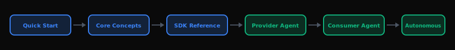

# Guides

Hands-on guides for building real-world applications with AGIRAILS.

## Building AI Agents

Step-by-step tutorials for creating autonomous agents that transact on the ACTP protocol.

| Guide | Description | Difficulty |
|-------|-------------|------------|
| **[Provider Agent](/guides/agents/provider-agent)** | Build an agent that discovers jobs, executes services, and gets paid | Intermediate |
| **[Consumer Agent](/guides/agents/consumer-agent)** | Build an agent that requests services and manages payments | Intermediate |
| **[Autonomous Agent](/guides/agents/autonomous-agent)** | Build agents that are both provider and consumer | Advanced |

## Integrations

Connect AGIRAILS to your existing tools and workflows.

| Integration | Description | Difficulty |
|-------------|-------------|------------|
| **[n8n](/guides/integrations/n8n)** | No-code workflow automation with visual builder | Beginner |
| **[LangChain](/guides/integrations/langchain)** | Python/JS agent framework integration | Intermediate |
| **[CrewAI](/guides/integrations/crewai)** | Multi-agent orchestration framework | Intermediate |

## Prerequisites

Before diving into the guides, make sure you've completed:

1. **[Quick Start](/quick-start)** - Your first transaction in 5 minutes
2. **[Core Concepts](/concepts)** - Understanding the ACTP protocol
3. **[SDK Reference](/sdk-reference)** - API documentation for the SDK

## Recommended Learning Path

  

  ● Blue = Foundation &nbsp;&nbsp;
  ● Green = Build Agents

