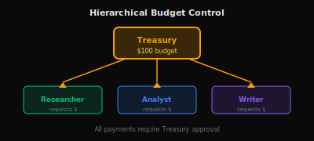
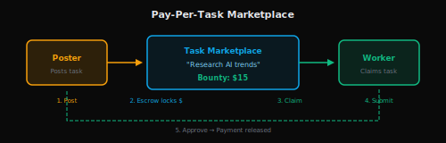

# CrewAI Integration

Build AI crews where agents can pay each other and external services.

<div style={{textAlign: 'center', margin: '2rem 0'}}>
  
</div>

| | |
|---|---|
| **Difficulty** | Advanced |
| **Time** | 45 minutes |
| **Prerequisites** | [LangChain Integration](./langchain), CrewAI basics, Python 3.9+ |

---

## Problem

You want to:
- Build AI crews that can pay for external services autonomously
- Coordinate budgets across multiple agents
- Create agent marketplaces where agents hire each other
- Implement financial accountability in multi-agent systems

---

## Solution

Create a `CrewPaymentTool` that manages a shared treasury, allowing agents to request, approve, and execute payments through AGIRAILS escrow.

:::tip TL;DR
Create treasury tool → Assign to Payment Coordinator agent → Other agents request payments through coordinator → All transactions via AGIRAILS escrow.
:::

---

## Core Concept: Payment Coordinator

Unlike single-agent systems, crews need **coordinated** payment management:

| Single Agent | Crew |
|--------------|------|
| Agent pays directly | Agents request from treasury |
| No budget coordination | Shared budget with limits |
| Simple approval | Multi-level authorization |
| One wallet | Treasury + per-agent allowances |

---

## Installation

```bash
pip install crewai langchain agirails python-dotenv
```

---

## Basic Setup

### Step 1: Create the Crew Payment Tool (SDK)

```python
# Level 2: Advanced API - Direct protocol control
import os, time
from typing import Literal
from crewai import Agent, Task, Crew, Process
from langchain.tools import BaseTool
from agirails import ACTPClient
from agirails.errors import ValidationError, TransactionError, RpcError

Action = Literal["request_budget", "pay_provider", "check_balance", "log_expense"]

class CrewPaymentTool(BaseTool):
    """Payment tool for CrewAI agents with budget management (AGIRAILS SDK)."""

    name = "crew_payment"
    description = "request_budget, pay_provider, check_balance, log_expense"

    def __init__(self, treasury_key: str, treasury_address: str, mode: str = 'testnet', daily_budget: int = 100_000_000):
        super().__init__()
        self.daily_budget = daily_budget  # USDC 6dp
        self.spent_today = 0
        self.expense_log = []
        self.client = ACTPClient(mode=mode, requester_address=treasury_address, private_key=treasury_key)

    def _run(self, action: Action, **kwargs) -> str:
        actions = {
            "request_budget": self._request_budget,
            "pay_provider": self._pay_provider,
            "check_balance": self._check_balance,
            "log_expense": self._log_expense,
        }
        fn = actions.get(action)
        if not fn:
            return f"Unknown action: {action}"
        try:
            return fn(**kwargs)
        except (ValidationError, TransactionError, RpcError) as e:
            return f"Error: {e}"

    def _request_budget(self, amount_usdc: int, purpose: str, agent: str) -> str:
        remaining = self.daily_budget - self.spent_today
        if amount_usdc > remaining:
            return f"DENIED: {amount_usdc/1_000_000:.2f} exceeds remaining {remaining/1_000_000:.2f}"
        return f"APPROVED: ${amount_usdc/1_000_000:.2f} for {purpose} (Agent: {agent})"

def _pay_provider(self, provider: str, amount_usdc: int, purpose: str, agent: str) -> str:
        remaining = self.daily_budget - self.spent_today
        if amount_usdc > remaining:
            return f"FAILED: Insufficient budget. Remaining: ${remaining/1_000_000:.2f}"

        self.spent_today += amount_usdc
        self.expense_log.append({
            "time": time.time(),
            "agent": agent,
            "provider": provider,
            "amount": amount_usdc,
            "purpose": purpose,
        })

        # AGIRAILS SDK: create + fund
        tx_id = self.client.create_transaction(
            requester=self.client.address,
            provider=provider,
            amount=amount_usdc,
            deadline=self.client.now() + 86400,
            dispute_window=7200,
            service_hash="0x" + "00"*32,
        )
        escrow_id = self.client.advanced.link_escrow(tx_id)

        remaining_after = self.daily_budget - self.spent_today
        return (
            f"PAID (initiated): ${amount_usdc/1_000_000:.2f} to {provider}\\n"
            f"Purpose: {purpose}\\n"
            f"By: {agent}\\n"
            f"Transaction: {tx_id}\\n"
            f"Escrow: {escrow_id}\\n"
            f"Remaining: ${remaining_after/1_000_000:.2f}\\n"
            "Note: Settlement via release_escrow_with_verification when attestation is ready."
        )

    def _check_balance(self) -> str:
        remaining = self.daily_budget - self.spent_today
        return f"Budget: ${self.daily_budget/1_000_000:.2f}, Spent: ${self.spent_today/1_000_000:.2f}, Remaining: ${remaining/1_000_000:.2f}"

    def _log_expense(self) -> str:
        if not self.expense_log:
            return "No expenses recorded."
        lines = ["Expense Log:"]
        for i, exp in enumerate(self.expense_log, 1):
            lines.append(f"{i}. ${exp['amount']/1_000_000:.2f} - {exp['purpose']} ({exp['agent']})")
        return "
".join(lines)
```

### Step 2: Register Tools in CrewAI

Use the payment tool (and optional registry tool) when building your crew.

```python
# Level 2: Advanced API - Direct protocol control
payment_tool = CrewPaymentTool(
    treasury_key=os.getenv("TREASURY_PRIVATE_KEY"),
    treasury_address=os.getenv("TREASURY_ADDRESS"),
    mode='testnet',
    daily_budget=100_000_000,  # $100 (6dp)
)

# Optional AIP-7 registry helper
# registry_tool = AGIRAILSRegistryTool(private_key=os.getenv("TREASURY_PRIVATE_KEY"))

coordinator = Agent(
    role="Payment Coordinator",
    goal="Manage budgets and pay providers",
    backstory="Seasoned ops agent with financial controls",
    tools=[payment_tool],
)
```

### Step 3: Define Tasks and Run
### Step 3: Define Tasks and Run

```python
# Level 2: Advanced API - Direct protocol control
def run_research_project(topic: str):
    coordinator, researcher, analyst, payment_tool = create_research_crew()

    # Task 1: Budget allocation
    budget_task = Task(
        description=f"""
        Review project: "{topic}"
        Allocate budget for data ($10-20), compute ($5-10).
        Use check_balance first.
        """,
        agent=coordinator,
        expected_output="Budget allocation plan"
    )

    # Task 2: Research
    research_task = Task(
        description=f"""
        Research: "{topic}"
        Request budget approval for paid resources.
        """,
        agent=researcher,
        expected_output="Research findings"
    )

    # Task 3: Analysis
    analysis_task = Task(
        description=f"""
        Analyze findings on: "{topic}"
        Coordinate with Payment Coordinator for compute.
        """,
        agent=analyst,
        expected_output="Analysis report"
    )

    # Create and run crew
    crew = Crew(
        agents=[coordinator, researcher, analyst],
        tasks=[budget_task, research_task, analysis_task],
        process=Process.sequential,
        verbose=True
    )

    return crew.kickoff()


# Run
result = run_research_project("AI agents in financial markets")
print(result)
```

---

## Crew Patterns

### Pattern 1: Hierarchical Budget Control

<div style={{textAlign: 'center', margin: '1.5rem 0'}}>
  
</div>

All payments flow through a central Treasury agent:

```python
# Level 2: Advanced API - Direct protocol control
# Treasury Agent controls all spending
treasury = Agent(
    role="Treasury Manager",
    goal="Control and optimize crew spending",
    backstory="Financial gatekeeper. No payment without approval.",
    tools=[payment_tool]
)

# Workers reference treasury in backstory
worker = Agent(
    role="Research Worker",
    backstory="...For paid resources, request from Treasury Manager..."
)
```

**Best for**: High-value transactions, strict compliance, audit requirements.

---

### Pattern 2: Delegated Budgets

<div style={{textAlign: 'center', margin: '1.5rem 0'}}>
  
</div>

Each agent gets their own budget allocation:

```python
# Level 2: Advanced API - Direct protocol control
class DelegatedBudgetTool(BaseTool):
    """Per-agent budget tool."""

    def __init__(self, agent_id: str, budget: float):
        super().__init__()
        self.agent_id = agent_id
        self.budget = budget
        self.spent = 0.0

    def _run(self, action: str, **kwargs) -> str:
        if action == "spend":
            amount = kwargs.get("amount", 0)
            if self.spent + amount > self.budget:
                return f"Over budget! ${self.budget - self.spent} left"
            self.spent += amount
            return f"Spent ${amount}. ${self.budget - self.spent} remaining"
        elif action == "balance":
            return f"Budget: ${self.budget}, Spent: ${self.spent}"

# Each agent gets own tool
researcher_budget = DelegatedBudgetTool("researcher", budget=20.0)
analyst_budget = DelegatedBudgetTool("analyst", budget=10.0)
```

**Best for**: Autonomous teams, parallel execution, faster decisions.

---

### Pattern 3: Pay-Per-Task Marketplace

<div style={{textAlign: 'center', margin: '1.5rem 0'}}>
  
</div>

Agents post and claim tasks with bounties:

```python
# Level 2: Advanced API - Direct protocol control
class TaskMarketplaceTool(BaseTool):
    """Task marketplace with bounties."""

    name = "task_marketplace"
    description = "Post tasks, claim tasks, submit work, release payment"

    def __init__(self):
        super().__init__()
        self.tasks = {}

    def _run(self, action: str, **kwargs) -> str:
        actions = {
            "post_task": self._post_task,
            "claim_task": self._claim_task,
            "submit_work": self._submit_work,
            "approve_and_pay": self._approve_and_pay
        }
        return actions.get(action, lambda **k: "Unknown")(**kwargs)

    def _post_task(self, description: str, bounty: float) -> str:
        task_id = f"task_{len(self.tasks)}"
        self.tasks[task_id] = {
            "description": description,
            "bounty": bounty,
            "status": "open"
        }
        return f"Posted: {task_id}, Bounty: ${bounty}"

    def _claim_task(self, task_id: str, agent: str) -> str:
        if task_id in self.tasks:
            self.tasks[task_id]["claimed_by"] = agent
            self.tasks[task_id]["status"] = "claimed"
            return f"Claimed: {task_id} by {agent}"
        return "Task not found"

    def _submit_work(self, task_id: str, result: str) -> str:
        if task_id in self.tasks:
            self.tasks[task_id]["result"] = result
            self.tasks[task_id]["status"] = "submitted"
            return f"Submitted work for {task_id}"
        return "Task not found"

    def _approve_and_pay(self, task_id: str) -> str:
        if task_id in self.tasks:
            task = self.tasks[task_id]
            task["status"] = "paid"
            return f"Paid ${task['bounty']} to {task['claimed_by']}"
        return "Task not found"
```

**Best for**: Dynamic workloads, incentive alignment, scalable crews.

---

## Multi-Crew Coordination

When crews need to transact with each other:

```python
# Level 2: Advanced API - Direct protocol control
class InterCrewPaymentTool(BaseTool):
    """Payments between different crews."""

    name = "inter_crew_payment"
    description = "Pay other crews for services"

    def __init__(self, crew_id: str, treasury_key: str):
        self.crew_id = crew_id
        self.treasury_key = treasury_key

    def _run(self, action: str, **kwargs) -> str:
        if action == "request_service":
            return self._request_service(**kwargs)
        elif action == "offer_service":
            return self._offer_service(**kwargs)

    def _request_service(self, target_crew: str, service: str, budget: float) -> str:
        return f"""
Service Request:
- From: {self.crew_id}
- To: {target_crew}
- Service: {service}
- Budget: ${budget}
- Status: PENDING
"""

    def _offer_service(self, service: str, price: float) -> str:
        return f"""
Service Offered:
- From: {self.crew_id}
- Service: {service}
- Price: ${price}
"""


# Usage
inter_crew = InterCrewPaymentTool(
    crew_id="research_alpha",
    treasury_key=os.getenv("CREW_TREASURY_KEY")
)

external_agent = Agent(
    role="External Relations",
    goal="Coordinate with other AI crews",
    backstory="You negotiate with external crews.",
    tools=[inter_crew]
)
```

---

## Best Practices

### 1. Budget Guards

```python
# Level 2: Advanced API - Direct protocol control
class GuardedPaymentTool(CrewPaymentTool):
    """Payment tool with hard limits."""

    def __init__(self, *args, max_single: float = 10.0, **kwargs):
        super().__init__(*args, **kwargs)
        self.max_single = max_single

    def _pay_provider(self, **kwargs) -> str:
        amount = kwargs.get("amount", 0)

        if amount > self.max_single:
            return f"BLOCKED: ${amount} > limit ${self.max_single}"

        if not kwargs.get("purpose"):
            return "BLOCKED: Purpose required"

        return super()._pay_provider(**kwargs)
```

### 2. Audit Trails

```python
# Level 2: Advanced API - Direct protocol control
import json
from datetime import datetime

class AuditedPaymentTool(CrewPaymentTool):
    """Payment tool with audit logging."""

    def __init__(self, *args, audit_file: str = "audit.json", **kwargs):
        super().__init__(*args, **kwargs)
        self.audit_file = audit_file

    def _log_audit(self, event: str, details: dict):
        entry = {
            "time": datetime.now().isoformat(),
            "event": event,
            "details": details
        }

        try:
            with open(self.audit_file, "r") as f:
                log = json.load(f)
        except:
            log = []

        log.append(entry)

        with open(self.audit_file, "w") as f:
            json.dump(log, f, indent=2)

    def _pay_provider(self, **kwargs) -> str:
        result = super()._pay_provider(**kwargs)
        self._log_audit("payment", kwargs)
        return result
```

### 3. Coordinator First

Always run Payment Coordinator first in sequential crews:

```python
# Level 2: Advanced API - Direct protocol control
crew = Crew(
    agents=[coordinator, researcher, analyst],  # Coordinator FIRST
    tasks=[budget_task, research_task, analysis_task],
    process=Process.sequential  # Sequential order
)
```

---

## Troubleshooting

### Agents overspending

**Problem**: Agents exceed budget limits

**Solution**: Hard limits in tool, not just instructions:

```python
# Level 2: Advanced API - Direct protocol control
def _pay_provider(self, amount: float, **kwargs) -> str:
    remaining = self.daily_budget - self.spent_today
    if amount > remaining:
        raise BudgetExceededError(f"${amount} > ${remaining}")
```

### Coordination failures

**Problem**: Agents don't coordinate on budget

**Solution**: Make coordinator the first agent, use sequential process.

### Payments not executing

**Problem**: Payments succeed in tool but not on blockchain

**Solution**: Verify actual blockchain calls:

```python
# Level 2: Advanced API - Direct protocol control
def _pay_provider(self, **kwargs) -> str:
    # Execute real transaction
    tx_hash = self._blockchain_payment(**kwargs)
    receipt = self.w3.eth.wait_for_transaction_receipt(tx_hash)

    if receipt['status'] == 0:
        return f"FAILED: Transaction reverted"

    return f"SUCCESS: {tx_hash.hex()}"
```

---

## Next Steps

<div className="row" style={{marginTop: '1rem'}}>
  <div className="col col--4" style={{marginBottom: '1rem'}}>
    <div className="card" style={{height: '100%', padding: '1.5rem'}}>
      <h4>🔗 LangChain</h4>
      <p>Simpler single-agent flows.</p>
      <a href="./langchain">LangChain Integration →</a>
    </div>
  </div>
  <div className="col col--4" style={{marginBottom: '1rem'}}>
    <div className="card" style={{height: '100%', padding: '1.5rem'}}>
      <h4>💰 Multi-Agent Budget</h4>
      <p>Advanced budget patterns.</p>
      <a href="/cookbook/multi-agent-budget">Budget Cookbook →</a>
    </div>
  </div>
  <div className="col col--4" style={{marginBottom: '1rem'}}>
    <div className="card" style={{height: '100%', padding: '1.5rem'}}>
      <h4>🔒 Security</h4>
      <p>Key management best practices.</p>
      <a href="/cookbook/secure-key-management">Key Management →</a>
    </div>
  </div>
</div>
