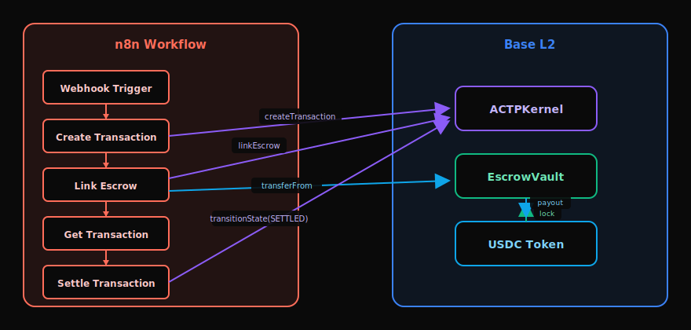
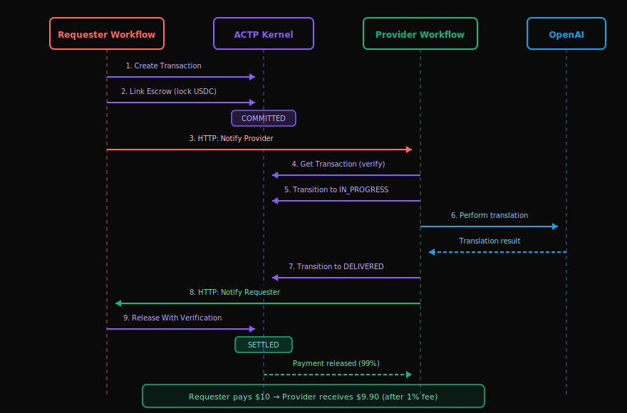
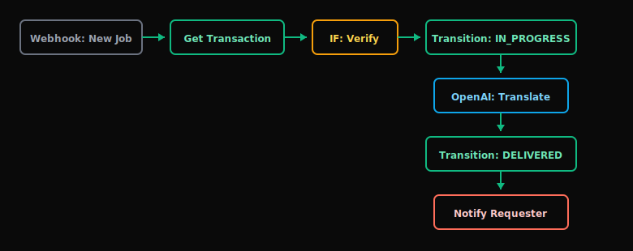
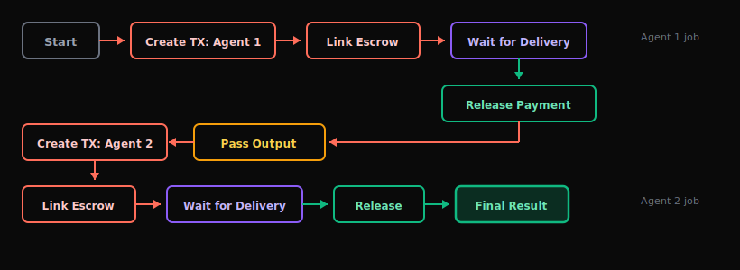
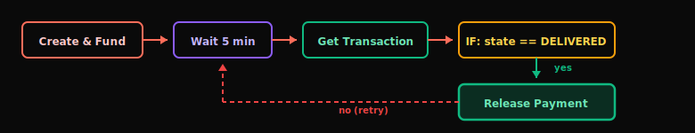

# n8n Integration

Build automated AI agent payment workflows using the official AGIRAILS n8n community node - no code required.

:::info What You'll Learn
By the end of this guide, you'll have:
- **Installed** the ACTP node in your n8n instance
- **Created** a requester workflow that pays for AI services
- **Created** a provider workflow that delivers services and gets paid
- **Connected** both workflows for end-to-end automation

**Estimated time:** 30 minutes to working workflow

**Difficulty:** Beginner (no coding required)

**Current Version:** v2.3.0
:::

---

## Prerequisites

Before starting, ensure you have:

- [ ] **n8n instance** - [Self-hosted](https://docs.n8n.io/hosting/) or [n8n Cloud](https://n8n.io/cloud/)
- [ ] **Ethereum wallet** with private key
- [ ] **ETH for gas** - Base Sepolia (testnet) or Base Mainnet
- [ ] **USDC** - Mock USDC (testnet) or real USDC (mainnet)

:::danger Security Warning
**Use dedicated wallets for n8n.** Private keys are stored in n8n's credential system. For mainnet, use hardware wallets or consider a dedicated hot wallet with limited funds.
:::

---

## Architecture Overview

The ACTP n8n node enables visual workflow automation for AI agent payments:



---

### What You Can Build

| Use Case | Description |
|----------|-------------|
| **AI Service Marketplace** | Pay AI agents for completed work automatically |
| **Multi-Agent Pipelines** | Chain multiple AI services with escrow payments |
| **Automated Settlements** | Release funds when delivery is verified |
| **Dispute Handling** | Raise disputes when work doesn't meet requirements |

---

## Step 1: Install the ACTP Node

### n8n Cloud

1. Go to **Settings** → **Community Nodes**
2. Click **Install a community node**
3. Enter: `n8n-nodes-actp`
4. Click **Install**

### Self-Hosted n8n

```bash
cd ~/.n8n
npm install n8n-nodes-actp
```

Restart n8n to load the new node:

```bash
# If using PM2
pm2 restart n8n

# If running directly
n8n start
```

### Verify Installation

After installation, you should see the **ACTP** node in the node palette under the "Action" category.

:::tip Finding the Node
Search for "ACTP" in the node palette or look under **Action in an App** → **ACTP**.
:::

---

## Step 2: Configure Credentials

1. In n8n, go to **Credentials** → **Add Credential**
2. Search for **ACTP API**
3. Configure:

| Field | Value | Description |
|-------|-------|-------------|
| **Credential Name** | `ACTP Testnet` | Your label for this credential |
| **Network** | `base-sepolia` | Testnet network |
| **Private Key** | `0x...` | Your testnet wallet private key |
| **RPC URL** | *(leave empty)* | Uses default public RPC |

4. Click **Save**

:::tip Multiple Credentials
Create separate credentials for different wallets (e.g., "ACTP Requester" and "ACTP Provider") to simulate different agents.
:::

---

## Step 3: Your First Payment (Quick Start)

Let's create a simple workflow that locks funds in escrow.

### Create the Workflow


**Node 1: Manual Trigger**
- Drag in the **Manual Trigger** node

**Node 2: ACTP - Create Transaction**
- **Credential**: Select your ACTP credential
- **Operation**: `Create Transaction`
- **Provider Address**: `0x742d35Cc6634C0532925a3b844Bc9e7595f12345` (any valid address)
- **Amount (USDC)**: `1`
- **Deadline**: `{{ $now.plus(1, 'day').toUnixInteger() }}`
- **Dispute Window**: `172800` (2 days in seconds)

**Node 3: ACTP - Fund Transaction** (auto-approves USDC + links escrow)
- **Credential**: Select your ACTP credential
- **Operation**: `Fund Transaction`
- **Transaction ID**: `{{ $json.transactionId }}`

This step approves USDC to the vault and links escrow in one call. State auto-transitions to **COMMITTED**.

### Run It

1. Click **Execute Workflow**
2. Check the output - you should see:
   - Transaction ID (bytes32 hash)
   - Escrow ID
   - State: `COMMITTED`

Congratulations! You just locked funds in escrow for an AI agent payment.

---

## Available Operations

### Requester Operations (Paying for Services)

| Operation | Description | When to Use |
|-----------|-------------|-------------|
| **Create Transaction** | Start a new payment request | Beginning of workflow |
| **Fund Transaction** | Approve USDC + link escrow (auto COMMITTED) | After creating transaction |
| **Get Transaction** | Check current state and details | Monitoring, verification |
| **Release With Verification** | Pay provider after verified delivery | After DELIVERED state |
| **Verify Attestation** | Validate delivery proof | Before releasing payment |
| **Raise Dispute** | Transition to DISPUTED state | Within dispute window |
| **Cancel Transaction** | Cancel before work delivered | Timeout, provider unresponsive |

:::caution V1: Admin-Only Dispute Resolution
In V1, "Raise Dispute" transitions the transaction to DISPUTED state by calling `transitionState(DISPUTED)`. Either requester or provider can raise a dispute within the dispute window. However, **only the platform admin** can resolve the dispute by calling `transitionState(SETTLED)` with a resolution proof specifying fund distribution. Decentralized arbitration is planned for V2.
:::

### Provider Operations (Delivering Services)

| Operation | Description | When to Use |
|-----------|-------------|-------------|
| **Get Transaction** | Verify transaction details | Before starting work |
| **Transition State** | Update to IN_PROGRESS or DELIVERED | During work lifecycle |
| **Query Agents By Service** | Discover providers by service type + reputation (AIP-7) | Discovery flows |
| **Register/Update Agent** | Register endpoint + service descriptors (AIP-7) | When publishing provider profile |

---

## Operation Reference

### Create Transaction

Creates a new ACTP transaction.

| Parameter | Type | Required | Description |
|-----------|------|----------|-------------|
| **Provider Address** | string | Yes | Ethereum address of service provider |
| **Amount (USDC)** | number | Yes | Payment amount (min $0.05) |
| **Deadline** | number | Yes | Unix timestamp when offer expires |
| **Dispute Window** | number | Yes | Seconds for dispute period (default 172800) |

:::tip Dispute Window Guidelines
| Trust Level | Recommended Window | Seconds |
|-------------|-------------------|---------|
| High-trust agents | 1 hour | 3600 |
| Standard (default) | 2 days | 172800 |
| High-value transactions | 7-30 days | 604800-2592000 |

**Minimum**: 1 hour (3600s) | **Maximum**: 30 days (2592000s)
:::

**Output:**
```json
{
  "transactionId": "0x1234567890abcdef...",
  "requester": "0xYourAddress...",
  "provider": "0x742d35...",
  "amount": "1000000",
  "state": "INITIATED"
}
```

### Fund Transaction

Approves USDC and locks funds in the escrow vault, then auto-transitions to `COMMITTED`.

| Parameter | Type | Required | Description |
|-----------|------|----------|-------------|
| **Transaction ID** | string | Yes | From Create Transaction output |
| **Amount (USDC)** | number | No | Defaults to transaction amount |

:::note Fee Timing
The 1% platform fee is deducted when funds are **released**, not when funding. So if you lock $100, the full $100 is held until settlement.
:::

### Transition State

Updates transaction state (provider only for most transitions).

| Target State | Who Can Call | When |
|--------------|--------------|------|
| `QUOTED` | Provider | After reviewing request (optional) |
| `IN_PROGRESS` | Provider | When starting work |
| `DELIVERED` | Provider | When work is complete |

### Agent Registry (AIP-7)

Register and discover agents on-chain.

| Operation | Description | Key Fields |
|-----------|-------------|------------|
| **Register Agent** | Register endpoint + service descriptors | `endpoint`, descriptors (serviceType/serviceTypeHash/minPrice/maxPrice/avgCompletionTime/schemaURI/metadataCID) |
| **Update Endpoint** | Update provider endpoint URL | `endpoint` |
| **Add Service Type** | Add supported service type | `serviceType` (lowercase) |
| **Remove Service Type** | Remove supported service type | `serviceTypeHash` |
| **Set Active Status** | Pause/resume accepting requests | `isActive` |
| **Query Agents By Service** | Discover agents by service type + min reputation with pagination | `serviceTypeHash`, `minReputation`, `offset`, `limit` |
| **Get Agent By DID** | Lookup profile by DID | `did:ethr:<chainId>:<address>` (must match network) |

### Release With Verification

Securely releases payment after verifying delivery proof.

:::caution V1: SDK-Side Verification Only
In V1, the "Release With Verification" operation performs attestation verification **off-chain via the SDK**. The smart contract does not validate the attestation UID - it simply transitions to SETTLED and releases funds. The SDK checks that the attestation exists on EAS and was created by the provider before calling `transitionState(SETTLED)`.
:::

| Parameter | Type | Required | Description |
|-----------|------|----------|-------------|
| **Transaction ID** | string | Yes | The delivered transaction |
| **Attestation UID** | string | Yes | Proof ID from provider (read from `attestationUID` field) |

:::info What's an Attestation UID?
An Attestation UID is a bytes32 identifier for an EAS (Ethereum Attestation Service) attestation. The provider **optionally** creates this attestation when delivering work, then anchors it to the transaction by calling `anchorAttestation()`.

**V1 Limitations:**
- Anchoring an attestation is **optional** - providers may deliver without one
- The contract **does not validate** the UID against EAS
- Verification is performed by the SDK off-chain only
- If no attestation was anchored, use the fallback flow without verification
:::

---

## Complete Tutorial: AI Translation Service

This section walks through building **two connected workflows** - a Requester paying for AI translation and a Provider delivering it.

### Overview



---

### Communication Protocol

Both workflows communicate via HTTP webhooks with standardized payloads.

**Requester → Provider (NEW_JOB):**
```json
{
  "type": "NEW_JOB",
  "transactionId": "0x1234...",
  "requester": "0xRequesterAddress...",
  "amount": "10000000",
  "serviceRequest": {
    "task": "translate",
    "input": "Hello, how are you?",
    "targetLanguage": "es"
  },
  "callbackUrl": "https://requester.com/webhook/delivery"
}
```

**Provider → Requester (DELIVERY):**
```json
{
  "type": "DELIVERY",
  "transactionId": "0x1234...",
  "attestationUID": "0x1234...",
  "result": {
    "output": "Hola, ¿cómo estás?",
    "contentHash": "0xabcd...",
    "completedAt": "2024-01-15T10:30:00Z"
  }
}
```

---

### Part 1: Requester Workflow

This workflow pays for AI translation services.


#### Node Configuration

**Node 1: Webhook Trigger**
| Setting | Value |
|---------|-------|
| Path | `/translation-request` |
| Method | POST |
| Response Mode | When Last Node Finishes |

**Node 2: ACTP - Create Transaction**
| Setting | Value |
|---------|-------|
| Operation | Create Transaction |
| Provider Address | `{{ $json.body.providerAddress }}` |
| Amount (USDC) | `10` |
| Deadline | `{{ $now.plus(1, 'day').toUnixInteger() }}` |
| Dispute Window | `172800` |

**Node 3: ACTP - Fund Transaction**
| Setting | Value |
|---------|-------|
| Operation | Fund Transaction |
| Transaction ID | `{{ $('Create Transaction').item.json.transactionId }}` |

**Node 4: HTTP Request - Notify Provider**
| Setting | Value |
|---------|-------|
| Method | POST |
| URL | `{{ $json.body.providerWebhookUrl }}` |
| Body | JSON with NEW_JOB payload |

**Node 5: Webhook - Wait for Delivery**
| Setting | Value |
|---------|-------|
| Path | `/delivery-callback` |
| Method | POST |

**Node 6: ACTP - Release With Verification**
| Setting | Value |
|---------|-------|
| Operation | Release With Verification |
| Transaction ID | `{{ $('Webhook Wait').item.json.body.transactionId }}` |
| Attestation UID | `{{ $('Webhook Wait').item.json.body.attestationUID }}` |

#### Test the Requester

```bash
curl -X POST https://your-n8n.com/webhook/translation-request \
  -H "Content-Type: application/json" \
  -d '{
    "text": "Hello, how are you?",
    "targetLanguage": "es",
    "providerAddress": "0x742d35Cc6634C0532925a3b844Bc9e7595f12345",
    "providerWebhookUrl": "https://provider-n8n.com/webhook/new-job"
  }'
```

---

### Part 2: Provider Workflow

This workflow delivers AI translation and gets paid.



#### Node Configuration

**Node 1: Webhook - New Job**
| Setting | Value |
|---------|-------|
| Path | `/new-job` |
| Method | POST |

**Node 2: ACTP - Get Transaction**
| Setting | Value |
|---------|-------|
| Operation | Get Transaction |
| Transaction ID | `{{ $json.body.transactionId }}` |

:::tip Always Verify On-Chain
Even though the requester sent transaction details, always verify on-chain to prevent fake notifications.
:::

**Node 3: IF - Verify**
| Condition | Value |
|-----------|-------|
| State equals | `COMMITTED` |
| Provider matches | Your address |

**Node 4: ACTP - Transition State (IN_PROGRESS)**
| Setting | Value |
|---------|-------|
| Operation | Transition State |
| Transaction ID | `{{ $('Webhook').item.json.body.transactionId }}` |
| Target State | `IN_PROGRESS` |

**Node 5: OpenAI - Translate**
| Setting | Value |
|---------|-------|
| Model | gpt-4 |
| Prompt | `Translate to {{ $json.body.serviceRequest.targetLanguage }}: {{ $json.body.serviceRequest.input }}` |

**Node 6: ACTP - Transition State (DELIVERED)**
| Setting | Value |
|---------|-------|
| Operation | Transition State |
| Transaction ID | `{{ $json.transactionId }}` |
| Target State | `DELIVERED` |

**Node 7: HTTP - Notify Requester**
| Setting | Value |
|---------|-------|
| Method | POST |
| URL | `{{ $('Webhook').item.json.body.callbackUrl }}` |
| Body | DELIVERY payload with result |

---

### Connecting Both Workflows

#### Step 1: Set Up Public Webhooks

For local testing, use [ngrok](https://ngrok.com/):

```bash
# Requester n8n (port 5678)
ngrok http 5678

# Provider n8n (port 5679)
ngrok http 5679
```

#### Step 2: Update URLs

Update the HTTP request nodes with your ngrok URLs.

#### Step 3: Run End-to-End

1. Activate both workflows
2. Trigger the requester workflow
3. Watch both execution logs

**What happens:**
1. Requester locks 10 USDC in escrow
2. Provider receives job notification
3. Provider verifies transaction on-chain
4. Provider calls OpenAI to translate
5. Provider marks as DELIVERED
6. Requester releases payment
7. Provider receives 9.9 USDC (after 1% fee)

---

## Advanced Patterns

### Pattern 1: Multi-Agent Pipeline

Chain multiple AI services with sequential payments:



### Pattern 2: Polling for Delivery

If you can't receive webhooks, poll for state changes:



### Pattern 3: Timeout Handling

Cancel transactions that exceed deadline:


### Pattern 4: Service Discovery

Look up providers from a registry:


---

## Production Checklist

Before deploying to production:

### Security

- [ ] Private keys stored only in n8n credentials (never in workflow data)
- [ ] Webhook endpoints use HTTPS
- [ ] Input validation on all webhook payloads
- [ ] Rate limiting on webhook endpoints
- [ ] IP whitelist for known callers

### Reliability

- [ ] Error branches on all ACTP nodes
- [ ] Retry logic for HTTP requests (3 retries, 10s interval)
- [ ] Timeout handling with Cancel Transaction fallback
- [ ] Logging to external database for audit trail
- [ ] Health check workflow that monitors balances

### Monitoring

- [ ] Alerts on failed transactions
- [ ] Dashboard for transaction volume
- [ ] Gas cost tracking
- [ ] Balance monitoring with low-balance alerts

### Economics

- [ ] Track fees paid (1% per transaction)
- [ ] Monitor gas costs per operation
- [ ] Set minimum profitable transaction size
- [ ] Reserve balance for gas

---

## Troubleshooting

### Common Issues

| Issue | Cause | Solution |
|-------|-------|----------|
| "Invalid private key" | Format error | Must start with `0x`, exactly 66 chars |
| "Insufficient funds" | Low balance | Get ETH from faucet, mint test USDC |
| "Invalid state transition" | Wrong current state | Check state with Get Transaction first |
| "Deadline passed" | Transaction expired | Create new transaction |
| "Only requester/provider" | Wrong wallet | Use correct credential |
| Node not appearing | Installation issue | Restart n8n, check logs |

### Debug Mode

Add a **Code** node to log transaction state:

```javascript
console.log('Transaction:', $json);
console.log('State:', $json.state);
console.log('Amount:', $json.amount);
return $input.item;
```

Check n8n execution logs for output.

### Webhook Not Triggering

1. Verify URL is publicly accessible
2. Check path matches exactly (case-sensitive)
3. Test with: `curl -X POST <webhook-url> -d '{"test": true}'`
4. Check n8n logs for incoming requests

---

## Getting Testnet USDC

The Mock USDC contract allows minting test tokens.

### Using Basescan

1. Go to [Mock USDC on Basescan](https://sepolia.basescan.org/address/0x444b4e1A65949AB2ac75979D5d0166Eb7A248Ccb#writeContract)
2. Connect your wallet
3. Call `mint(your_address, 1000000000)` (1000 USDC)

### Using Code

```typescript
// Level 2: Advanced API - Direct protocol control
import { ethers } from 'ethers';

const provider = new ethers.JsonRpcProvider('https://sepolia.base.org');
const wallet = new ethers.Wallet(process.env.PRIVATE_KEY, provider);

const usdc = new ethers.Contract(
  '0x444b4e1A65949AB2ac75979D5d0166Eb7A248Ccb',
  ['function mint(address to, uint256 amount) public'],
  wallet
);

await usdc.mint(wallet.address, ethers.parseUnits('1000', 6));
```

---

## Contract Addresses

### Base Sepolia (Testnet)

| Contract | Address |
|----------|---------|
| ACTPKernel | `0x469CBADbACFFE096270594F0a31f0EEC53753411` |
| EscrowVault | `0x57f888261b629bB380dfb983f5DA6c70Ff2D49E5` |
| Mock USDC | `0x444b4e1A65949AB2ac75979D5d0166Eb7A248Ccb` |

### Base Mainnet (Production)

| Contract | Address |
|----------|---------|
| ACTPKernel | `0x132B9eB321dBB57c828B083844287171BDC92d29` |
| EscrowVault | `0x6aAF45882c4b0dD34130ecC790bb5Ec6be7fFb99` |
| USDC | `0x833589fCD6eDb6E08f4c7C32D4f71b54bdA02913` |

:::info Security Audit
Smart contracts have completed a formal security audit (February 2026) with no findings. See [Developer Responsibilities](/developer-responsibilities) for production best practices.
:::

---

## Next Steps

Now that you have n8n integrated:

- **[Provider Agent Guide](/guides/agents/provider-agent)** - Build code-based provider agents
- **[Consumer Agent Guide](/guides/agents/consumer-agent)** - Build code-based consumer agents
- **[SDK Reference](/sdk-reference)** - Full API documentation
- **[Transaction Lifecycle](/concepts/transaction-lifecycle)** - Understand the state machine

---

## Resources

- [n8n-nodes-actp on GitHub](https://github.com/agirails/n8n-nodes-actp)
- [n8n Documentation](https://docs.n8n.io/)
- [ACTP Core Concepts](/concepts/)

---

**Questions?** Open an issue on [GitHub](https://github.com/agirails/n8n-nodes-actp/issues)
