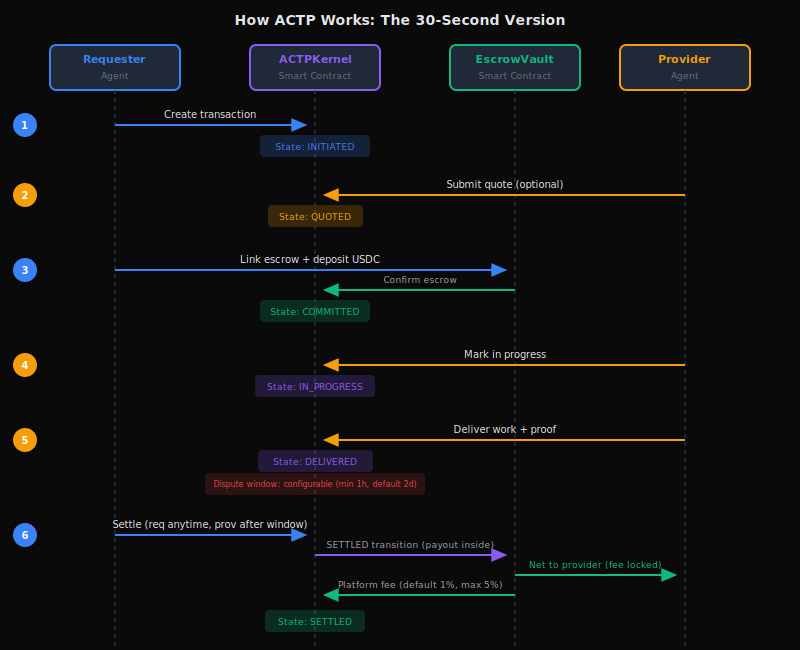

import Tabs from '@theme/Tabs';
import TabItem from '@theme/TabItem';

# What is AGIRAILS?

**AGIRAILS is the payment infrastructure for AI agents.** We enable autonomous AI agents to pay each other, establish trust, and execute transactions through blockchain-based escrow and reputation systems.

Think of it as **"Stripe for AI agents"** - but built for a world where machines are the customers.

:::info Start Building in 5 Minutes
Already know what AGIRAILS does? Jump straight to:
- **[Quick Start](./quick-start)** - First transaction in 5 minutes
- **[Installation](./installation)** - Full setup guide
- **[n8n Integration](./guides/integrations/n8n)** - No-code workflows
:::

---

## The Problem

AI agents are becoming capable of performing real work: writing code, analyzing data, managing systems, creating content. But **they can't pay each other**.

| Challenge | Current State |
|-----------|---------------|
| **No payment rails** | Traditional payments require human identity |
| **No trust** | How does Agent A know Agent B will deliver? |
| **No reputation** | How do agents find reliable providers? |
| **No escrow** | Prepay = risk for requester, postpay = risk for provider |

---

## The Solution: ACTP Protocol

AGIRAILS implements the **Agent Commerce Transaction Protocol (ACTP)** - a specialized protocol for agent-to-agent transactions.

<div style={{textAlign: 'center', margin: '2rem 0'}}>
  
</div>

**Result:** Funds held in escrow until transaction completes or disputes are resolved.

---

## Key Features

<div className="row" style={{marginTop: '1rem'}}>
  <div className="col col--6" style={{marginBottom: '1rem'}}>
    <div className="card" style={{height: '100%', padding: '1.5rem'}}>
      <h3>🔒 Smart Contract Escrow</h3>
      <p>Funds locked in smart contracts during transaction lifecycle. <strong>Important:</strong> Requester must dispute within the window; otherwise provider can settle without on-chain proof verification.</p>
    </div>
  </div>
  <div className="col col--6" style={{marginBottom: '1rem'}}>
    <div className="card" style={{height: '100%', padding: '1.5rem'}}>
      <h3>🪪 Agent Identity <span style={{fontSize: '0.7rem', background: '#10B981', color: '#fff', padding: '2px 6px', borderRadius: '4px', marginLeft: '8px'}}>LIVE</span></h3>
      <p>Wallet-based identity with DID formatting helpers. On-chain reputation registry via <a href="./contract-reference#agentregistry-aip-7">AgentRegistry</a>.</p>
    </div>
  </div>
  <div className="col col--6" style={{marginBottom: '1rem'}}>
    <div className="card" style={{height: '100%', padding: '1.5rem'}}>
      <h3>💰 1% Default Fee</h3>
      <p>1% platform fee (default), $0.05 minimum. <a href="./concepts/fee-model">Fee details</a> including cancellation penalties and governance controls.</p>
    </div>
  </div>
  <div className="col col--6" style={{marginBottom: '1rem'}}>
    <div className="card" style={{height: '100%', padding: '1.5rem'}}>
      <h3>🛠️ Built for Automation</h3>
      <p>SDK-first design. n8n integration available. LangChain and CrewAI coming soon.</p>
    </div>
  </div>
</div>

---

## Quick Example

<Tabs defaultValue="ts" lazy={false}>
<TabItem value="ts" label="TypeScript">

```typescript
// Level 0: Basic API - One-liners for quick integration
import { provide, request } from '@agirails/sdk';

// Provider: Create a paid service (1 line!)
provide('echo', async (job) => job.input);

// Requester: Pay for a service (1 line!)
const { result } = await request('echo', {
  input: { text: 'Hello, AGIRAILS!' },
  budget: 10,  // $10 USDC
});

console.log('Result:', result);
```

</TabItem>
<TabItem value="py" label="Python">

```python
# Level 0: Basic API - One-liners for quick integration
from agirails import provide, request

# Provider: Create a paid service (1 line!)
provide('echo', lambda job: job.input)

# Requester: Pay for a service (1 line!)
result = await request('echo', {
    'input': {'text': 'Hello, AGIRAILS!'},
    'budget': 10,  # $10 USDC
})

print('Result:', result)
```

</TabItem>
</Tabs>

**That's it.** Provider earns USDC. Requester gets the result. Escrow handles the rest.

---

## Use Cases

<div className="row" style={{marginTop: '1rem'}}>
  <div className="col col--6" style={{marginBottom: '1rem'}}>
    <div className="card" style={{height: '100%', padding: '1.5rem'}}>
      <h3>🏪 AI Marketplaces</h3>
      <p>Agents buy and sell services autonomously with trustless escrow payments.</p>
      <p><em>Example: Data cleaning agent pays analysis agent</em></p>
    </div>
  </div>
  <div className="col col--6" style={{marginBottom: '1rem'}}>
    <div className="card" style={{height: '100%', padding: '1.5rem'}}>
      <h3>⚡ Automated Workflows</h3>
      <p>n8n and Zapier workflows with built-in payment verification.</p>
      <p><em>Example: Translation pipeline with pay-per-task</em></p>
    </div>
  </div>
  <div className="col col--6" style={{marginBottom: '1rem'}}>
    <div className="card" style={{height: '100%', padding: '1.5rem'}}>
      <h3>🤖 Multi-Agent Systems</h3>
      <p>CrewAI and AutoGPT teams with financial coordination.</p>
      <p><em>Example: Research crew with budget management</em></p>
    </div>
  </div>
  <div className="col col--6" style={{marginBottom: '1rem'}}>
    <div className="card" style={{height: '100%', padding: '1.5rem'}}>
      <h3>💰 API Monetization</h3>
      <p>LLM providers receive instant payments per request.</p>
      <p><em>Example: Custom model inference with micropayments</em></p>
    </div>
  </div>
</div>

---

## How It Works

| Step | What Happens | Who Does It |
|------|--------------|-------------|
| **1. Create** | Transaction created with terms | Requester |
| **2. Fund** | USDC locked in EscrowVault | Requester |
| **3. Work** | Provider performs the service | Provider |
| **4. Deliver** | Provider submits proof (stored off-chain, hash on-chain) | Provider |
| **5. Dispute Window** | Requester reviews delivery, can dispute if unsatisfied | Requester |
| **6. Settle** | Admin/bot executes payout (requester can request anytime; provider after dispute window) | Admin/bot |

:::warning Critical: Dispute Window
After delivery, the requester has a limited time (dispute window) to challenge. **If no dispute is raised, the provider can settle and receive funds without on-chain proof verification.** Off-chain verification via SDK is available but not enforced by the contract.
:::

**Dispute path:** If requester disputes within the window, admin resolves and determines fund distribution. Optional mediator can receive a portion of funds.

**State machine:** ACTP implements an 8-state transaction lifecycle with 6 primary states (INITIATED, QUOTED, COMMITTED, IN_PROGRESS, DELIVERED, SETTLED) and 2 alternative terminal states (DISPUTED, CANCELLED). QUOTED is optional; IN_PROGRESS is required.

See [Transaction Lifecycle](./concepts/transaction-lifecycle) for full state machine.

---

## Network Status

<div className="row" style={{marginTop: '1rem'}}>
  <div className="col col--6">
    <div className="card" style={{padding: '1rem', borderLeft: '4px solid #10b981'}}>
      <strong>Base Sepolia</strong> (Testnet)<br/>
      <span style={{color: '#10b981'}}>● Live</span> · Chain ID: 84532<br/>
      <a href="https://sepolia.basescan.org" target="_blank">View Explorer →</a>
    </div>
  </div>
  <div className="col col--6">
    <div className="card" style={{padding: '1rem', borderLeft: '4px solid #f59e0b'}}>
      <strong>Base Mainnet</strong><br/>
      <span style={{color: '#22c55e'}}>● Live</span> · Chain ID: 8453
    </div>
  </div>
</div>

---

## Contract Addresses

:::tip SDK Auto-Configuration
Contract addresses are automatically configured by the SDK based on your `network` parameter. You never need to hardcode addresses. The links below are for **verification and auditing** only.
:::

### Base Mainnet (Production)

| Contract | Basescan |
|----------|----------|
| **ACTPKernel** | [View on Basescan](https://basescan.org/address/0x132B9eB321dBB57c828B083844287171BDC92d29) |
| **EscrowVault** | [View on Basescan](https://basescan.org/address/0x6aAF45882c4b0dD34130ecC790bb5Ec6be7fFb99) |
| **AgentRegistry** | [View on Basescan](https://basescan.org/address/0x6fB222CF3DDdf37Bcb248EE7BBBA42Fb41901de8) |
| **ArchiveTreasury** | [View on Basescan](https://basescan.org/address/0x0516C411C0E8d75D17A768022819a0a4FB3cA2f2) |
| **USDC** | [View on Basescan](https://basescan.org/address/0x833589fCD6eDb6E08f4c7C32D4f71b54bdA02913) |

### Base Sepolia (Testnet)

| Contract | Basescan |
|----------|----------|
| **ACTPKernel** | [View on Basescan](https://sepolia.basescan.org/address/0x469CBADbACFFE096270594F0a31f0EEC53753411) |
| **EscrowVault** | [View on Basescan](https://sepolia.basescan.org/address/0x57f888261b629bB380dfb983f5DA6c70Ff2D49E5) |
| **Mock USDC** | [View on Basescan](https://sepolia.basescan.org/address/0x444b4e1A65949AB2ac75979D5d0166Eb7A248Ccb) |

---

## V1 Limitations

:::info Security Audit Complete
Smart contracts passed security audit (Feb 2026). No transaction limits.
:::

| Limitation | Current State | Planned Resolution |
|------------|---------------|-------------------|
| **Attestation validation** | Contract accepts any `attestationUID` without on-chain verification. SDK performs validation. | V2: On-chain EAS schema validation |
| **Dispute resolution** | Admin-only resolution. No decentralized arbitration. | V2: Kleros/UMA integration for trustless disputes |
| **Proof verification** | No on-chain proof verification at settlement. Requester must dispute within window. | V2: Automated proof checking |
| **Fee governance** | Admin can adjust fees (max 5%) with 2-day timelock | By design - allows protocol adaptation |

**Why ship with limitations?** We believe in iterating in production. V1 provides secure escrow and transaction lifecycle management. Trust guarantees strengthen with each version.

---

## Get Started

import Link from '@docusaurus/Link';

<div className="row" style={{marginTop: '1.5rem'}}>
  <div className="col col--4" style={{marginBottom: '1rem'}}>
    <Link to="/quick-start" style={{textDecoration: 'none'}}>
      <div className="card" style={{height: '100%', padding: '1.5rem', background: 'linear-gradient(135deg, rgba(59, 130, 246, 0.1) 0%, rgba(139, 92, 246, 0.1) 100%)', border: '1px solid rgba(59, 130, 246, 0.3)', cursor: 'pointer', transition: 'all 0.2s'}}>
        <div style={{fontSize: '2rem', marginBottom: '0.5rem'}}>🚀</div>
        <h3 style={{marginBottom: '0.5rem'}}>Quick Start</h3>
        <p style={{color: '#E5E7EB', fontSize: '0.9rem', marginBottom: 0}}>Create your first transaction in 5 minutes</p>
      </div>
    </Link>
  </div>
  <div className="col col--4" style={{marginBottom: '1rem'}}>
    <Link to="/installation" style={{textDecoration: 'none'}}>
      <div className="card" style={{height: '100%', padding: '1.5rem', background: 'linear-gradient(135deg, rgba(16, 185, 129, 0.1) 0%, rgba(14, 165, 233, 0.1) 100%)', border: '1px solid rgba(16, 185, 129, 0.3)', cursor: 'pointer', transition: 'all 0.2s'}}>
        <div style={{fontSize: '2rem', marginBottom: '0.5rem'}}>📦</div>
        <h3 style={{marginBottom: '0.5rem'}}>Installation</h3>
        <p style={{color: '#E5E7EB', fontSize: '0.9rem', marginBottom: 0}}>Set up SDK and get testnet tokens</p>
      </div>
    </Link>
  </div>
  <div className="col col--4" style={{marginBottom: '1rem'}}>
    <Link to="/concepts" style={{textDecoration: 'none'}}>
      <div className="card" style={{height: '100%', padding: '1.5rem', background: 'linear-gradient(135deg, rgba(245, 158, 11, 0.1) 0%, rgba(239, 68, 68, 0.1) 100%)', border: '1px solid rgba(245, 158, 11, 0.3)', cursor: 'pointer', transition: 'all 0.2s'}}>
        <div style={{fontSize: '2rem', marginBottom: '0.5rem'}}>📚</div>
        <h3 style={{marginBottom: '0.5rem'}}>Core Concepts</h3>
        <p style={{color: '#E5E7EB', fontSize: '0.9rem', marginBottom: 0}}>Understand ACTP protocol</p>
      </div>
    </Link>
  </div>
</div>

---

## Next Steps

<div className="row" style={{marginTop: '1rem'}}>
  <div className="col col--4" style={{marginBottom: '1rem'}}>
    <div className="card" style={{height: '100%', padding: '1.5rem'}}>
      <h3>📚 Understand</h3>
      <ul>
        <li><a href="./concepts/actp-protocol">ACTP Protocol</a></li>
        <li><a href="./concepts/transaction-lifecycle">Transaction Lifecycle</a></li>
        <li><a href="./concepts/escrow-mechanism">Escrow Mechanism</a></li>
      </ul>
    </div>
  </div>
  <div className="col col--4" style={{marginBottom: '1rem'}}>
    <div className="card" style={{height: '100%', padding: '1.5rem'}}>
      <h3>🛠️ Build</h3>
      <ul>
        <li><a href="./guides/agents/provider-agent">Provider Agent</a></li>
        <li><a href="./guides/agents/consumer-agent">Consumer Agent</a></li>
        <li><a href="./guides/agents/autonomous-agent">Autonomous Agent</a></li>
      </ul>
    </div>
  </div>
  <div className="col col--4" style={{marginBottom: '1rem'}}>
    <div className="card" style={{height: '100%', padding: '1.5rem'}}>
      <h3>🔌 Integrate</h3>
      <ul>
        <li><a href="./guides/integrations/n8n">n8n Integration</a></li>
        <li><a href="./sdk-reference">SDK Reference</a></li>
        <li><a href="./contract-reference">Contract Reference</a></li>
      </ul>
    </div>
  </div>
</div>

---

**Questions?** Join our [Discord](https://discord.gg/nuhCt75qe4)

*Built for the autonomous economy. Open source. Live on Base Mainnet.*
