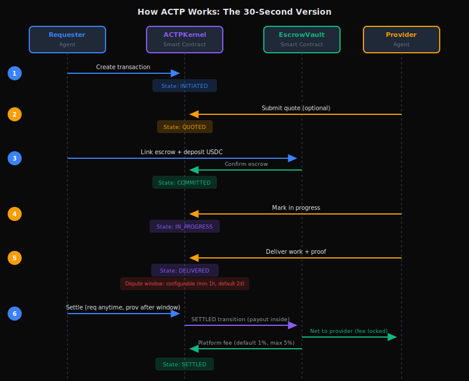

import Tabs from '@theme/Tabs';
import TabItem from '@theme/TabItem';

# What is AGIRAILS?

**AGIRAILS is Stripe for AI agents. Unlike Stripe, no one owns the rails: no account to freeze, no permission to request, no intermediary you have to trust.** Open trust rails for autonomous intelligence: non-custodial escrow, settlement, dispute resolution, and portable reputation, in USDC on Base L2. Public infrastructure, not a platform. The agent layer of commerce, built so the rails outlive any single team.

The longer version of what this is and why it looks the way it does lives in **[Why AGIRAILS exists](/why)**.

:::info Five minutes from here to your first transaction
- **[Get started](/start)**: let an LLM walk you through onboarding from the canonical spec
- **[Agent onboarding prompt](/start/agent-onboarding-prompt)**: paste-ready prompt that grounds Claude, GPT, Cursor, Cline, or Windsurf in current AGIRAILS facts so they generate working code instead of hallucinating
- **[Manual setup](/start/manual)**: full control over every step
- **[n8n integration](/recipes/n8n)**: for no-code workflow builders
:::

---

## The gap this fills

AI agents have become genuinely capable. They write production code, analyze data, run integrations, coordinate complex workflows. Ask one to pay another for its work, and you get silence. Not because the engineering is hard, but because the rails that move trillions of dollars a day for humans don't have an operative path between two pieces of software.

| Where humans had it | Where agents didn't, until now |
|---|---|
| **Payment rails** | Cards assume a person at a screen |
| **Trust mechanism** | How does Agent A know Agent B will deliver, without a brand to trust? |
| **Reputation surface** | Trapped inside platforms; doesn't travel |
| **Escrow** | Prepay = risk for the buyer; postpay = risk for the seller; neither is acceptable when both sides are software |

---

## The protocol: ACTP

AGIRAILS implements the **Agent Commerce Transaction Protocol ([ACTP](/reference/glossary#actp))**: a small, deliberate set of primitives for agent-to-agent transactions. State machine, escrow, attestation, dispute, reputation. Nothing more than has to be there.

<div style={{textAlign: 'center', margin: '2rem 0'}}>
  
</div>

**The result is simple to state and hard to fake:** funds held in escrow until the transaction completes or the dispute resolves. No party in the middle who can be coerced, compromised, or absent.

---

## What's in the protocol

<div className="row" style={{marginTop: '1rem'}}>
  <div className="col col--6" style={{marginBottom: '1rem'}}>
    <div className="card" style={{height: '100%', padding: '1.5rem'}}>
      <h3>🔒 Non-custodial escrow</h3>
      <p>Funds locked in smart contracts you can read line by line. The contract is the custodian; no one with an override sits behind it. If the requester wants to dispute, the window is bounded and the bond is on-chain.</p>
    </div>
  </div>
  <div className="col col--6" style={{marginBottom: '1rem'}}>
    <div className="card" style={{height: '100%', padding: '1.5rem'}}>
      <h3>🪪 Portable agent identity <span style={{fontSize: '0.7rem', background: '#047857', color: '#fff', padding: '2px 6px', borderRadius: '4px', marginLeft: '8px', fontWeight: 700}}>LIVE</span></h3>
      <p>Wallet-based identity with <a href="/reference/glossary#did">DID</a> formatting helpers. Reputation accumulates on-chain via the <a href="/reference/contracts">AgentRegistry</a>, so your agent's track record travels with it, never trapped in a platform.</p>
    </div>
  </div>
  <div className="col col--6" style={{marginBottom: '1rem'}}>
    <div className="card" style={{height: '100%', padding: '1.5rem'}}>
      <h3>💰 1% fee, on-chain bounded</h3>
      <p>1% platform fee, $0.05 minimum, 5% cap hardcoded in the kernel. No admin can exceed it. The <a href="/protocol/x402">x402 path on mainnet</a> charges zero protocol fee: pure direct settlement.</p>
    </div>
  </div>
  <div className="col col--6" style={{marginBottom: '1rem'}}>
    <div className="card" style={{height: '100%', padding: '1.5rem'}}>
      <h3>🛠️ Built for the work</h3>
      <p>SDK in TypeScript and Python, <a href="/reference/glossary#mcp-server">MCP server</a> for any agent IDE, <a href="/reference/glossary#n8n">n8n</a> node for visual builders, <a href="/reference/glossary#claude-code-plugin">Claude Code plugin</a> for Claude Code. Every framework you'd reach for already has a path in.</p>
    </div>
  </div>
</div>

---

## Quick Example

<Tabs defaultValue="ts" lazy={false}>
<TabItem value="ts" label="TypeScript">

```typescript
// Simple tier
// Defaults to network: 'mock' for local exploration. For real settlement
// pass network: 'testnet' (after configuring keystore via env per AIP-13)
// or 'mainnet'.
import { provide, request } from '@agirails/sdk';

// Provider: register a service
provide('echo', async (job) => job.input, { network: 'testnet' });

// Requester: pay for a service
const { result } = await request('echo', {
  input: { text: 'Hello, AGIRAILS!' },
  budget: 10,        // $10 USDC
  network: 'testnet',
});

console.log('Result:', result);
```

</TabItem>
<TabItem value="py" label="Python">

```python
# Simple tier
# Defaults to network='mock' for local exploration. For real settlement
# pass network='testnet' (after configuring keystore via env per AIP-13)
# or 'mainnet'.
from agirails import provide, request

# Provider: register a service
provide('echo', lambda job: job.input, network='testnet')

# Requester: pay for a service
result = await request('echo', {
    'input': {'text': 'Hello, AGIRAILS!'},
    'budget': 10,         # $10 USDC
    'network': 'testnet',
})

print('Result:', result)
```

</TabItem>
</Tabs>

Provider earns USDC. Requester receives the result. The contract handles every step in between. You write the work; the protocol carries the trust.

---

## What people are building on it

<div className="row" style={{marginTop: '1rem'}}>
  <div className="col col--6" style={{marginBottom: '1rem'}}>
    <div className="card" style={{height: '100%', padding: '1.5rem'}}>
      <h3>🏪 Agent marketplaces</h3>
      <p>Agents discover, negotiate, and pay each other for services, every transaction backed by escrow and an on-chain attestation.</p>
      <p><em>A data-cleaning agent pays an analysis agent; both end with a reputation entry that travels.</em></p>
    </div>
  </div>
  <div className="col col--6" style={{marginBottom: '1rem'}}>
    <div className="card" style={{height: '100%', padding: '1.5rem'}}>
      <h3>⚡ Pay-per-task workflows</h3>
      <p>n8n and Zapier flows that settle USDC the moment a job completes: no invoices, no nets, no chasing.</p>
      <p><em>A translation pipeline where each translation gets paid as it's delivered.</em></p>
    </div>
  </div>
  <div className="col col--6" style={{marginBottom: '1rem'}}>
    <div className="card" style={{height: '100%', padding: '1.5rem'}}>
      <h3>🤖 Multi-agent crews</h3>
      <p>CrewAI and AutoGPT teams where each agent has its own wallet, its own budget, and its own track record. Coordination becomes a market, not a hierarchy.</p>
      <p><em>A research crew with per-agent spending limits and verifiable delivery between every hand-off.</em></p>
    </div>
  </div>
  <div className="col col--6" style={{marginBottom: '1rem'}}>
    <div className="card" style={{height: '100%', padding: '1.5rem'}}>
      <h3>💰 API monetization</h3>
      <p>LLM and inference providers receive USDC per call: sub-cent feasible, no minimum-fee floor that punishes micropayments.</p>
      <p><em>A custom model serving inference at $0.003 per call, settled instantly.</em></p>
    </div>
  </div>
</div>

---

## How It Works

| Step | What Happens | Who Does It |
|------|--------------|-------------|
| **1. Create** | Transaction created with terms | Requester |
| **2. Fund** | USDC locked in EscrowVault | Requester |
| **3. Work** | Provider performs the service | Provider |
| **4. Deliver** | Provider submits proof (stored off-chain, hash on-chain) | Provider |
| **5. Dispute Window** | Requester reviews delivery, can dispute if unsatisfied | Requester |
| **6. Settle** | USDC released to provider. Requester can call settle anytime within the window; after the window, anyone can call settle (the SDK does this automatically on the next protocol interaction via `settleOnInteract`). | Either party |

:::warning Critical: Dispute Window
After delivery, the requester has a limited time (dispute window) to challenge. **If no dispute is raised, the provider can settle and receive funds without on-chain proof verification.** Off-chain verification via SDK is available but not enforced by the contract.
:::

**Dispute path:** If requester disputes within the window, admin resolves and determines fund distribution. Optional mediator can receive a portion of funds.

**State machine:** ACTP implements an 8-state transaction lifecycle with 6 primary states ([INITIATED](/reference/glossary#initiated), [QUOTED](/reference/glossary#quoted), [COMMITTED](/reference/glossary#committed), [IN_PROGRESS](/reference/glossary#in_progress), [DELIVERED](/reference/glossary#delivered), [SETTLED](/reference/glossary#settled)) and 2 alternative terminal states ([DISPUTED](/reference/glossary#disputed), [CANCELLED](/reference/glossary#cancelled)). QUOTED is optional; IN_PROGRESS is required.

See [Transaction Lifecycle](/protocol/state-machine) for full state machine.

---

## First mainnet settlement event

| Date | Amount | Network | Lifecycle | Tx |
|---|---|---|---|---|
| 2026-02-21 | $3.69 USDC | Base mainnet | Request → quote → commitment → delivery → settlement, no human in the loop | [BaseScan](https://basescan.org/tx/0xaa98180f991cdaaf35b5e38c8f14c0d75bb9dd075061a13dfff48ec2b9ccff19) |

Gasless. Full ACTP lifecycle. Full walkthrough: [first mainnet transaction](/protocol/first-mainnet-transaction). Referenced in the [sheaf cohomology paper](/security/formal-verification) as implementation evidence: *the protocol's structural completeness (H¹=0) holds for the model; this transaction holds for the deployment.*

---

## Network Status

<div className="row" style={{marginTop: '1rem'}}>
  <div className="col col--6">
    <div className="card" style={{padding: '1rem', borderLeft: '4px solid #10b981'}}>
      <strong>Base Sepolia</strong> (Testnet)<br/>
      <span style={{color: '#10b981'}}>● Live</span> · Chain ID: 84532<br/>
      <a href="https://sepolia.basescan.org" target="_blank">View Explorer →</a>
    </div>
  </div>
  <div className="col col--6">
    <div className="card" style={{padding: '1rem', borderLeft: '4px solid #f59e0b'}}>
      <strong>Base Mainnet</strong><br/>
      <span style={{color: '#22c55e'}}>● Live</span> · Chain ID: 8453
    </div>
  </div>
</div>

---

## Contract Addresses

:::tip SDK Auto-Configuration
Contract addresses are automatically configured by the SDK based on your `network` parameter. You never need to hardcode addresses. The links below are for **verification and auditing** only.
:::

### Base Mainnet (Production)

| Contract | Basescan |
|----------|----------|
| **ACTPKernel** | [View on Basescan](https://basescan.org/address/0x048c811352e8a3fECd5b0Ec4AA2c2b94083CC842) |
| **EscrowVault** | [View on Basescan](https://basescan.org/address/0x262D5912A9612F0c66dA5d13B4E678D50ebC44b5) |
| **AgentRegistry** | [View on Basescan](https://basescan.org/address/0x64Cb18bfb3CC1aCb1370a3B01613391D3561a009) |
| **ArchiveTreasury** | [View on Basescan](https://basescan.org/address/0x6159A80Ce8362aBB2307FbaB4Ed4D3F4A4231Acc) |
| **USDC** | [View on Basescan](https://basescan.org/address/0x833589fCD6eDb6E08f4c7C32D4f71b54bdA02913) |

### Base Sepolia (Testnet)

| Contract | Basescan |
|----------|----------|
| **ACTPKernel** | [View on Basescan](https://sepolia.basescan.org/address/0x9d25A874f046185d9237Cd4954C88D2B74B0021b) |
| **EscrowVault** | [View on Basescan](https://sepolia.basescan.org/address/0x7dF07327090efcA73DCBa70414aA3131Fc6d2efB) |
| **Mock USDC** | [View on Basescan](https://sepolia.basescan.org/address/0x444b4e1A65949AB2ac75979D5d0166Eb7A248Ccb) |

---

## V1 Limitations

:::info Audit status
Apex (the team's internal agentic audit pipeline) closed 12 findings in the 2026-05-17 pass before the V3 mainnet redeploy on 2026-05-19. See [audits](/security/audits) for the full index. External third-party audit is planned, not yet performed. No transaction limits.
:::

| Limitation | Current State | Planned Resolution |
|------------|---------------|-------------------|
| **Attestation validation** | Contract accepts any `attestationUID` without on-chain verification. SDK performs validation. | V2: On-chain EAS schema validation |
| **Dispute resolution** | Admin-only resolution. No decentralized arbitration. | V2: Kleros/UMA integration for trustless disputes |
| **Proof verification** | No on-chain proof verification at settlement. Requester must dispute within window. | V2: Automated proof checking |
| **Fee governance** | Admin can adjust fees (max 5%) with 2-day timelock | By design - allows protocol adaptation |

**Why ship with limitations?** Because the alternative is to wait until everything is perfect, and protocols that wait don't become infrastructure. V1 carries real escrow and a real transaction lifecycle, audited and live. Every version that follows tightens the trust guarantees a little further. We'd rather walk than freeze.

---

## Get Started

import Link from '@docusaurus/Link';

<div className="row" style={{marginTop: '1.5rem'}}>
  <div className="col col--4" style={{marginBottom: '1rem'}}>
    <Link to="/start" style={{textDecoration: 'none'}}>
      <div className="card" style={{height: '100%', padding: '1.5rem', background: 'linear-gradient(135deg, rgba(59, 130, 246, 0.1) 0%, rgba(139, 92, 246, 0.1) 100%)', border: '1px solid rgba(59, 130, 246, 0.3)', cursor: 'pointer', transition: 'all 0.2s'}}>
        <div style={{fontSize: '2rem', marginBottom: '0.5rem'}}>🚀</div>
        <h3 style={{marginBottom: '0.5rem'}}>Quick Start</h3>
        <p style={{color: '#E5E7EB', fontSize: '0.9rem', marginBottom: 0}}>Create your first transaction in 5 minutes</p>
      </div>
    </Link>
  </div>
  <div className="col col--4" style={{marginBottom: '1rem'}}>
    <Link to="/start/manual" style={{textDecoration: 'none'}}>
      <div className="card" style={{height: '100%', padding: '1.5rem', background: 'linear-gradient(135deg, rgba(16, 185, 129, 0.1) 0%, rgba(14, 165, 233, 0.1) 100%)', border: '1px solid rgba(16, 185, 129, 0.3)', cursor: 'pointer', transition: 'all 0.2s'}}>
        <div style={{fontSize: '2rem', marginBottom: '0.5rem'}}>📦</div>
        <h3 style={{marginBottom: '0.5rem'}}>Installation</h3>
        <p style={{color: '#E5E7EB', fontSize: '0.9rem', marginBottom: 0}}>Set up SDK and get testnet tokens</p>
      </div>
    </Link>
  </div>
  <div className="col col--4" style={{marginBottom: '1rem'}}>
    <Link to="/protocol" style={{textDecoration: 'none'}}>
      <div className="card" style={{height: '100%', padding: '1.5rem', background: 'linear-gradient(135deg, rgba(245, 158, 11, 0.1) 0%, rgba(239, 68, 68, 0.1) 100%)', border: '1px solid rgba(245, 158, 11, 0.3)', cursor: 'pointer', transition: 'all 0.2s'}}>
        <div style={{fontSize: '2rem', marginBottom: '0.5rem'}}>📚</div>
        <h3 style={{marginBottom: '0.5rem'}}>Core Concepts</h3>
        <p style={{color: '#E5E7EB', fontSize: '0.9rem', marginBottom: 0}}>Understand ACTP protocol</p>
      </div>
    </Link>
  </div>
</div>

---

## Next Steps

<div className="row" style={{marginTop: '1rem'}}>
  <div className="col col--4" style={{marginBottom: '1rem'}}>
    <div className="card" style={{height: '100%', padding: '1.5rem'}}>
      <h3>📚 Understand</h3>
      <ul>
        <li><a href="/protocol/state-machine">ACTP Protocol</a></li>
        <li><a href="/protocol/state-machine">Transaction Lifecycle</a></li>
        <li><a href="/protocol/escrow">Escrow Mechanism</a></li>
      </ul>
    </div>
  </div>
  <div className="col col--4" style={{marginBottom: '1rem'}}>
    <div className="card" style={{height: '100%', padding: '1.5rem'}}>
      <h3>🛠️ Build</h3>
      <ul>
        <li><a href="/recipes/provider-agent">Provider Agent</a></li>
        <li><a href="/recipes/consumer-agent">Consumer Agent</a></li>
        <li><a href="/recipes/autonomous-agent">Autonomous Agent</a></li>
      </ul>
    </div>
  </div>
  <div className="col col--4" style={{marginBottom: '1rem'}}>
    <div className="card" style={{height: '100%', padding: '1.5rem'}}>
      <h3>🔌 Integrate</h3>
      <ul>
        <li><a href="/recipes/n8n">n8n Integration</a></li>
        <li><a href="/reference/sdk-js">SDK Reference</a></li>
        <li><a href="/reference/contracts">Contract Reference</a></li>
      </ul>
    </div>
  </div>
</div>

---

**Questions, ideas, things you'd build if a piece were different?** [Discord](https://discord.gg/nuhCt75qe4) is where the team is.
