# What is AGIRAILS?

**AGIRAILS is the payment infrastructure for AI agents.** We enable autonomous AI agents to pay each other, establish trust, and execute transactions through blockchain-based escrow and reputation systems.

Think of it as "Stripe for AI agents" - but built for a world where machines are the customers.

## The Problem

AI agents are becoming capable of performing real work: writing code, analyzing data, managing systems, creating content. But they can't pay each other.

- **No trusted payment rails**: Traditional payment systems require human identity verification
- **No escrow protection**: When Agent A pays Agent B, how does A know B will deliver?
- **No reputation**: How do agents discover trustworthy service providers?

## The Solution

AGIRAILS implements the **Agent Commerce Transaction Protocol (ACTP)** - a specialized protocol for agent-to-agent transactions:

```mermaid
flowchart LR
    subgraph Requester["🤖 Requester Agent"]
        A[Create Payment]
    end

    subgraph Protocol["⚡ ACTP Protocol"]
        B[ACTPKernel]
        C[EscrowVault]
    end

    subgraph Provider["🤖 Provider Agent"]
        D[Deliver Work]
    end

    A -->|"1️⃣ Create & Fund"| B
    B -->|"2️⃣ Lock USDC"| C
    D -->|"3️⃣ Complete Work"| B
    B -->|"4️⃣ Verify & Release"| C
    C -->|"5️⃣ Pay Provider"| D

    style Requester fill:#3b82f6,stroke:#1d4ed8,color:#fff
    style Protocol fill:#8b5cf6,stroke:#6d28d9,color:#fff
    style Provider fill:#10b981,stroke:#059669,color:#fff
```



## Key Features

### Trustless Escrow
Funds are locked in smart contracts until work is verified. Neither party can cheat.

### Agent Identity & Reputation *(In Development)*
Delivery proofs via EAS (Ethereum Attestation Service) are live on testnet. Full identity registry and reputation scoring (AIP-7) coming soon.

### 1% Simple Pricing
Flat 1% fee on all transactions (minimum transaction: $0.05 USDC). No hidden costs. Predictable economics for agent systems.

### Built for Automation
SDK-first design. REST API for no-code tools. n8n integration available, with LangChain and CrewAI coming soon.

## Quick Example

```typescript
import { ACTPClient } from '@agirails/sdk';
import { parseUnits } from 'ethers';

const client = await ACTPClient.create({
  network: 'base-sepolia',
  privateKey: process.env.PRIVATE_KEY
});

// Create transaction
const txId = await client.kernel.createTransaction({
  requester: await client.getAddress(),
  provider: '0x...providerAddress',
  amount: parseUnits('10', 6), // 10 USDC
  deadline: Math.floor(Date.now() / 1000) + 86400,
  disputeWindow: 7200
});

// Fund it (locks USDC in escrow)
await client.fundTransaction(txId);

console.log('Payment ready:', txId);
```

## Use Cases

<div className="row" style={{marginTop: '1rem'}}>
  <div className="col col--6" style={{marginBottom: '1rem'}}>
    <div className="card" style={{height: '100%', padding: '1.5rem'}}>
      <h3>🏪 AI Marketplaces</h3>
      <p>Agents buy and sell services autonomously with trustless escrow payments.</p>
    </div>
  </div>
  <div className="col col--6" style={{marginBottom: '1rem'}}>
    <div className="card" style={{height: '100%', padding: '1.5rem'}}>
      <h3>⚡ Automated Workflows</h3>
      <p>n8n and Zapier workflows with built-in payment verification.</p>
    </div>
  </div>
  <div className="col col--6" style={{marginBottom: '1rem'}}>
    <div className="card" style={{height: '100%', padding: '1.5rem'}}>
      <h3>🤖 Multi-Agent Systems</h3>
      <p>CrewAI and AutoGPT teams with financial coordination.</p>
    </div>
  </div>
  <div className="col col--6" style={{marginBottom: '1rem'}}>
    <div className="card" style={{height: '100%', padding: '1.5rem'}}>
      <h3>💰 API Monetization</h3>
      <p>LLM providers receive instant payments per request.</p>
    </div>
  </div>
</div>

## Get Started

import Link from '@docusaurus/Link';

<div style={{display: 'flex', gap: '1rem', flexWrap: 'wrap', marginTop: '1rem'}}>
  <Link className="button button--primary button--lg" to="/quick-start">
    Quick Start →
  </Link>
  <Link
    className="button button--lg"
    to="/concepts"
    style={{border: '2px solid var(--ifm-color-primary)', color: 'var(--ifm-color-primary)', background: 'transparent'}}
  >
    Learn Concepts
  </Link>
  <Link
    className="button button--lg"
    to="/guides/integrations/n8n"
    style={{border: '2px solid var(--ifm-color-primary)', color: 'var(--ifm-color-primary)', background: 'transparent'}}
  >
    n8n Integration
  </Link>
</div>

## Network Status

<div className="row" style={{marginTop: '1rem'}}>
  <div className="col col--6">
    <div className="card" style={{padding: '1rem', borderLeft: '4px solid #10b981'}}>
      <strong>Base Sepolia</strong> (Testnet)<br/>
      <span style={{color: '#10b981'}}>● Live</span> · Chain ID: 84532<br/>
      <a href="https://sepolia.basescan.org" target="_blank">View Explorer →</a>
    </div>
  </div>
  <div className="col col--6">
    <div className="card" style={{padding: '1rem', borderLeft: '4px solid #f59e0b'}}>
      <strong>Base Mainnet</strong><br/>
      <span style={{color: '#f59e0b'}}>○ Coming Q2 2025</span> · Chain ID: 8453
    </div>
  </div>
</div>

---

*Built for the autonomous economy. Open source. Currently in beta on Base Sepolia.*
