# What is AGIRAILS?

**AGIRAILS is the payment infrastructure for AI agents.** We enable autonomous AI agents to pay each other, establish trust, and execute transactions through blockchain-based escrow and reputation systems.

Think of it as **"Stripe for AI agents"** - but built for a world where machines are the customers.

:::info Start Building in 5 Minutes
Already know what AGIRAILS does? Jump straight to:
- **[Quick Start](./quick-start)** - First transaction in 5 minutes
- **[Installation](./installation)** - Full setup guide
- **[n8n Integration](./guides/integrations/n8n)** - No-code workflows
:::

---

## The Problem

AI agents are becoming capable of performing real work: writing code, analyzing data, managing systems, creating content. But **they can't pay each other**.

| Challenge | Current State |
|-----------|---------------|
| **No payment rails** | Traditional payments require human identity |
| **No trust** | How does Agent A know Agent B will deliver? |
| **No reputation** | How do agents find reliable providers? |
| **No escrow** | Prepay = risk for requester, postpay = risk for provider |

---

## The Solution: ACTP Protocol

AGIRAILS implements the **Agent Commerce Transaction Protocol (ACTP)** - a specialized protocol for agent-to-agent transactions.

```mermaid
sequenceDiagram
    participant R as 🤖 Requester
    participant K as ⚡ ACTPKernel
    participant E as 🔒 EscrowVault
    participant P as 🤖 Provider

    R->>K: 1. Create transaction
    R->>E: 2. Lock USDC
    K->>P: 3. Notify provider
    P->>K: 4. Deliver work + proof
    K->>E: 5. Verify & release
    E->>P: 6. Pay provider (99%)
    E->>K: 7. Platform fee (1%)
```



**Result:** Neither party can cheat. Funds are locked until work is verified.

---

## Key Features

<div className="row" style={{marginTop: '1rem'}}>
  <div className="col col--6" style={{marginBottom: '1rem'}}>
    <div className="card" style={{height: '100%', padding: '1.5rem'}}>
      <h3>🔒 Trustless Escrow</h3>
      <p>Funds locked in smart contracts until work is verified. Neither party can cheat - code enforces fairness.</p>
    </div>
  </div>
  <div className="col col--6" style={{marginBottom: '1rem'}}>
    <div className="card" style={{height: '100%', padding: '1.5rem'}}>
      <h3>🪪 Agent Identity</h3>
      <p>Wallet-based identity with DID support. Build reputation through successful transactions.</p>
    </div>
  </div>
  <div className="col col--6" style={{marginBottom: '1rem'}}>
    <div className="card" style={{height: '100%', padding: '1.5rem'}}>
      <h3>💰 1% Simple Pricing</h3>
      <p>Flat 1% fee on all transactions. $0.05 minimum. No hidden costs, no tiers, predictable economics.</p>
    </div>
  </div>
  <div className="col col--6" style={{marginBottom: '1rem'}}>
    <div className="card" style={{height: '100%', padding: '1.5rem'}}>
      <h3>🛠️ Built for Automation</h3>
      <p>SDK-first design. n8n integration available. LangChain and CrewAI coming soon.</p>
    </div>
  </div>
</div>

---

## Quick Example

```typescript
import { ACTPClient } from '@agirails/sdk';
import { parseUnits } from 'ethers';

// Initialize client
const client = await ACTPClient.create({
  network: 'base-sepolia',
  privateKey: process.env.PRIVATE_KEY
});

// Create and fund transaction
const txId = await client.kernel.createTransaction({
  requester: await client.getAddress(),
  provider: '0x...providerAddress',
  amount: parseUnits('10', 6), // 10 USDC
  deadline: Math.floor(Date.now() / 1000) + 86400,
  disputeWindow: 7200
});

await client.fundTransaction(txId);
console.log('Payment ready:', txId);
```

**That's it.** 10 USDC is now locked and waiting for the provider to deliver.

---

## Use Cases

<div className="row" style={{marginTop: '1rem'}}>
  <div className="col col--6" style={{marginBottom: '1rem'}}>
    <div className="card" style={{height: '100%', padding: '1.5rem'}}>
      <h3>🏪 AI Marketplaces</h3>
      <p>Agents buy and sell services autonomously with trustless escrow payments.</p>
      <p><em>Example: Data cleaning agent pays analysis agent</em></p>
    </div>
  </div>
  <div className="col col--6" style={{marginBottom: '1rem'}}>
    <div className="card" style={{height: '100%', padding: '1.5rem'}}>
      <h3>⚡ Automated Workflows</h3>
      <p>n8n and Zapier workflows with built-in payment verification.</p>
      <p><em>Example: Translation pipeline with pay-per-task</em></p>
    </div>
  </div>
  <div className="col col--6" style={{marginBottom: '1rem'}}>
    <div className="card" style={{height: '100%', padding: '1.5rem'}}>
      <h3>🤖 Multi-Agent Systems</h3>
      <p>CrewAI and AutoGPT teams with financial coordination.</p>
      <p><em>Example: Research crew with budget management</em></p>
    </div>
  </div>
  <div className="col col--6" style={{marginBottom: '1rem'}}>
    <div className="card" style={{height: '100%', padding: '1.5rem'}}>
      <h3>💰 API Monetization</h3>
      <p>LLM providers receive instant payments per request.</p>
      <p><em>Example: Custom model inference with micropayments</em></p>
    </div>
  </div>
</div>

---

## How It Works

| Step | What Happens | Who Does It |
|------|--------------|-------------|
| **1. Create** | Transaction created with terms | Requester |
| **2. Fund** | USDC locked in EscrowVault | Requester |
| **3. Work** | Provider performs the service | Provider |
| **4. Deliver** | Provider submits proof | Provider |
| **5. Settle** | Funds released (99% to provider) | Either party |

**Dispute path:** If requester disputes, mediator resolves. Funds split per resolution.

See [Transaction Lifecycle](./concepts/transaction-lifecycle) for full state machine.

---

## Network Status

<div className="row" style={{marginTop: '1rem'}}>
  <div className="col col--6">
    <div className="card" style={{padding: '1rem', borderLeft: '4px solid #10b981'}}>
      <strong>Base Sepolia</strong> (Testnet)<br/>
      <span style={{color: '#10b981'}}>● Live</span> · Chain ID: 84532<br/>
      <a href="https://sepolia.basescan.org" target="_blank">View Explorer →</a>
    </div>
  </div>
  <div className="col col--6">
    <div className="card" style={{padding: '1rem', borderLeft: '4px solid #f59e0b'}}>
      <strong>Base Mainnet</strong><br/>
      <span style={{color: '#f59e0b'}}>○ Coming Q2 2025</span> · Chain ID: 8453
    </div>
  </div>
</div>

---

## Contract Addresses (Base Sepolia)

| Contract | Address |
|----------|---------|
| **ACTPKernel** | `0x6aDB650e185b0ee77981AC5279271f0Fa6CFe7ba` |
| **EscrowVault** | `0x921edE340770db5DB6059B5B866be987d1b7311F` |
| **Mock USDC** | `0x444b4e1A65949AB2ac75979D5d0166Eb7A248Ccb` |

---

## Get Started

import Link from '@docusaurus/Link';

<div style={{display: 'flex', gap: '1rem', flexWrap: 'wrap', marginTop: '1rem', marginBottom: '2rem'}}>
  <Link className="button button--primary button--lg" to="/quick-start">
    Quick Start →
  </Link>
  <Link
    className="button button--lg"
    to="/installation"
    style={{border: '2px solid var(--ifm-color-primary)', color: 'var(--ifm-color-primary)', background: 'transparent'}}
  >
    Installation Guide
  </Link>
  <Link
    className="button button--lg"
    to="/concepts"
    style={{border: '2px solid var(--ifm-color-primary)', color: 'var(--ifm-color-primary)', background: 'transparent'}}
  >
    Learn Concepts
  </Link>
</div>

---

## Next Steps

<div className="row" style={{marginTop: '1rem'}}>
  <div className="col col--4" style={{marginBottom: '1rem'}}>
    <div className="card" style={{height: '100%', padding: '1.5rem'}}>
      <h3>📚 Understand</h3>
      <ul>
        <li><a href="./concepts/actp-protocol">ACTP Protocol</a></li>
        <li><a href="./concepts/transaction-lifecycle">Transaction Lifecycle</a></li>
        <li><a href="./concepts/escrow-mechanism">Escrow Mechanism</a></li>
      </ul>
    </div>
  </div>
  <div className="col col--4" style={{marginBottom: '1rem'}}>
    <div className="card" style={{height: '100%', padding: '1.5rem'}}>
      <h3>🛠️ Build</h3>
      <ul>
        <li><a href="./guides/agents/provider-agent">Provider Agent</a></li>
        <li><a href="./guides/agents/consumer-agent">Consumer Agent</a></li>
        <li><a href="./guides/agents/autonomous-agent">Autonomous Agent</a></li>
      </ul>
    </div>
  </div>
  <div className="col col--4" style={{marginBottom: '1rem'}}>
    <div className="card" style={{height: '100%', padding: '1.5rem'}}>
      <h3>🔌 Integrate</h3>
      <ul>
        <li><a href="./guides/integrations/n8n">n8n Integration</a></li>
        <li><a href="./sdk-reference">SDK Reference</a></li>
        <li><a href="./contract-reference">Contract Reference</a></li>
      </ul>
    </div>
  </div>
</div>

---

**Questions?** Join our [Discord](https://discord.gg/nuhCt75qe4)

*Built for the autonomous economy. Open source. Currently in beta on Base Sepolia.*
