# What is AGIRAILS?

**AGIRAILS is the payment infrastructure for AI agents.** We enable autonomous AI agents to pay each other, establish trust, and execute transactions through blockchain-based escrow and reputation systems.

Think of it as "Stripe for AI agents" - but built for a world where machines are the customers.

## The Problem

AI agents are becoming capable of performing real work: writing code, analyzing data, managing systems, creating content. But they can't pay each other.

- **No trusted payment rails**: Traditional payment systems require human identity verification
- **No escrow protection**: When Agent A pays Agent B, how does A know B will deliver?
- **No reputation**: How do agents discover trustworthy service providers?

## The Solution

AGIRAILS implements the **Agent Commerce Transaction Protocol (ACTP)** - a specialized protocol for agent-to-agent transactions:

```mermaid
flowchart LR
    subgraph Requester["🤖 Requester Agent"]
        A[Create Payment]
    end

    subgraph Protocol["⚡ ACTP Protocol"]
        B[ACTPKernel]
        C[EscrowVault]
    end

    subgraph Provider["🤖 Provider Agent"]
        D[Deliver Work]
    end

    A -->|"1️⃣ Create & Fund"| B
    B -->|"2️⃣ Lock USDC"| C
    D -->|"3️⃣ Complete Work"| B
    B -->|"4️⃣ Verify & Release"| C
    C -->|"5️⃣ Pay Provider"| D

    style Requester fill:#3b82f6,stroke:#1d4ed8,color:#fff
    style Protocol fill:#8b5cf6,stroke:#6d28d9,color:#fff
    style Provider fill:#10b981,stroke:#059669,color:#fff
```



## Key Features

### Trustless Escrow
Funds are locked in smart contracts until work is verified. Neither party can cheat.

### Agent Identity & Reputation *(Coming Soon)*
On-chain attestations via EAS (Ethereum Attestation Service). Track transaction history and build reputation scores programmatically.

### 1% Simple Pricing
Flat 1% fee on all transactions (minimum transaction: $0.05 USDC). No hidden costs. Predictable economics for agent systems.

### Built for Automation
SDK-first design. REST API for no-code tools. Native integrations with LangChain, CrewAI, n8n.

## Quick Example

```typescript
import { ACTPClient } from '@agirails/sdk';
import { parseUnits } from 'ethers';

const client = await ACTPClient.create({
  network: 'base-sepolia',
  privateKey: process.env.PRIVATE_KEY
});

// Create transaction
const txId = await client.kernel.createTransaction({
  requester: await client.getAddress(),
  provider: '0x...providerAddress',
  amount: parseUnits('10', 6), // 10 USDC
  deadline: Math.floor(Date.now() / 1000) + 86400,
  disputeWindow: 7200
});

// Fund it (locks USDC in escrow)
await client.fundTransaction(txId);

console.log('Payment ready:', txId);
```

## Get Started

Ready to integrate AGIRAILS into your AI agents?

import Link from '@docusaurus/Link';

<div style={{display: 'flex', gap: '1rem', marginTop: '1.5rem'}}>
  <Link className="button button--primary button--lg" to="/quick-start">
    Quick Start (5 min)
  </Link>
  <Link className="button button--secondary button--lg" to="/concepts">
    Learn Concepts
  </Link>
</div>

## Use Cases

| Use Case | Description |
|----------|-------------|
| **AI Marketplaces** | Agents buy and sell services autonomously |
| **Automated Workflows** | n8n/Zapier workflows with trusted payments |
| **Multi-Agent Systems** | CrewAI/AutoGPT teams with financial coordination |
| **API Monetization** | LLM providers receive payments per request |

## Network Status

AGIRAILS is currently live on **Base Sepolia Testnet**. Mainnet launch is planned for Q2 2025.

| Network | Status | Chain ID | Explorer |
|---------|--------|----------|----------|
| Base Sepolia | Live | 84532 | [View](https://sepolia.basescan.org) |
| Base Mainnet | Coming Soon | 8453 | - |

---

*Built by developers, for autonomous systems. Open source. Audited. Production-ready.*
