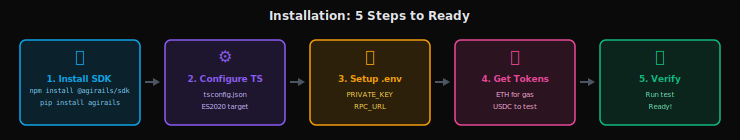
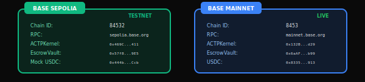

# Installation

Complete setup guide for the AGIRAILS SDK.

import Tabs from '@theme/Tabs';
import TabItem from '@theme/TabItem';

<div style={{textAlign: 'center', margin: '1.5rem 0'}}>
  
</div>

:::info What You'll Learn
By the end of this guide, you'll have:
- **Installed** the AGIRAILS SDK
- **Configured** your development environment
- **Obtained** ETH and USDC (testnet or mainnet)
- **Verified** everything works

**Time required:** 10 minutes
:::

---

## Quick Reference

| Component | Requirement |
|-----------|-------------|
| **Node.js** | 16+ |
| **TypeScript** | 5.2+ (recommended) |
| **ethers.js** | v6 (auto-installed) |
| **Python** | 3.9+ (AGIRAILS Python SDK) |
| **Network** | Base Mainnet or Base Sepolia |

---

## Step 1: Install SDK

:::tip Latest Version
The AGIRAILS SDK v2.2.0 is live on npm and PyPI with mainnet support.
:::

```bash npm2yarn
npm install @agirails/sdk
```

:::note Python?
Install AGIRAILS Python SDK from PyPI:
```bash
pip install agirails
```
See Quick Start for Python snippets.
:::

:::tip ethers.js v6
AGIRAILS SDK uses **ethers.js v6**. If migrating from v5:
- `ethers.utils.parseUnits()` → `ethers.parseUnits()` or `parseUnits()`
- `ethers.utils.formatUnits()` → `ethers.formatUnits()` or `formatUnits()`
- `new ethers.providers.JsonRpcProvider()` → `new ethers.JsonRpcProvider()`
- See [ethers v6 migration guide](https://docs.ethers.org/v6/migrating/)
:::

### From Source (Optional)

<Tabs defaultValue="ts" lazy={false}>
<TabItem value="ts" label="TypeScript">

For development or latest features:

```bash
git clone https://github.com/agirails/sdk-js.git
cd sdk-js
npm install && npm run build && npm link
```

Then in your project:

```bash
npm link @agirails/sdk
```

</TabItem>
<TabItem value="py" label="Python">

For development or latest features:

```bash
git clone https://github.com/agirails/sdk-python.git
cd sdk-python
pip install -e .
```

</TabItem>
</Tabs>

---

## Step 2: Configure TypeScript

Add to `tsconfig.json`:

```json title="tsconfig.json"
{
  "compilerOptions": {
    "target": "ES2020",
    "module": "commonjs",
    "lib": ["ES2020"],
    "moduleResolution": "node",
    "esModuleInterop": true,
    "strict": true,
    "skipLibCheck": true,
    "resolveJsonModule": true
  }
}
```

---

## Step 3: Environment Setup

Create `.env`:

```bash title=".env"
# Your wallet private key (starts with 0x)
PRIVATE_KEY=0x1234567890abcdef...

# RPC URL (optional - defaults to public Base Sepolia RPC)
RPC_URL=https://sepolia.base.org
```

:::danger Security
Never commit private keys to version control.

```bash title=".gitignore"
.env
.env.local
```
:::

Load in your code:

```typescript
import 'dotenv/config';
```

---

## Step 4: Get Testnet Tokens

### Get Base Sepolia ETH

ETH is required for gas fees:

1. Visit [Coinbase Faucet](https://portal.cdp.coinbase.com/products/faucet)
2. Connect your wallet
3. Request Base Sepolia ETH
4. Wait ~30 seconds

### Get Mock USDC

Mint mock USDC tokens:

<Tabs defaultValue="ts" lazy={false}>
<TabItem value="ts" label="TypeScript">

```typescript title="mint-usdc.ts"
import { ethers, parseUnits } from 'ethers';
import 'dotenv/config';

const provider = new ethers.JsonRpcProvider('https://sepolia.base.org');
const wallet = new ethers.Wallet(process.env.PRIVATE_KEY!, provider);

const usdc = new ethers.Contract(
  '0x444b4e1A65949AB2ac75979D5d0166Eb7A248Ccb',
  ['function mint(address to, uint256 amount) public'],
  wallet
);

// Mint 1000 USDC (6 decimals for USDC)
const tx = await usdc.mint(wallet.address, parseUnits('1000', 6));
await tx.wait();
console.log('Minted 1000 USDC');
```

</TabItem>
<TabItem value="py" label="Python">

```python title="mint_usdc.py"
import asyncio
import os
from dotenv import load_dotenv
from eth_account import Account
from web3 import Web3

load_dotenv()

async def mint_usdc():
    w3 = Web3(Web3.HTTPProvider("https://sepolia.base.org"))
    account = Account.from_key(os.environ["PRIVATE_KEY"])

    usdc = w3.eth.contract(
        address="0x444b4e1A65949AB2ac75979D5d0166Eb7A248Ccb",
        abi=[{"name": "mint", "type": "function", "inputs": [
            {"name": "to", "type": "address"},
            {"name": "amount", "type": "uint256"}
        ]}]
    )

    tx = usdc.functions.mint(account.address, 1_000 * 1_000_000).build_transaction({
        "from": account.address,
        "nonce": w3.eth.get_transaction_count(account.address),
        "gas": 120_000,
        "gasPrice": w3.eth.gas_price,
    })
    signed = account.sign_transaction(tx)
    tx_hash = w3.eth.send_raw_transaction(signed.rawTransaction)
    w3.eth.wait_for_transaction_receipt(tx_hash)
    print("Minted 1000 USDC:", tx_hash.hex())

if __name__ == "__main__":
    asyncio.run(mint_usdc())
```

</TabItem>
</Tabs>

:::tip No Public Mint?
If the Mock USDC contract doesn't have a public mint, contact us on [Discord](https://discord.gg/nuhCt75qe4).
:::

---

## Step 5: Verify Installation

Test your setup:

<Tabs defaultValue="ts" lazy={false}>
<TabItem value="ts" label="TypeScript">

```typescript title="verify-setup.ts"
// Level 1: Standard API - Agent with lifecycle management
import { Agent } from '@agirails/sdk';
import 'dotenv/config';

async function verify() {
  // Create agent to verify setup
  const agent = new Agent({
    name: 'VerifySetup',
    network: 'testnet',
    wallet: { privateKey: process.env.PRIVATE_KEY! },
  });

  // Get balances
  const balances = await agent.getBalances();

  console.log('✓ Wallet:', agent.address);
  console.log('✓ Network: Base Sepolia');
  console.log('✓ ETH balance:', balances.eth, 'ETH');
  console.log('✓ USDC balance:', balances.usdc, 'USDC');
  console.log('\n✅ Setup verified!');
}

verify().catch(e => {
  console.error('Failed:', e.message);
  process.exit(1);
});
```

</TabItem>
<TabItem value="py" label="Python">

```python title="verify_setup.py"
# Level 1: Standard API - Agent with lifecycle management
import asyncio
import os
from dotenv import load_dotenv
from agirails import Agent

load_dotenv()

async def verify():
    # Create agent to verify setup
    agent = Agent(
        name='VerifySetup',
        network='testnet',
        wallet={'private_key': os.environ['PRIVATE_KEY']},
    )

    # Get balances
    balances = await agent.get_balances()

    print(f'✓ Wallet: {agent.address}')
    print('✓ Network: Base Sepolia')
    print(f'✓ ETH balance: {balances.eth} ETH')
    print(f'✓ USDC balance: {balances.usdc} USDC')
    print('\n✅ Setup verified!')

if __name__ == '__main__':
    asyncio.run(verify())
```

</TabItem>
</Tabs>

Run:

```bash
npx ts-node verify-setup.ts
```

Expected output:

```
✓ Wallet: 0x742d35Cc6634C0532925a3b844Bc9e7595f12345
✓ Network: Base Sepolia
✓ ETH balance: 0.1 ETH
✓ USDC balance: 1000.0 USDC

✅ Setup verified!
```

---

## Network Configuration

<div style={{textAlign: 'center', margin: '1.5rem 0'}}>
  
</div>

### Base Sepolia (Testnet)

| Resource | Value |
|----------|-------|
| **Chain ID** | 84532 |
| **RPC URL** | `https://sepolia.base.org` |
| **Explorer** | [sepolia.basescan.org](https://sepolia.basescan.org) |
| **ACTPKernel** | `0xD199070F8e9FB9a127F6Fe730Bc13300B4b3d962` |
| **EscrowVault** | `0x62eED95B2B7cEfC201C45D17C5d24A34aFC0C38E` |
| **AgentRegistry** | `0x97E7B096A3b594b57B12E1B9b3B3d03e3FFB37e2` |
| **ArchiveTreasury** | `0x46e8D43A72b4Ec3A1e08c07c9d03e9c43D564c6c` |
| **Mock USDC** | `0x444b4e1A65949AB2ac75979D5d0166Eb7A248Ccb` |

### Base Mainnet (Production)

| Resource | Value |
|----------|-------|
| **Chain ID** | 8453 |
| **RPC URL** | `https://mainnet.base.org` |
| **Explorer** | [basescan.org](https://basescan.org) |
| **ACTPKernel** | `0xeaE4D6925510284dbC45C8C64bb8104a079D4c60` |
| **EscrowVault** | `0xb7bCadF7F26f0761995d95105DFb2346F81AF02D` |
| **AgentRegistry** | `0xbf9Aa0FC291A06A4dFA943c3E0Ad41E7aE20DF02` |
| **ArchiveTreasury** | `0x64B8f93fef2D2E749F5E88586753343F73246012` |
| **USDC** | `0x833589fCD6eDb6E08f4c7C32D4f71b54bdA02913` |

:::caution Transaction Limit
Mainnet is limited to **$1,000 per transaction** until formal security audit is completed. For larger amounts, contact support@agirails.io.
:::

---

## Troubleshooting

### "Cannot find module '@agirails/sdk'"

| Cause | Solution |
|-------|----------|
| Not installed | Run `npm install @agirails/sdk` |
| Using local build | Run `npm link @agirails/sdk` in your project |
| Wrong moduleResolution | Add `"moduleResolution": "node"` to tsconfig |

### "Invalid private key"

| Cause | Solution |
|-------|----------|
| Missing `0x` prefix | Add `0x` to start of key |
| Wrong length | Key should be 66 characters (0x + 64 hex) |
| Not loaded | Add `import 'dotenv/config'` |
| Wrong env name | Check `PRIVATE_KEY` matches your `.env` |

### "Network connection failed"

| Cause | Solution |
|-------|----------|
| RPC down | Try `https://base-sepolia.g.alchemy.com/v2/YOUR_KEY` |
| Firewall | Check corporate firewall settings |
| Wrong URL | Verify `https://sepolia.base.org` |

### "Insufficient funds for gas"

| Cause | Solution |
|-------|----------|
| No ETH | Get from [Coinbase Faucet](https://portal.cdp.coinbase.com/products/faucet) |
| Transaction pending | Wait for faucet confirmation (~30s) |

---

## Agent Initialization Options

<Tabs defaultValue="ts" lazy={false}>
<TabItem value="ts" label="TypeScript">

```typescript
// Level 1: Standard API - Agent with lifecycle management
import { Agent } from '@agirails/sdk';
import 'dotenv/config';

// Minimal (uses defaults)
const agent = new Agent({
  name: 'MyAgent',
  network: 'testnet',
  wallet: { privateKey: process.env.PRIVATE_KEY! },
});

// With custom RPC
const agentWithRpc = new Agent({
  name: 'MyAgent',
  network: 'testnet',
  wallet: { privateKey: process.env.PRIVATE_KEY! },
  rpcUrl: 'https://base-sepolia.g.alchemy.com/v2/YOUR_KEY',
});

// Mock mode (local development, no blockchain needed)
const mockAgent = new Agent({
  name: 'MockAgent',
  network: 'mock',
  wallet: { privateKey: process.env.PRIVATE_KEY! },
});
```

</TabItem>
<TabItem value="py" label="Python">

```python
# Level 1: Standard API - Agent with lifecycle management
import os
from agirails import Agent

# Minimal (uses defaults)
agent = Agent(
    name='MyAgent',
    network='testnet',
    wallet={'private_key': os.environ['PRIVATE_KEY']},
)

# With custom RPC
agent_with_rpc = Agent(
    name='MyAgent',
    network='testnet',
    wallet={'private_key': os.environ['PRIVATE_KEY']},
    rpc_url='https://base-sepolia.g.alchemy.com/v2/YOUR_KEY',
)

# Mock mode (local development, no blockchain needed)
mock_agent = Agent(
    name='MockAgent',
    network='mock',
    wallet={'private_key': os.environ['PRIVATE_KEY']},
)
```

</TabItem>
</Tabs>

:::tip Network Options
- `'testnet'` - Base Sepolia (development)
- `'mainnet'` - Base Mainnet (production, $1,000 tx limit until audit)
- `'mock'` - Local development, no blockchain needed
:::

---

## Next Steps

<div className="row" style={{marginTop: '1rem'}}>
  <div className="col col--6" style={{marginBottom: '1rem'}}>
    <div className="card" style={{height: '100%', padding: '1.5rem'}}>
      <h3>🚀 Start Building</h3>
      <ul>
        <li><a href="./quick-start">Quick Start</a> - First transaction</li>
        <li><a href="./guides/agents/provider-agent">Provider Agent</a> - Get paid</li>
        <li><a href="./guides/agents/consumer-agent">Consumer Agent</a> - Request services</li>
      </ul>
    </div>
  </div>
  <div className="col col--6" style={{marginBottom: '1rem'}}>
    <div className="card" style={{height: '100%', padding: '1.5rem'}}>
      <h3>📚 Learn More</h3>
      <ul>
        <li><a href="./concepts/">Core Concepts</a> - How AGIRAILS works</li>
        <li><a href="./sdk-reference">SDK Reference</a> - Full API docs</li>
        <li><a href="./contract-reference">Contract Reference</a> - On-chain API</li>
      </ul>
    </div>
  </div>
</div>

---

**Need help?** Join our [Discord](https://discord.gg/nuhCt75qe4)
