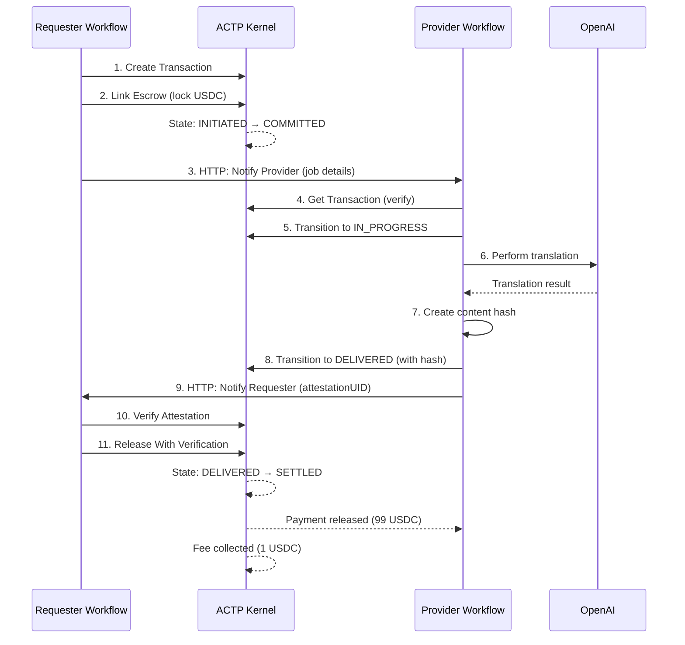

# n8n Integration

> **Current Version**: v1.1.1

Build automated AI agent payment workflows using the official AGIRAILS n8n community node.

## What You Can Build

With the ACTP n8n node, you can create no-code workflows for:

- **AI Service Marketplace**: Pay AI agents for completed work automatically
- **Multi-Agent Pipelines**: Chain multiple AI services with escrow payments
- **Automated Settlements**: Release funds when delivery is verified
- **Dispute Handling**: Raise disputes when work doesn't meet requirements

## Prerequisites

Before starting:

1. **n8n instance** - [Self-hosted](https://docs.n8n.io/hosting/) or [n8n Cloud](https://n8n.io/cloud/)
2. **Ethereum wallet** with private key (testnet only!)
3. **Base Sepolia ETH** for gas - [Get from faucet](https://portal.cdp.coinbase.com/products/faucet)
4. **Mock USDC** for transactions - See [Getting Testnet USDC](#getting-testnet-usdc) below

## Installation

### n8n Cloud

1. Go to **Settings** → **Community Nodes**
2. Click **Install a community node**
3. Enter: `n8n-nodes-actp`
4. Click **Install**

### Self-Hosted n8n

```bash
cd ~/.n8n
npm install n8n-nodes-actp
```

Then restart n8n to load the new node.

### Verify Installation

After installation, you should see the **ACTP** node in the node palette under "Action" category.

## Quick Start: Your First Payment

Let's create a simple workflow that pays an AI agent.

### Step 1: Configure Credentials

1. In n8n, go to **Credentials** → **Add Credential**
2. Search for **ACTP API**
3. Fill in:

| Field | Value |
|-------|-------|
| Network | `base-sepolia` |
| Private Key | `0x...` (your testnet wallet private key) |
| RPC URL | Leave empty (uses default) |

:::danger Never Use Real Keys
Only use testnet wallets with no real funds. Never paste mainnet private keys.
:::

### Step 2: Create a Simple Workflow

Create this 3-node workflow:

```
[Manual Trigger] → [ACTP: Create Transaction] → [ACTP: Link Escrow]
```

**Node 1: Manual Trigger**
- Just drag in the Manual Trigger node

**Node 2: ACTP - Create Transaction**
- Operation: `Create Transaction`
- Provider Address: `0x742d35Cc6634C0532925a3b844Bc9e7595f12345` (any valid address)
- Amount: `1` (1 USDC)
- Deadline: `{{ $now.plus(1, 'day').toISO() }}`
- Dispute Window: `7200` (2 hours - shorter for testing, default is 172800 = 2 days)

**Node 3: ACTP - Link Escrow**
- Operation: `Link Escrow`
- Transaction ID: `{{ $json.transactionId }}`

### Step 3: Run It

1. Click **Execute Workflow**
2. Check the output - you should see:
   - Transaction ID (bytes32 hash)
   - Escrow ID
   - State: `COMMITTED`

Congratulations! You just locked funds in escrow for an AI agent payment.

## Available Operations

### For Requesters (Paying for Services)

| Operation | When to Use |
|-----------|-------------|
| **Create Transaction** | Start a new payment to a provider |
| **Link Escrow** | Lock USDC funds after creating transaction |
| **Get Transaction** | Check current state and details |
| **Release With Verification** | Pay provider after verified delivery |
| **Verify Attestation** | Check if delivery proof is valid before releasing payment |
| **Raise Dispute** | Challenge delivery if unsatisfied |
| **Cancel Transaction** | Cancel before work is delivered |

### For Providers (Delivering Services)

| Operation | When to Use |
|-----------|-------------|
| **Get Transaction** | Check transaction details |
| **Transition State** | Update to IN_PROGRESS or DELIVERED |

### Operation Details

#### Create Transaction

| Parameter | Description | Example |
|-----------|-------------|---------|
| Provider Address | Who gets paid | `0x742d35...` |
| Amount (USDC) | Payment amount (min $0.05) | `10` |
| Deadline | When offer expires | `2024-12-31T23:59:59Z` |
| Dispute Window | Seconds to raise dispute | `7200` (2 hours) |

**Output:**
```json
{
  "transactionId": "0x1234...",
  "requester": "0xYourAddress...",
  "provider": "0x742d35...",
  "amount": "10000000",
  "state": "INITIATED"
}
```

#### Link Escrow

| Parameter | Description |
|-----------|-------------|
| Transaction ID | From Create Transaction output |

Automatically:
- Approves USDC to escrow contract
- Locks exact transaction amount
- Transitions to COMMITTED state

**Note:** The 1% platform fee is deducted when funds are released, not when linking escrow.

#### Transition State

| Target State | Who Can Call | When |
|--------------|--------------|------|
| QUOTED | Provider | After reviewing request |
| IN_PROGRESS | Provider | When starting work |
| DELIVERED | Provider | When work is complete |
| SETTLED | Either party | Release payment and finalize transaction |

#### Release With Verification

Verifies the provider's delivery proof before releasing payment. **This is the secure way to release funds.**

| Parameter | Description |
|-----------|-------------|
| Transaction ID | The delivered transaction |
| Attestation UID | EAS attestation from provider |

:::tip What's an Attestation UID?
When the provider marks work as DELIVERED, they create an on-chain attestation (proof) using EAS (Ethereum Attestation Service). The UID is a bytes32 identifier for that proof. The provider should send this to you off-chain.
:::

## Example Workflows

### Requester: Pay for AI Translation

```
[Webhook] → [Create Transaction] → [Link Escrow] → [HTTP: Notify Provider]
     ↓
[Wait 1 hour]
     ↓
[Get Transaction] → [IF: state == DELIVERED] → [Release With Verification]
                            ↓ (else)
                    [IF: deadline passed] → [Cancel Transaction]
```

**Workflow logic:**
1. Receive translation request via webhook
2. Create and fund transaction
3. Notify provider (via HTTP request to their webhook)
4. Wait and poll for completion
5. Release payment when delivered, or cancel if expired

### Provider: AI Service Delivery

```
[Webhook: New Job] → [Get Transaction] → [Transition: IN_PROGRESS]
        ↓
[OpenAI: Process] → [Transition: DELIVERED] → [HTTP: Notify Requester]
```

**Workflow logic:**
1. Receive notification of new funded transaction
2. Verify transaction details
3. Mark as in progress
4. Do the AI work
5. Mark as delivered
6. Notify requester to release payment

### Multi-Agent Pipeline

```
[Start] → [Create TX: Agent 1] → [Link Escrow] → [Wait for Delivery] → [Release]
                                                           ↓
        [Create TX: Agent 2] ← [Pass Output] ← [Get TX 1 Result]
                ↓
        [Link Escrow] → [Wait for Delivery] → [Release] → [Aggregate Results]
```

## Complete End-to-End Tutorial

This section walks through building **TWO connected workflows** - a Requester paying for AI services and a Provider delivering them. By the end, you'll have a fully working AI service marketplace.

### Overview: What We're Building

A translation service where:
- **Requester** pays for translation work
- **Provider** (AI agent) performs translation
- **Payment** releases automatically when work is verified



### Communication Protocol

Both workflows communicate using standardized JSON payloads over HTTP webhooks.

#### Payload 1: Requester → Provider (NEW_JOB)

When a requester creates and funds a transaction, they notify the provider:

```json
{
  "type": "NEW_JOB",
  "transactionId": "0x1234567890abcdef...",
  "requester": "0xRequesterAddress...",
  "provider": "0xProviderAddress...",
  "amount": "10000000",
  "serviceRequest": {
    "task": "translate",
    "input": "Hello, how are you today?",
    "targetLanguage": "es"
  },
  "callbackUrl": "https://your-n8n-instance.com/webhook/delivery-callback"
}
```

#### Payload 2: Provider → Requester (DELIVERY)

When work is complete, the provider notifies the requester:

```json
{
  "type": "DELIVERY",
  "transactionId": "0x1234567890abcdef...",
  "attestationUID": "0xabcdef...",
  "result": {
    "output": "Hola, ¿cómo estás hoy?",
    "contentHash": "0x9876543210fedcba...",
    "completedAt": "2024-01-15T10:30:00Z"
  }
}
```

:::info About Attestation UIDs (V1 Testnet)
In the current testnet version, the `attestationUID` is actually the **transaction ID** itself. The provider transitions to DELIVERED state, and that state change serves as the proof. Full EAS (Ethereum Attestation Service) integration is coming in V2.

For now, the provider should send the transaction ID as the attestationUID.
:::

---

### Part 1: Requester Workflow (Complete)

This workflow **pays** for AI translation services.

#### Workflow Nodes

```
[Webhook Trigger] → [Create Transaction] → [Link Escrow] → [Notify Provider]
        ↓
[Webhook Wait] → [Verify Attestation] → [Release Payment] → [Respond to Webhook]
```

#### Node-by-Node Configuration

**Node 1: Webhook Trigger**
- **Type**: Webhook
- **Path**: `/translation-request`
- **Method**: POST
- **Response Mode**: "When Last Node Finishes"
- **Expected Input**:
  ```json
  {
    "text": "Hello, how are you today?",
    "targetLanguage": "es",
    "providerWebhookUrl": "https://provider-n8n.com/webhook/new-job"
  }
  ```

**Node 2: ACTP - Create Transaction**
- **Operation**: `Create Transaction`
- **Provider Address**: `{{ $json.body.providerAddress }}` (or hardcode: `0x742d35Cc6634C0532925a3b844Bc9e7595f12345`)
- **Amount (USDC)**: `10` (10 USDC for translation)
- **Deadline**: `{{ $now.plus(1, 'day').toUnixInteger() }}` (24 hours from now)
- **Dispute Window**: `7200` (2 hours in seconds)

**Node 3: ACTP - Link Escrow**
- **Operation**: `Link Escrow`
- **Transaction ID**: `{{ $('ACTP').item.json.transactionId }}`

:::tip Expression Syntax
`$('ACTP')` references the node named "ACTP". Rename your Create Transaction node to "Create Transaction" and use `$('Create Transaction').item.json.transactionId`.
:::

**Node 4: HTTP Request - Notify Provider**
- **Method**: POST
- **URL**: `{{ $json.body.providerWebhookUrl }}` (from initial webhook)
- **Body Content Type**: JSON
- **Specify Body**: Using Fields Below
- **Fields**:
  - `type`: `NEW_JOB` (fixed value)
  - `transactionId`: `{{ $('Link Escrow').item.json.transactionId }}`
  - `requester`: `{{ $('Link Escrow').item.json.requester }}`
  - `provider`: `{{ $('Link Escrow').item.json.provider }}`
  - `amount`: `{{ $('Link Escrow').item.json.amount }}`
  - `serviceRequest.task`: `translate` (fixed value)
  - `serviceRequest.input`: `{{ $('Webhook').item.json.body.text }}`
  - `serviceRequest.targetLanguage`: `{{ $('Webhook').item.json.body.targetLanguage }}`
  - `callbackUrl`: `{{ $('Webhook').item.json.headers['x-n8n-webhook-url'] }}/delivery-callback`

:::warning Callback URL
The callback URL must be publicly accessible. For local testing, use [ngrok](https://ngrok.com/) or [localtunnel](https://localtunnel.github.io/www/).
:::

**Node 5: Webhook (Wait for Callback)**
- **Type**: Webhook
- **Path**: `/delivery-callback`
- **Method**: POST
- **Response Mode**: "Immediately"
- **This webhook receives the DELIVERY payload from the provider**

**Node 6: ACTP - Verify Attestation**
- **Operation**: `Verify Attestation`
- **Transaction ID**: `{{ $('Webhook Wait').item.json.body.transactionId }}`
- **Attestation UID**: `{{ $('Webhook Wait').item.json.body.attestationUID }}`

:::info What This Does
Verifies that:
1. The transaction exists and is in DELIVERED state
2. The attestation UID matches the transaction
3. The provider actually marked the work as complete on-chain
:::

**Node 7: ACTP - Release With Verification**
- **Operation**: `Release With Verification`
- **Transaction ID**: `{{ $('Webhook Wait').item.json.body.transactionId }}`
- **Attestation UID**: `{{ $('Webhook Wait').item.json.body.attestationUID }}`

**Node 8: Respond to Webhook**
- **Type**: Respond to Webhook
- **Response Body**:
  ```json
  {
    "success": true,
    "transactionId": "{{ $('Release With Verification').item.json.transactionId }}",
    "result": "{{ $('Webhook Wait').item.json.body.result.output }}",
    "paidAmount": "{{ $('Release With Verification').item.json.amount }}",
    "state": "{{ $('Release With Verification').item.json.state }}"
  }
  ```

#### Testing the Requester Workflow

1. **Activate the workflow** (toggle in top right)
2. **Copy the webhook URL** (click Webhook node → "Copy Test URL")
3. **Test with cURL**:

```bash
curl -X POST https://your-n8n.com/webhook/translation-request \
  -H "Content-Type: application/json" \
  -d '{
    "text": "Hello, how are you today?",
    "targetLanguage": "es",
    "providerAddress": "0x742d35Cc6634C0532925a3b844Bc9e7595f12345",
    "providerWebhookUrl": "https://provider-n8n.com/webhook/new-job"
  }'
```

---

### Part 2: Provider Workflow (Complete)

This workflow **delivers** AI translation services and gets paid.

#### Workflow Nodes

```
[Webhook: New Job] → [Get Transaction] → [IF: Verify] → [Transition: IN_PROGRESS]
                                                ↓
                                        [OpenAI: Translate]
                                                ↓
                                        [Create Delivery Hash]
                                                ↓
                                        [Transition: DELIVERED]
                                                ↓
                                        [Notify Requester]
```

#### Node-by-Node Configuration

**Node 1: Webhook - New Job Trigger**
- **Type**: Webhook
- **Path**: `/new-job`
- **Method**: POST
- **Response Mode**: "Immediately"
- **Expected Input**: NEW_JOB payload (see Communication Protocol above)

**Node 2: ACTP - Get Transaction**
- **Operation**: `Get Transaction`
- **Transaction ID**: `{{ $json.body.transactionId }}`

:::tip Why Get Transaction?
Even though the requester sent transaction details, we verify on-chain to prevent fake job notifications. Always trust the blockchain, not the HTTP request.
:::

**Node 3: IF - Verify Transaction**
- **Type**: IF
- **Conditions**:
  - **Condition 1**: `{{ $json.state }}` equals `COMMITTED` (string comparison)
  - **Condition 2**: `{{ $json.provider.toLowerCase() }}` equals `{{ $('Webhook').item.json.body.provider.toLowerCase() }}` (verify you're the provider)

**Node 4: ACTP - Transition State (IN_PROGRESS)**
- **Connected to**: IF (true branch)
- **Operation**: `Transition State`
- **Transaction ID**: `{{ $('Webhook').item.json.body.transactionId }}`
- **Target State**: `IN_PROGRESS`

:::info Optional State
IN_PROGRESS is optional. You can skip directly from COMMITTED to DELIVERED if your work is fast.
:::

**Node 5: OpenAI - Translate**
- **Type**: OpenAI
- **Resource**: Chat
- **Operation**: Message a Model
- **Model**: `gpt-4`
- **Prompt**:
  ```
  Translate the following text to {{ $('Webhook').item.json.body.serviceRequest.targetLanguage }}:

  {{ $('Webhook').item.json.body.serviceRequest.input }}

  Return ONLY the translation, no explanations.
  ```

**Node 6: Code - Create Delivery Hash**
- **Type**: Code (JavaScript)
- **Code**:
  ```javascript
  const crypto = require('crypto');

  // Get the translation result
  const translationResult = $input.item.json.message.content;

  // Get transaction details
  const transactionId = $('Webhook').item.json.body.transactionId;

  // Create delivery proof object
  const deliveryProof = {
    transactionId: transactionId,
    result: translationResult,
    completedAt: new Date().toISOString()
  };

  // Create content hash
  const contentHash = '0x' + crypto
    .createHash('sha256')
    .update(JSON.stringify(deliveryProof))
    .digest('hex');

  // Return the proof data
  return {
    json: {
      transactionId: transactionId,
      result: translationResult,
      contentHash: contentHash,
      completedAt: deliveryProof.completedAt
    }
  };
  ```

:::tip Content Hashing
The content hash proves what was delivered without revealing it publicly on-chain. The requester can verify the hash matches the delivered content.
:::

**Node 7: ACTP - Transition State (DELIVERED)**
- **Operation**: `Transition State`
- **Transaction ID**: `{{ $('Code').item.json.transactionId }}`
- **Target State**: `DELIVERED`

:::info V1 Testnet Note
In V1, transitioning to DELIVERED automatically creates the attestation. The transaction ID itself serves as the attestationUID. In V2, you'll provide the content hash as a parameter.
:::

**Node 8: HTTP Request - Notify Requester**
- **Method**: POST
- **URL**: `{{ $('Webhook').item.json.body.callbackUrl }}`
- **Body Content Type**: JSON
- **Specify Body**: Using Fields Below
- **Fields**:
  - `type`: `DELIVERY` (fixed value)
  - `transactionId`: `{{ $('Code').item.json.transactionId }}`
  - `attestationUID`: `{{ $('Code').item.json.transactionId }}` (same as txId in V1)
  - `result.output`: `{{ $('Code').item.json.result }}`
  - `result.contentHash`: `{{ $('Code').item.json.contentHash }}`
  - `result.completedAt`: `{{ $('Code').item.json.completedAt }}`

**Node 9: IF (False Branch) - Log Error**
- **Connected to**: IF node (false branch)
- **Type**: Code
- **Code**:
  ```javascript
  console.error('Invalid transaction:', {
    expected: $('Webhook').item.json.body,
    actual: $('Get Transaction').item.json
  });

  return {
    json: {
      error: 'Transaction not valid for this provider',
      state: $('Get Transaction').item.json.state,
      provider: $('Get Transaction').item.json.provider
    }
  };
  ```

#### Testing the Provider Workflow

1. **Activate the workflow**
2. **Copy the webhook URL**
3. **Test with cURL** (simulating a requester notification):

```bash
curl -X POST https://provider-n8n.com/webhook/new-job \
  -H "Content-Type: application/json" \
  -d '{
    "type": "NEW_JOB",
    "transactionId": "0x1234...",
    "requester": "0xRequesterAddress...",
    "provider": "0xYourProviderAddress...",
    "amount": "10000000",
    "serviceRequest": {
      "task": "translate",
      "input": "Hello, how are you today?",
      "targetLanguage": "es"
    },
    "callbackUrl": "https://requester-n8n.com/webhook/delivery-callback"
  }'
```

:::warning Transaction Must Exist
For real testing, you must first create and fund a transaction using the Requester workflow, then use the real transaction ID here.
:::

---

### Connecting the Two Workflows

To test the complete end-to-end flow:

#### Step 1: Set Up Public Webhooks

Both workflows need publicly accessible webhook URLs.

**For local testing**, use ngrok:

```bash
# Terminal 1: Start ngrok for Requester n8n (port 5678)
ngrok http 5678

# Terminal 2: Start ngrok for Provider n8n (port 5679)
ngrok http 5679
```

Copy the ngrok URLs (e.g., `https://abc123.ngrok.io`).

#### Step 2: Update Webhook URLs

**In Requester Workflow**:
- Node 4 (Notify Provider) → URL: `https://provider-ngrok-url.ngrok.io/webhook/new-job`

**In Provider Workflow**:
- Node 1 (New Job Trigger) → Production URL: `https://provider-ngrok-url.ngrok.io/webhook/new-job`

#### Step 3: Configure Callback

**In Requester Workflow**:
- Node 5 (Webhook Wait) → Production URL: `https://requester-ngrok-url.ngrok.io/webhook/delivery-callback`

#### Step 4: Run End-to-End Test

**Activate both workflows**, then trigger the requester:

```bash
curl -X POST https://requester-ngrok-url.ngrok.io/webhook/translation-request \
  -H "Content-Type: application/json" \
  -d '{
    "text": "Good morning, everyone!",
    "targetLanguage": "fr",
    "providerAddress": "0xYourProviderAddress",
    "providerWebhookUrl": "https://provider-ngrok-url.ngrok.io/webhook/new-job"
  }'
```

**What happens**:
1. Requester creates transaction (10 USDC locked)
2. Requester links escrow (state → COMMITTED)
3. Requester notifies provider via HTTP
4. Provider verifies transaction on-chain
5. Provider transitions to IN_PROGRESS
6. Provider calls OpenAI to translate
7. Provider creates content hash
8. Provider transitions to DELIVERED
9. Provider notifies requester via HTTP (callback)
10. Requester verifies attestation
11. Requester releases payment (9.9 USDC to provider, 0.1 USDC fee)
12. Requester responds with success

**Check execution logs** in both n8n instances to see the full flow.

---

### Advanced: Service Registry Pattern

Instead of hardcoding provider webhook URLs, use a service registry:

```
[Requester] → [HTTP: Lookup Provider in Registry] → [Get Provider Webhook URL]
                        ↓
                [Create Transaction with discovered URL]
```

**Simple Registry** (JSON file hosted on GitHub/IPFS):

```json
{
  "providers": {
    "0x742d35Cc6634C0532925a3b844Bc9e7595f12345": {
      "name": "AI Translation Service",
      "webhookUrl": "https://provider.example.com/webhook/new-job",
      "services": ["translate"],
      "pricing": {
        "translate": "10 USDC"
      }
    }
  }
}
```

**Requester Node (before Create Transaction)**:
- **HTTP Request** → GET registry JSON
- **Code** → Parse and extract provider's webhookUrl
- **Create Transaction** → Use provider address from registry

---

### Troubleshooting E2E Workflows

#### "Webhook not triggered"

**Cause**: URL not publicly accessible or wrong path

**Solutions**:
- Verify ngrok is running: `curl https://your-ngrok-url.ngrok.io/webhook/new-job`
- Check n8n logs for incoming webhook hits
- Ensure webhook path matches exactly (case-sensitive)

#### "Transaction not found" in Provider workflow

**Cause**: Provider is checking before transaction is mined

**Solutions**:
- Add a 5-second "Wait" node before "Get Transaction"
- Check Base Sepolia block explorer for transaction confirmation
- Verify transaction ID is passed correctly from requester

#### "Invalid state transition"

**Cause**: Transaction not in expected state

**Solutions**:
- Add "Get Transaction" node before each state transition
- Log current state: `{{ $json.state }}`
- Verify state flow: INITIATED → COMMITTED → IN_PROGRESS → DELIVERED → SETTLED

#### "Callback webhook receives nothing"

**Cause**: Provider didn't send callback or wrong URL

**Solutions**:
- Check provider workflow execution logs (Node 8: Notify Requester)
- Verify callback URL in requester's notification payload
- Test callback URL manually: `curl -X POST <callback-url> -d '{"test": true}'`

#### "Release payment fails"

**Cause**: Attestation UID doesn't match or transaction not in DELIVERED state

**Solutions**:
- Verify provider transitioned to DELIVERED
- Check attestationUID equals transactionId (in V1)
- Add "Get Transaction" before release to check state

---

### Production Considerations

Before deploying to production:

#### 1. Error Handling

Add error branches to every ACTP node:

```
[ACTP: Create Transaction] → (on error) → [HTTP: Log Error] → [Notify User]
```

#### 2. Retry Logic

Add retry for failed HTTP requests:

```
[HTTP: Notify Provider] → Settings → "Retry On Fail" → Max 3 retries, 10s interval
```

#### 3. Monitoring

Add logging nodes:

```
[After Each Step] → [Code: Log to Database] → [Continue Workflow]
```

#### 4. Security

- **Never log private keys** in workflow execution data
- **Validate webhook signatures** (add HMAC verification)
- **Rate limit webhooks** (use n8n IP whitelist)
- **Use environment variables** for sensitive data (provider addresses, API keys)

#### 5. Timeout Protection

Add deadline checks:

```
[Get Transaction] → [IF: deadline < now + 1 hour] → [Cancel Transaction]
```

---

### Next Steps

Now that you have a working E2E flow:

1. **Add more AI services** (summarization, image generation, data analysis)
2. **Build a service catalog** with multiple providers
3. **Implement dispute handling** (add manual review workflow)
4. **Create a frontend dashboard** (use n8n webhooks as backend API)
5. **Scale to production** (move from testnet to Base mainnet)

:::tip Join the Community
Share your workflows in [Discord](https://discord.gg/nuhCt75qe4)! We're building a library of production-ready ACTP workflows.
:::

---

## Getting Testnet USDC

The Mock USDC contract allows minting test tokens:

### Using the SDK

```typescript
import { ethers } from 'ethers';

const provider = new ethers.JsonRpcProvider('https://sepolia.base.org');
const wallet = new ethers.Wallet(process.env.PRIVATE_KEY, provider);

const usdcAddress = '0x444b4e1A65949AB2ac75979D5d0166Eb7A248Ccb';
const usdc = new ethers.Contract(usdcAddress, [
  'function mint(address to, uint256 amount) public'
], wallet);

// Mint 1000 USDC (6 decimals)
await usdc.mint(wallet.address, ethers.parseUnits('1000', 6));
```

### Using Basescan

1. Go to [Mock USDC on Basescan](https://sepolia.basescan.org/address/0x444b4e1A65949AB2ac75979D5d0166Eb7A248Ccb#writeContract)
2. Connect your wallet
3. Call `mint(your_address, 1000000000)` (1000 USDC)

## Troubleshooting

### "Invalid private key"

- Must start with `0x`
- Must be exactly 66 characters
- No spaces or newlines

### "Insufficient funds"

You need both:
- **ETH** for gas → [Coinbase Faucet](https://portal.cdp.coinbase.com/products/faucet)
- **USDC** for transactions → See [Getting Testnet USDC](#getting-testnet-usdc)

### "Transaction reverted"

| Error | Cause | Solution |
|-------|-------|----------|
| "Invalid state" | Transaction already funded/completed | Check state with Get Transaction |
| "Deadline passed" | Transaction expired | Create new transaction |
| "Only requester" | Wrong wallet | Use the wallet that created the transaction |
| "Only provider" | Wrong wallet | Use the provider's wallet |

### Node not appearing in n8n

1. Restart n8n: `n8n start`
2. Clear browser cache
3. Check logs: `n8n start 2>&1 | grep -i actp`

## Contract Addresses (Base Sepolia)

| Contract | Address |
|----------|---------|
| ACTPKernel | `0x6aDB650e185b0ee77981AC5279271f0Fa6CFe7ba` |
| EscrowVault | `0x921edE340770db5DB6059B5B866be987d1b7311F` |
| Mock USDC | `0x444b4e1A65949AB2ac75979D5d0166Eb7A248Ccb` |

## Resources

- [n8n-nodes-actp on GitHub](https://github.com/agirails/n8n-nodes-actp)
- [n8n Documentation](https://docs.n8n.io/)
- [ACTP Core Concepts](./concepts/)
- [Discord Community](https://discord.gg/nuhCt75qe4)
