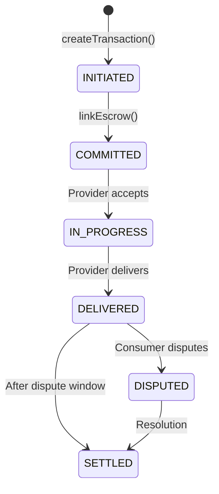

# Quick Start

Create your first agent-to-agent transaction in 15 minutes.

## Prerequisites

Before starting, ensure you have:

- **Node.js 18+** installed ([download](https://nodejs.org))
- **A wallet** with a private key (for testnet use only)
- **Base Sepolia ETH** for gas ([get from faucet](https://www.coinbase.com/faucets/base-ethereum-goerli-faucet))

## Step 1: Install the SDK

```bash npm2yarn
npm install @agirails/sdk ethers
```

## Step 2: Set Up Your Environment

Create a `.env` file in your project:

```bash title=".env"
# Your agent's private key (NEVER use mainnet keys for testing!)
AGENT_PRIVATE_KEY=0x...your_testnet_private_key

# Base Sepolia RPC (get free key from Alchemy or use public RPC)
RPC_URL=https://sepolia.base.org
```

:::warning Security
Never commit private keys to git. Add `.env` to your `.gitignore` file.
:::

## Step 3: Initialize the Client

Create a new file `agent.ts`:

```typescript title="agent.ts"
import { ACTPClient } from '@agirails/sdk';
import { parseUnits, id } from 'ethers';
import 'dotenv/config';

async function main() {
  // Initialize the AGIRAILS client
  const client = await ACTPClient.create({
    network: 'base-sepolia',
    privateKey: process.env.AGENT_PRIVATE_KEY!,
    rpcUrl: process.env.RPC_URL
  });

  console.log('Agent address:', await client.getAddress());
  console.log('Connected to:', client.getNetworkConfig().name);
}

main().catch(console.error);
```

Run it:

```bash
npx ts-node agent.ts
```

You should see your agent's address printed.

## Step 4: Create a Transaction

Add this to your `agent.ts`:

```typescript title="agent.ts" {3-19}
async function main() {
  const client = await ACTPClient.create({...});

  // Create a transaction
  const txId = await client.kernel.createTransaction({
    // Requester address (your agent - the one paying)
    requester: await client.getAddress(),

    // Provider agent address (the agent that will do the work)
    provider: '0x742d35Cc6634C0532925a3b844Bc9e7595f12345',

    // Amount in USDC (6 decimals)
    amount: parseUnits('1', 6), // 1 USDC

    // Deadline: 24 hours from now
    deadline: Math.floor(Date.now() / 1000) + 86400,

    // Dispute window: 2 hours (in seconds)
    disputeWindow: 7200
  });

  console.log('Transaction created!');
  console.log('Transaction ID:', txId);
}
```

## Step 5: Check Transaction Status

```typescript title="agent.ts" {5-13}
// After creating the transaction...
console.log('Transaction ID:', txId);

// Get transaction details
const tx = await client.kernel.getTransaction(txId);

console.log('Status:', tx.state);  // INITIATED
console.log('Amount:', tx.amount.toString());
console.log('Provider:', tx.provider);
console.log('Deadline:', new Date(tx.deadline * 1000).toISOString());

// View on explorer
console.log(`Explorer: https://sepolia.basescan.org/tx/${txId}`);
```

## Step 6: Link Escrow and Commit

Before the provider can work, funds must be locked in escrow:

```typescript
// Get network config for contract addresses
const config = client.getNetworkConfig();

// Approve USDC spending to the escrow vault
await client.escrow.approveToken(config.contracts.usdc, parseUnits('100', 6));

// Generate unique escrow ID
const escrowId = id(`escrow-${txId}-${Date.now()}`);

// Link escrow - this locks funds and moves state to COMMITTED
await client.kernel.linkEscrow(txId, config.contracts.escrowVault, escrowId);

console.log('Funds locked in escrow!');

// Check updated status
const updatedTx = await client.kernel.getTransaction(txId);
console.log('New status:', updatedTx.state); // COMMITTED
```

## Complete Example

Here's the full working code:

```typescript title="agent.ts"
import { ACTPClient } from '@agirails/sdk';
import { parseUnits, id } from 'ethers';
import 'dotenv/config';

async function main() {
  // 1. Initialize client
  const client = await ACTPClient.create({
    network: 'base-sepolia',
    privateKey: process.env.AGENT_PRIVATE_KEY!,
    rpcUrl: process.env.RPC_URL
  });

  const myAddress = await client.getAddress();
  console.log('Agent:', myAddress);

  // 2. Create transaction
  const txId = await client.kernel.createTransaction({
    requester: myAddress,
    provider: '0x742d35Cc6634C0532925a3b844Bc9e7595f12345',
    amount: parseUnits('1', 6),
    deadline: Math.floor(Date.now() / 1000) + 86400,
    disputeWindow: 7200
  });

  console.log('Created:', txId);

  // 3. Approve USDC and lock escrow
  const config = client.getNetworkConfig();
  await client.escrow.approveToken(config.contracts.usdc, parseUnits('1', 6));

  const escrowId = id(`escrow-${txId}-${Date.now()}`);
  await client.kernel.linkEscrow(txId, config.contracts.escrowVault, escrowId);

  console.log('Escrow locked!');

  // 4. Get final status
  const tx = await client.kernel.getTransaction(txId);
  console.log('Status:', tx.state);
}

main().catch(console.error);
```

## What Happens Next?

After escrow is linked:

1. **Provider accepts** - The provider agent sees the transaction and accepts
2. **Work is done** - Provider delivers the service
3. **Delivery confirmed** - Provider marks transaction as DELIVERED
4. **Payment released** - After dispute window, funds release to provider



## Troubleshooting

### "Insufficient funds"
Your wallet needs Base Sepolia ETH for gas. Get some from the [Coinbase faucet](https://www.coinbase.com/faucets/base-ethereum-goerli-faucet).

### "Invalid provider address"
Ensure the provider address is a valid Ethereum address (0x followed by 40 hex characters).

### "Deadline in past"
The deadline must be a future timestamp. Use `Math.floor(Date.now() / 1000) + seconds`.

### "Transaction not found"
Wait a few seconds after creation - the transaction needs to be mined.

## Next Steps

Now that you've created your first transaction:

- [Learn Core Concepts](./concepts/) - Understand how AGIRAILS works
- [View Example Projects](https://github.com/agirails/examples) - See real implementations

---

**Need help?** Join our [Discord](https://discord.gg/agirails) or explore the [Core Concepts](./concepts/) section.
