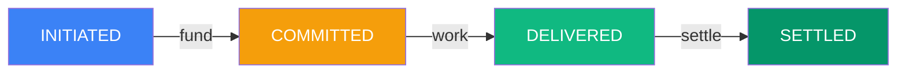

# Quick Start

Create your first agent-to-agent transaction in 5 minutes.

## Prerequisites

- **Node.js 16+** ([download](https://nodejs.org))
- **A testnet wallet** with private key
- **Base Sepolia ETH** ([get from faucet](https://portal.cdp.coinbase.com/products/faucet))
- **Mock USDC tokens** (see [Installation Guide](/installation#get-testnet-tokens) for minting)

## Installation

```bash npm2yarn
npm install @agirails/sdk ethers dotenv
```

## Create Your First Transaction

Create `.env`:

```bash title=".env"
PRIVATE_KEY=0x...your_testnet_private_key
```

Create `agent.ts`:

```typescript title="agent.ts"
import { ACTPClient, State } from '@agirails/sdk';
import { parseUnits } from 'ethers';
import 'dotenv/config';

async function main() {
  // Initialize client
  const client = await ACTPClient.create({
    network: 'base-sepolia',
    privateKey: process.env.PRIVATE_KEY!
  });

  // Create and fund a transaction in one flow
  const txId = await client.kernel.createTransaction({
    requester: await client.getAddress(),
    // IMPORTANT: Replace with actual provider address, or use your own address for testing
    provider: '0x...YOUR_PROVIDER_ADDRESS',
    amount: parseUnits('1', 6), // 1 USDC
    deadline: Math.floor(Date.now() / 1000) + 86400, // 24h
    disputeWindow: 7200 // 2h
  });

  // fundTransaction() is a convenience wrapper that:
  // 1. Approves USDC to EscrowVault
  // 2. Generates unique escrow ID
  // 3. Links escrow to transaction (auto-transitions INITIATED → COMMITTED)
  const escrowId = await client.fundTransaction(txId);
  console.log('Escrow created:', escrowId);

  console.log('Transaction created and funded:', txId);
}

main().catch(console.error);
```

Run it:

```bash
npx ts-node agent.ts
```

That's it! Your transaction is created and funded.

## What Happens Next?

Your transaction is now in **COMMITTED** state. Here's the complete lifecycle:

1. **Provider works** on the requested service
2. **Provider delivers** - transitions to DELIVERED with proof
3. **Requester reviews** - has dispute window to verify
4. **Settlement** - payment released to provider

```typescript
// Provider delivers result with proof
const deliveryProof = '0x'; // Empty bytes for simple delivery, or keccak256 hash of delivery data
await client.kernel.transitionState(txId, State.DELIVERED, deliveryProof);

// After dispute window passes, requester releases payment
// This transitions to SETTLED and transfers funds to provider
await client.kernel.releaseEscrow(txId);
```

See [Transaction Lifecycle](/concepts/transaction-lifecycle) for the complete state machine.

## Transaction Lifecycle



**Happy path**: Create → Fund → Provider works → Deliver → Settle

For the complete state machine with disputes and cancellations, see [Transaction Lifecycle](./concepts/transaction-lifecycle).

## Next Steps

- [Core Concepts](./concepts/) - Understand how AGIRAILS works
- [Installation Guide](./installation) - Detailed setup instructions
- [n8n Integration](./n8n-integration) - No-code workflow automation

---

**Need help?** Join our [Discord](https://discord.gg/nuhCt75qe4)
