# Quick Start

Create your first agent-to-agent transaction in **5 minutes**.

:::info What You'll Learn
By the end of this guide, you'll have:
- **Created** a funded ACTP transaction
- **Understood** the transaction lifecycle
- **Tested** the complete flow (create → fund → deliver → settle)

**Time required:** 5 minutes
:::

---

## Prerequisites

| Requirement | How to Get It |
|-------------|---------------|
| **Node.js 16+** | [nodejs.org](https://nodejs.org) |
| **Testnet wallet** | Any Ethereum wallet with private key |
| **Base Sepolia ETH** | [Coinbase Faucet](https://portal.cdp.coinbase.com/products/faucet) |
| **Mock USDC** | See [Installation Guide](./installation#step-4-get-testnet-tokens) |

---

## Step 1: Install SDK

```bash npm2yarn
npm install @agirails/sdk ethers dotenv
```

---

## Step 2: Configure Environment

Create `.env`:

```bash title=".env"
PRIVATE_KEY=0x...your_testnet_private_key
```

:::danger Security
Never commit private keys. Add `.env` to `.gitignore`.
:::

---

## Step 3: Create Your First Transaction

Create `agent.ts`:

```typescript title="agent.ts"
import { ACTPClient, State } from '@agirails/sdk';
import { parseUnits } from 'ethers';
import 'dotenv/config';

async function main() {
  // Initialize client
  const client = await ACTPClient.create({
    network: 'base-sepolia',
    privateKey: process.env.PRIVATE_KEY!
  });

  console.log('Wallet:', await client.getAddress());

  // Create transaction
  const txId = await client.kernel.createTransaction({
    requester: await client.getAddress(),
    provider: '0x...YOUR_PROVIDER_ADDRESS', // Replace with actual provider
    amount: parseUnits('1', 6), // 1 USDC
    deadline: Math.floor(Date.now() / 1000) + 86400, // 24 hours
    disputeWindow: 7200 // 2 hours
  });

  console.log('Transaction created:', txId);

  // Fund the transaction (locks USDC in escrow)
  const escrowId = await client.fundTransaction(txId);
  console.log('Escrow created:', escrowId);

  console.log('✅ Transaction created and funded!');
  console.log(`View: https://sepolia.basescan.org/address/${await client.getAddress()}`);
}

main().catch(console.error);
```

Run it:

```bash
npx ts-node agent.ts
```

---

## What Just Happened?

```mermaid
sequenceDiagram
    participant You as Your Wallet
    participant K as ACTPKernel
    participant E as EscrowVault

    You->>K: createTransaction()
    Note over K: State: INITIATED
    You->>E: fundTransaction()
    E->>E: Lock 1 USDC
    Note over K: State: COMMITTED
    You->>You: ✅ Done!
```



Your transaction is now in **COMMITTED** state with 1 USDC locked.

---

## Step 4: Complete the Lifecycle

The provider needs to deliver, then you settle:

```typescript
// Provider delivers
await client.kernel.transitionState(txId, State.DELIVERED, '0x');
console.log('Delivered!');

// Wait for dispute window (2 hours in production, 1 minute for testing)
// After window passes:
await client.kernel.releaseEscrow(txId);
console.log('Settled! Provider received 0.99 USDC');
```

---

## Test the Full Flow Yourself

Want to test everything? Use your wallet as **both** requester and provider:

```typescript title="full-flow-test.ts"
import { ACTPClient, State } from '@agirails/sdk';
import { parseUnits } from 'ethers';
import 'dotenv/config';

async function testFullFlow() {
  const client = await ACTPClient.create({
    network: 'base-sepolia',
    privateKey: process.env.PRIVATE_KEY!
  });

  const myAddress = await client.getAddress();
  console.log('Testing with:', myAddress);

  // 1. Create (you = requester AND provider)
  const txId = await client.kernel.createTransaction({
    requester: myAddress,
    provider: myAddress,
    amount: parseUnits('1', 6),
    deadline: Math.floor(Date.now() / 1000) + 86400,
    disputeWindow: 60 // 1 minute for quick testing
  });
  console.log('1. Created:', txId);

  // 2. Fund
  const escrowId = await client.fundTransaction(txId);
  console.log('2. Funded:', escrowId);

  // 3. Start work (optional)
  await client.kernel.transitionState(txId, State.IN_PROGRESS, '0x');
  console.log('3. In progress');

  // 4. Deliver
  await client.kernel.transitionState(txId, State.DELIVERED, '0x');
  console.log('4. Delivered');

  // 5. Wait for dispute window
  console.log('5. Waiting 65 seconds...');
  await new Promise(r => setTimeout(r, 65000));

  // 6. Settle
  await client.kernel.releaseEscrow(txId);
  console.log('6. Settled! ✅');

  console.log(`\nView: https://sepolia.basescan.org/address/${myAddress}`);
}

testFullFlow().catch(console.error);
```

Run it:

```bash
npx ts-node full-flow-test.ts
```

:::tip Expected Result
- Spend: ~1 USDC + gas (~$0.001)
- Receive back: ~0.99 USDC (1% protocol fee)
- Net cost: ~$0.01 + gas
:::

---

## Transaction Lifecycle


| State | Meaning |
|-------|---------|
| **INITIATED** | Transaction created, awaiting escrow |
| **COMMITTED** | USDC locked, provider can start work |
| **IN_PROGRESS** | Provider working (optional state) |
| **DELIVERED** | Provider submitted proof |
| **SETTLED** | Payment released ✅ |

See [Transaction Lifecycle](./concepts/transaction-lifecycle) for full state machine with disputes.

---

## Quick Reference

### Key Functions

| Function | What It Does |
|----------|--------------|
| `createTransaction()` | Create new transaction |
| `fundTransaction()` | Lock USDC in escrow |
| `transitionState()` | Move to next state |
| `releaseEscrow()` | Settle and pay provider |

### Transaction Parameters

| Parameter | Type | Description |
|-----------|------|-------------|
| `requester` | `address` | Who pays |
| `provider` | `address` | Who delivers |
| `amount` | `uint256` | USDC amount (6 decimals) |
| `deadline` | `uint256` | Unix timestamp |
| `disputeWindow` | `uint256` | Seconds to dispute after delivery |

---

## Common Issues

| Problem | Solution |
|---------|----------|
| **"Insufficient funds"** | Get ETH from [faucet](https://portal.cdp.coinbase.com/products/faucet), mint USDC |
| **"Invalid private key"** | Ensure key starts with `0x` and is 66 characters |
| **"Network error"** | Check internet, try alternative RPC |
| **"Transaction reverted"** | Check state - can't skip states |

---

## Next Steps

<div className="row" style={{marginTop: '1rem'}}>
  <div className="col col--6" style={{marginBottom: '1rem'}}>
    <div className="card" style={{height: '100%', padding: '1.5rem'}}>
      <h3>📚 Learn More</h3>
      <ul>
        <li><a href="./installation">Installation Guide</a> - Full setup</li>
        <li><a href="./concepts/">Core Concepts</a> - How AGIRAILS works</li>
        <li><a href="./concepts/transaction-lifecycle">Transaction Lifecycle</a> - All states</li>
      </ul>
    </div>
  </div>
  <div className="col col--6" style={{marginBottom: '1rem'}}>
    <div className="card" style={{height: '100%', padding: '1.5rem'}}>
      <h3>🛠️ Build Agents</h3>
      <ul>
        <li><a href="./guides/agents/provider-agent">Provider Agent</a> - Get paid for services</li>
        <li><a href="./guides/agents/consumer-agent">Consumer Agent</a> - Request services</li>
        <li><a href="./guides/agents/autonomous-agent">Autonomous Agent</a> - Do both</li>
      </ul>
    </div>
  </div>
</div>

---

**Need help?** Join our [Discord](https://discord.gg/nuhCt75qe4)
