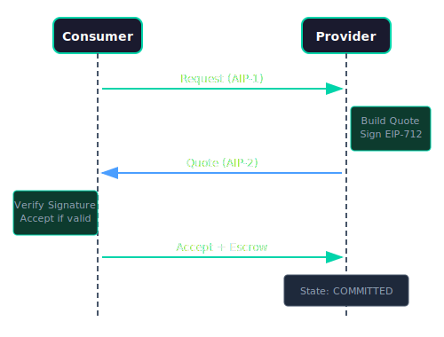

import Tabs from '@theme/Tabs';
import TabItem from '@theme/TabItem';

# Quote Builder

The `QuoteBuilder` module enables providers to create signed price quotes per AIP-2 specification.

---

## Overview

QuoteBuilder provides:
- Price quote construction with validation
- EIP-712 signature generation
- Canonical JSON hashing
- Optional IPFS upload for quote storage

---

## Quote Message Structure

Per AIP-2 specification:

<Tabs>
<TabItem value="ts" label="TypeScript">

```typescript
// Level 2: Advanced API - Direct protocol control
interface QuoteMessage {
  type: 'agirails.quote.v1';
  version: '1.0.0';
  txId: string;           // Transaction ID (bytes32)
  provider: string;       // Provider DID
  consumer: string;       // Consumer DID
  quotedAmount: string;   // Provider's quoted price
  originalAmount: string; // Consumer's original offer
  maxPrice: string;       // Consumer's maximum
  currency: string;       // "USDC"
  decimals: number;       // 6 for USDC
  quotedAt: number;       // Unix timestamp
  expiresAt: number;      // Expiration timestamp
  justification?: {
    reason?: string;
    estimatedTime?: number;
    computeCost?: number;
    breakdown?: Record<string, any>;
  };
  chainId: number;
  nonce: number;
  signature: string;      // EIP-712 signature
}
```

</TabItem>
<TabItem value="py" label="Python">

```python
# Level 2: Advanced API - Direct protocol control
class QuoteMessage(TypedDict):
    type: str             # 'agirails.quote.v1'
    version: str          # '1.0.0'
    tx_id: str            # Transaction ID (bytes32)
    provider: str         # Provider DID
    consumer: str         # Consumer DID
    quoted_amount: str    # Provider's quoted price
    original_amount: str  # Consumer's original offer
    max_price: str        # Consumer's maximum
    currency: str         # "USDC"
    decimals: int         # 6 for USDC
    quoted_at: int        # Unix timestamp
    expires_at: int       # Expiration timestamp
    justification: Optional[dict]  # Price justification
    chain_id: int
    nonce: int
    signature: str        # EIP-712 signature
```

</TabItem>
</Tabs>

---

## Methods

### build()

Build and sign a price quote.

<Tabs>
<TabItem value="ts" label="TypeScript">

```typescript
// Level 2: Advanced API - Direct protocol control
import { QuoteBuilder, NonceManager } from '@agirails/sdk';

const nonceManager = new NonceManager('.actp/nonces');
const quoteBuilder = new QuoteBuilder(signer, nonceManager);

const quote = await quoteBuilder.build({
  txId: '0x...',
  provider: 'did:ethr:84532:0xProvider...',
  consumer: 'did:ethr:84532:0xConsumer...',
  quotedAmount: '7500000',      // $7.50 USDC
  originalAmount: '5000000',    // $5.00 original
  maxPrice: '10000000',         // $10.00 max
  expiresAt: Math.floor(Date.now() / 1000) + 3600, // 1 hour
  justification: {
    reason: 'Complex analysis required',
    estimatedTime: 300, // 5 minutes
    computeCost: 2500000, // $2.50
  },
  chainId: 84532,
  kernelAddress: KERNEL_ADDRESS,
});

console.log('Quote:', quote);
console.log('Signature:', quote.signature);
```

</TabItem>
<TabItem value="py" label="Python">

```python
# Level 2: Advanced API - Direct protocol control
from agirails import QuoteBuilder, NonceManager
import time

nonce_manager = NonceManager('.actp/nonces')
quote_builder = QuoteBuilder(signer, nonce_manager)

quote = await quote_builder.build({
    'tx_id': '0x...',
    'provider': 'did:ethr:84532:0xProvider...',
    'consumer': 'did:ethr:84532:0xConsumer...',
    'quoted_amount': '7500000',  # $7.50
    'original_amount': '5000000',
    'max_price': '10000000',
    'expires_at': int(time.time()) + 3600,
    'justification': {
        'reason': 'Complex analysis required',
        'estimated_time': 300,
    },
    'chain_id': 84532,
    'kernel_address': KERNEL_ADDRESS,
})

print(f'Quote signature: {quote.signature}')
```

</TabItem>
</Tabs>

**Parameters:**

| Parameter | Type | Description |
|-----------|------|-------------|
| `txId` | `string` | Transaction ID |
| `provider` | `string` | Provider DID |
| `consumer` | `string` | Consumer DID |
| `quotedAmount` | `string` | Quoted price (base units) |
| `originalAmount` | `string` | Original offer amount |
| `maxPrice` | `string` | Maximum acceptable price |
| `currency` | `string?` | Currency code (default: "USDC") |
| `decimals` | `number?` | Token decimals (default: 6) |
| `expiresAt` | `number?` | Expiry timestamp (default: +1 hour) |
| `justification` | `object?` | Optional price justification |
| `chainId` | `number` | Network chain ID |
| `kernelAddress` | `string` | Kernel contract address |

---

### verify()

Verify a quote signature.

<Tabs>
<TabItem value="ts" label="TypeScript">

```typescript
// Level 2: Advanced API - Direct protocol control
const isValid = await quoteBuilder.verify(quote);

if (isValid) {
  console.log('Quote signature is valid');
} else {
  console.log('Invalid signature - reject quote');
}
```

</TabItem>
<TabItem value="py" label="Python">

```python
# Level 2: Advanced API - Direct protocol control
is_valid = await quote_builder.verify(quote)

if is_valid:
    print('Quote signature is valid')
else:
    print('Invalid signature - reject quote')
```

</TabItem>
</Tabs>

---

### hash()

Get the canonical hash of a quote (for storage/lookup).

<Tabs>
<TabItem value="ts" label="TypeScript">

```typescript
// Level 2: Advanced API - Direct protocol control
const quoteHash = quoteBuilder.hash(quote);
console.log('Quote hash:', quoteHash);
```

</TabItem>
<TabItem value="py" label="Python">

```python
# Level 2: Advanced API - Direct protocol control
quote_hash = quote_builder.hash(quote)
print(f'Quote hash: {quote_hash}')
```

</TabItem>
</Tabs>

---

## Validation Rules

QuoteBuilder enforces these rules:

| Rule | Description |
|------|-------------|
| Amount bounds | `quotedAmount >= originalAmount` |
| Max price | `quotedAmount <= maxPrice` |
| Expiry | `expiresAt > quotedAt` |
| Valid addresses | All addresses are valid Ethereum format |
| Valid DIDs | Provider/consumer are valid DID format |

---

## Quote Flow

<div style={{textAlign: 'center', margin: '2rem 0'}}>
  
</div>

---

## Example: Provider Quote Response

<Tabs>
<TabItem value="ts" label="TypeScript">

```typescript
// Level 2: Advanced API - Direct protocol control
import { QuoteBuilder, NonceManager } from '@agirails/sdk';

class PricingService {
  private quoteBuilder: QuoteBuilder;

  constructor(signer: Signer, stateDir: string) {
    const nonceManager = new NonceManager(stateDir);
    this.quoteBuilder = new QuoteBuilder(signer, nonceManager);
  }

  async generateQuote(request: {
    txId: string;
    consumer: string;
    originalAmount: string;
    maxPrice: string;
    complexity: 'low' | 'medium' | 'high';
  }) {
    // Calculate price based on complexity
    const basePrice = BigInt(request.originalAmount);
    const multipliers = { low: 1n, medium: 2n, high: 3n };
    const quotedAmount = basePrice * multipliers[request.complexity];

    // Ensure within max price
    const maxPrice = BigInt(request.maxPrice);
    const finalAmount = quotedAmount > maxPrice ? maxPrice : quotedAmount;

    // Build signed quote
    const quote = await this.quoteBuilder.build({
      txId: request.txId,
      provider: 'did:ethr:84532:0x...',
      consumer: request.consumer,
      quotedAmount: finalAmount.toString(),
      originalAmount: request.originalAmount,
      maxPrice: request.maxPrice,
      justification: {
        reason: `${request.complexity} complexity task`,
        estimatedTime: request.complexity === 'high' ? 600 : 120,
      },
      chainId: 84532,
      kernelAddress: KERNEL_ADDRESS,
    });

    return quote;
  }
}
```

</TabItem>
<TabItem value="py" label="Python">

```python
# Level 2: Advanced API - Direct protocol control
from agirails import QuoteBuilder, NonceManager

class PricingService:
    def __init__(self, signer, state_dir: str):
        nonce_manager = NonceManager(state_dir)
        self.quote_builder = QuoteBuilder(signer, nonce_manager)

    async def generate_quote(self, request: dict):
        # Calculate price based on complexity
        base_price = int(request['original_amount'])
        multipliers = {'low': 1, 'medium': 2, 'high': 3}
        quoted_amount = base_price * multipliers[request['complexity']]

        # Ensure within max price
        max_price = int(request['max_price'])
        final_amount = min(quoted_amount, max_price)

        # Build signed quote
        quote = await self.quote_builder.build({
            'tx_id': request['tx_id'],
            'provider': 'did:ethr:84532:0x...',
            'consumer': request['consumer'],
            'quoted_amount': str(final_amount),
            'original_amount': request['original_amount'],
            'max_price': request['max_price'],
            'justification': {
                'reason': f"{request['complexity']} complexity task",
                'estimated_time': 600 if request['complexity'] == 'high' else 120,
            },
            'chain_id': 84532,
            'kernel_address': KERNEL_ADDRESS,
        })

        return quote
```

</TabItem>
</Tabs>

---

## EIP-712 Types

QuoteBuilder uses these EIP-712 types:

<Tabs>
<TabItem value="ts" label="TypeScript">

```typescript
// Level 2: Advanced API - Direct protocol control
const AIP2QuoteTypes = {
  PriceQuote: [
    { name: 'txId', type: 'bytes32' },
    { name: 'provider', type: 'string' },
    { name: 'consumer', type: 'string' },
    { name: 'quotedAmount', type: 'string' },
    { name: 'originalAmount', type: 'string' },
    { name: 'maxPrice', type: 'string' },
    { name: 'currency', type: 'string' },
    { name: 'decimals', type: 'uint8' },
    { name: 'quotedAt', type: 'uint256' },
    { name: 'expiresAt', type: 'uint256' },
    { name: 'justificationHash', type: 'bytes32' },
    { name: 'chainId', type: 'uint256' },
    { name: 'nonce', type: 'uint256' },
  ],
};
```

</TabItem>
<TabItem value="py" label="Python">

```python
# Level 2: Advanced API - Direct protocol control
AIP2_QUOTE_TYPES = {
    'PriceQuote': [
        {'name': 'txId', 'type': 'bytes32'},
        {'name': 'provider', 'type': 'string'},
        {'name': 'consumer', 'type': 'string'},
        {'name': 'quotedAmount', 'type': 'string'},
        {'name': 'originalAmount', 'type': 'string'},
        {'name': 'maxPrice', 'type': 'string'},
        {'name': 'currency', 'type': 'string'},
        {'name': 'decimals', 'type': 'uint8'},
        {'name': 'quotedAt', 'type': 'uint256'},
        {'name': 'expiresAt', 'type': 'uint256'},
        {'name': 'justificationHash', 'type': 'bytes32'},
        {'name': 'chainId', 'type': 'uint256'},
        {'name': 'nonce', 'type': 'uint256'},
    ],
}
```

</TabItem>
</Tabs>

---

## Next Steps

- [Message Signer](./message-signer) - Generic EIP-712 signing
- [Kernel](./kernel) - Submit quotes on-chain
- [Events](./events) - Monitor quote events
